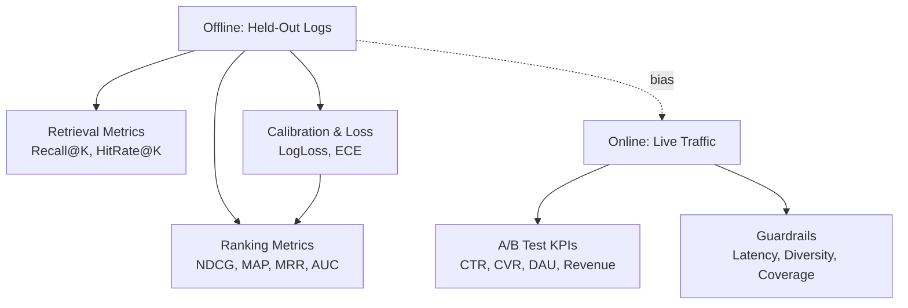

> *"You can't improve what you don't measure, and you'll regret what you measure wrong."*

## Introduction

Recommender systems are evaluated at three layers: **retrieval** (did we surface relevant candidates?), **ranking** (is the order good?), and **business** (did users do something valuable?). A great team measures all three, knows the failure modes of each metric, and aligns them with product goals.

This post is a tour of the metrics you'll actually see in interview loops, design docs, and dashboards — what they reward, what they hide, and when to use which.

## 1. The Layered Evaluation Mental Model



A subtle but crucial point: **offline metrics correlate with online metrics, they do not equal them.** Selection bias, position bias, and freshness gaps mean a 5% NDCG lift may translate to 0% CTR lift — or worse.

## 2. Retrieval Metrics

Retrieval is set-based: "did relevant items appear in the top-K candidates I returned?" Order matters less than coverage.

### 2.1 Hit Rate (HR@K) / Recall@K

$$\text{HR@K} = \frac{1}{|U|}\sum_{u \in U} \mathbb{1}[\text{relevant item} \in \text{top-K}_u]$$

For implicit feedback with one held-out item per user, HR@K is equivalent to **Recall@K**.

### 2.2 Coverage

What fraction of the catalog ever appears in top-K? Low coverage = popularity bias.

$$\text{Coverage@K} = \frac{|\bigcup_u \text{TopK}_u|}{|I|}$$

### 2.3 Pros & Cons

| Metric | Pros | Cons |
|---|---|---|
| HR@K / Recall@K | Simple, intuitive, fast to compute | Ignores rank order; favors popular items |
| Precision@K | Useful when slate size is small | Affected by ground-truth sparsity |
| Coverage | Catches popularity bias | Doesn't measure quality |

## 3. Ranking Metrics

### 3.1 Mean Average Precision (MAP)

For a user $u$ with $m$ relevant items:

$$\text{AP}_u = \frac{1}{m}\sum_{k=1}^{N} P(k) \cdot \text{rel}(k), \quad \text{MAP} = \frac{1}{|U|}\sum_u \text{AP}_u$$

### 3.2 Mean Reciprocal Rank (MRR)

$$\text{MRR} = \frac{1}{|U|}\sum_u \frac{1}{\text{rank}_u^*}$$

where $\text{rank}_u^*$ is the rank of the first relevant item. Used heavily in search and Q&A.

### 3.3 Normalized Discounted Cumulative Gain (NDCG)

$$\text{DCG@K} = \sum_{i=1}^{K} \frac{2^{\text{rel}_i}-1}{\log_2(i+1)}, \quad \text{NDCG@K} = \frac{\text{DCG@K}}{\text{IDCG@K}}$$

NDCG is the gold standard for graded relevance (e.g., ratings, dwell time buckets).

### 3.4 AUC / ROC-AUC

Probability that a random positive ranks above a random negative. **GAUC** (group-wise AUC, averaged per user) is what you actually want in RecSys — vanilla AUC mixes across users and can be misleading.

### 3.5 Pros & Cons

| Metric | Pros | Cons |
|---|---|---|
| MAP | Robust, handles multiple positives | Binary relevance only |
| MRR | Great for "first hit" problems | Ignores positions 2..K |
| NDCG | Graded relevance, smooth | Sensitive to gain function choice |
| AUC | Stable, threshold-free | Insensitive to top-of-list errors |
| GAUC | Per-user AUC — what users feel | Slow on long-tail users |

## 4. Calibration & Probability Quality

Pointwise scores need to be **calibrated** so downstream auctions (ads) and slate optimization (diversity) work.

- **LogLoss** (binary cross-entropy): rewards calibrated probabilities.
- **Expected Calibration Error (ECE)**: bins predictions and compares predicted vs observed frequency.
- **Brier Score**: $\frac{1}{N}\sum (p_i - y_i)^2$.

Production teams plot **reliability diagrams** weekly — they'll catch drift no AUC delta will.

## 5. Business / Online Metrics

| Metric | What it captures |
|---|---|
| CTR | Click-through rate (engagement, often confounded by position) |
| CVR | Conversion rate (purchase, signup) |
| DAU/MAU | Retention proxy |
| Session length | Engagement depth |
| Revenue / GMV | Direct value |
| Time-to-action | Surfacing speed |
| Long-term value (LTV) | True north — hard to measure |

**Trap:** optimizing CTR alone is a one-way ticket to clickbait. Multi-objective + counterfactual + holdouts (see [Blog 17](./17-position-bias.md), [Blog 20](./20-ab-testing.md)).

## 6. Beyond Accuracy: Diversity, Novelty, Serendipity

- **Intra-list diversity (ILD)**: mean pairwise distance among top-K items.
- **Novelty**: $-\log(\text{popularity})$.
- **Serendipity**: relevant *and* unexpected.
- **Catalog coverage**, **long-tail share** as fairness proxies.

See [Blog 19](./19-diversity-fairness.md) for the full treatment.

## 7. Code: Compute the Big Six on MovieLens

```python
# pip install pandas numpy scikit-learn
import numpy as np
import pandas as pd
from sklearn.metrics import roc_auc_score, log_loss

# --- 1. Load MovieLens 100K ratings (download from https://grouplens.org/datasets/movielens/100k/)
ratings = pd.read_csv("u.data", sep="\t",
                     names=["user", "item", "rating", "ts"])

# Implicit positives: rating >= 4
ratings["label"] = (ratings["rating"] >= 4).astype(int)

# Toy "model": predict probability proportional to global popularity
pop = ratings.groupby("item")["label"].mean().to_dict()
ratings["score"] = ratings["item"].map(pop)

# --- 2. Metric implementations
def hit_rate_at_k(df, k=10):
    return (
        df.sort_values("score", ascending=False)
          .groupby("user")
          .head(k)
          .groupby("user")["label"].max()
          .mean()
    )

def ndcg_at_k(df, k=10):
    def _ndcg(g):
        g = g.sort_values("score", ascending=False).head(k)
        rel = g["label"].values
        gains = (2**rel - 1) / np.log2(np.arange(2, len(rel)+2))
        ideal = np.sort(rel)[::-1]
        idcg = (2**ideal - 1) / np.log2(np.arange(2, len(ideal)+2))
        return gains.sum() / (idcg.sum() + 1e-9)
    return df.groupby("user").apply(_ndcg).mean()

def mrr(df):
    def _mrr(g):
        g = g.sort_values("score", ascending=False).reset_index(drop=True)
        hits = g.index[g["label"] == 1]
        return 0 if len(hits) == 0 else 1 / (hits[0] + 1)
    return df.groupby("user").apply(_mrr).mean()

def gauc(df):
    aucs = []
    for _, g in df.groupby("user"):
        if g["label"].nunique() < 2:
            continue
        aucs.append(roc_auc_score(g["label"], g["score"]))
    return np.mean(aucs)

# --- 3. Report
print(f"HR@10:   {hit_rate_at_k(ratings, 10):.4f}")
print(f"NDCG@10: {ndcg_at_k(ratings, 10):.4f}")
print(f"MRR:     {mrr(ratings):.4f}")
print(f"GAUC:    {gauc(ratings):.4f}")
print(f"LogLoss: {log_loss(ratings['label'], ratings['score'].clip(1e-6, 1-1e-6)):.4f}")
```

## 8. Choosing the Right Metric

| Product surface | Primary offline | Primary online |
|---|---|---|
| E-commerce ranking | NDCG@K, GAUC | CTR, CVR, GMV |
| Feed (Twitter/TikTok) | MRR, NDCG | Session time, retention |
| Search | NDCG@10, MRR | CTR, query reformulation rate |
| Email/Push | Recall@K, calibrated CTR | Open rate, unsubscribes |
| Ads | LogLoss, calibrated AUC | eCPM, advertiser ROI |

## 9. Production Tips

- **Always slice metrics**: by country, device, user cohort, item freshness.
- **Long-tail evaluation**: report metrics on users with <5 interactions separately.
- **Counterfactual eval** (Blog 17) before risking online traffic.
- **Holdout users**, not interactions — random interaction holdout leaks future info.
- **Multiple time windows**: 7-day vs 28-day metrics catch novelty effects.

## 10. Common Pitfalls

1. Reporting AUC instead of GAUC.
2. Computing NDCG without normalizing per-user IDCG.
3. Random splits instead of **time-based** splits.
4. Optimizing CTR while CVR drops.
5. Ignoring **position bias** — a model can "win" because it puts items higher (Blog 17).
6. Comparing models on different candidate sets.

## 11. Public Datasets to Practice

- **MovieLens 100K/1M/25M** — ratings — https://grouplens.org/datasets/movielens/
- **Amazon Reviews 2018** — reviews+meta — https://nijianmo.github.io/amazon/
- **Yelp Open Dataset** — https://www.yelp.com/dataset
- **RetailRocket** — clicks/views/purchases — https://www.kaggle.com/datasets/retailrocket/ecommerce-dataset
- **Criteo CTR** — binary clicks — https://ailab.criteo.com/download-criteo-1tb-click-logs-dataset/

## 12. Further Reading

- Cremonesi et al., *Performance of Recommender Algorithms on Top-N Tasks* (RecSys 2010)
- Hu, Koren, Volinsky, *Collaborative Filtering for Implicit Feedback Datasets* (2008)
- Yang et al., *Streaming Recommender Systems* (KDD 2018)
- Diaz et al., *Evaluating Stochastic Rankings with Expected Exposure* (CIKM 2020)
