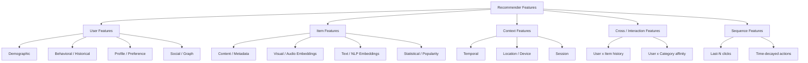

> *"Garbage in, garbage out — but in RecSys, the right features are 80% of the lift."*

## Introduction

Features are the language your model uses to describe users, items, and context. Get them right and even a logistic regression can outperform a transformer. Get them wrong and no architecture will save you. This post is a taxonomy of the feature families used in modern recommenders, the engineering tricks each requires, and the gotchas they hide.

## 1. The Feature Taxonomy



## 2. User Features

### 2.1 Demographic
Age, gender, country, language. **Pros:** stable, cheap. **Cons:** privacy-sensitive (GDPR/CCPA), sparse, often missing or self-reported.

> **Production note:** demographic features often add little lift once behavioral features are present — but they're crucial for **cold start** (Blog 18).

### 2.2 Behavioral / Historical
Counts and aggregates over user actions: clicks, purchases, watch time, ratings, skips.

| Feature | Definition |
|---|---|
| `n_clicks_7d` | Clicks in last 7 days |
| `purchase_amount_30d` | dollars spent in last 30 days |
| `avg_dwell_time` | Mean seconds per view |
| `last_session_gap_hr` | Hours since last session |
| `category_affinity_score` | Fraction of clicks in each category |

These are typically computed in a **feature store** (Blog 22) with online/offline parity guaranteed by point-in-time joins.

### 2.3 Profile / Preference
Explicit signals — followed creators, saved searches, "thumbs up", muted categories.

### 2.4 Social / Graph
Friends, follows, co-views. Powers graph models (Blog 10). Features: number of friends who liked item, friend-of-friend signals, embedding from node2vec on the social graph.

## 3. Item Features

### 3.1 Content / Metadata
Title, brand, category, price, tags. Categorical features are typically **hashed** + embedded.

### 3.2 Text Embeddings
Title and description → embeddings via BERT, sentence-transformers, or fastText.

### 3.3 Visual / Audio
Image embeddings (ResNet, CLIP) for fashion/visual products. Audio embeddings (VGGish, MERT) for music.

### 3.4 Statistical / Popularity
CTR, CVR, average rating, click count over various time windows. **Beware of leakage** — must be computed *as of* the prediction time.

## 4. Context Features

| Type | Examples |
|---|---|
| Temporal | hour-of-day, day-of-week, is-weekend, days-since-launch |
| Location | country, city, geohash, store-locality |
| Device | iOS/Android, app version, screen size, connection type |
| Session | session position, scroll depth, in-app referrer, query (for search) |

```python
import pandas as pd
df["hour"] = pd.to_datetime(df["ts"], unit="s").dt.hour
df["is_weekend"] = pd.to_datetime(df["ts"], unit="s").dt.dayofweek >= 5
```

## 5. Cross & Interaction Features

The deep learning revolution started by automating cross features (Wide & Deep, DCN — Blog 06/07). But hand-crafted crosses still beat neural ones in many shops:

- `user_country x item_category`
- `device x ad_creative_size`
- `query_intent x item_brand`

In TensorFlow:
```python
crossed = tf.feature_column.crossed_column(
    ["user_country", "item_category"], hash_bucket_size=10000)
```

## 6. Sequence Features

Users are sequences, not bag-of-actions. Modern systems feed **last-N item IDs** + dwell times into transformer encoders (Blog 08).

```python
# 50 most recent item ids, padded with 0
seq = user_history[-50:]
seq = [0] * (50 - len(seq)) + seq
```

## 7. Engineering Tricks

### 7.1 Categorical Encoding
- **One-hot**: only for low-cardinality
- **Hashing trick**: fast, no vocab maintenance, allows collisions on purpose
- **Embeddings**: $d \approx \min(50, \lceil n^{0.25} \rceil)$
- **Target encoding**: replace category with smoothed mean target (careful with leakage — use out-of-fold)

### 7.2 Numerical
- **Log-transform** heavy-tailed features (revenue, view-count)
- **Bucketize then embed** for non-monotone effects
- **Standardize** for neural nets

### 7.3 Missing Values
- Use **explicit "missing" embedding**, not zero — zero collides with informative inputs.

### 7.4 Freshness
Cache hot features in Redis; tier the rest in offline parquet + DynamoDB.

## 8. Feature Importance & Selection

```python
# Permutation importance with LightGBM
import lightgbm as lgb
from sklearn.inspection import permutation_importance

model = lgb.LGBMClassifier(n_estimators=200)
model.fit(X_train, y_train)
r = permutation_importance(model, X_val, y_val, n_repeats=5, random_state=0)
imp = pd.Series(r.importances_mean, index=X_val.columns).sort_values(ascending=False)
print(imp.head(20))
```

For deep models, use **integrated gradients** or **SHAP** sparingly — they're expensive at scale.

## 9. End-to-End Code: Build a Feature Table on RetailRocket

```python
# pip install pandas pyarrow
import pandas as pd

# RetailRocket events: timestamp, visitorid, event, itemid, transactionid
events = pd.read_csv("events.csv")
events["ts"] = pd.to_datetime(events["timestamp"], unit="ms")

def user_features(events, as_of):
    past = events[events["ts"] < as_of]
    g = past.groupby("visitorid")
    return pd.DataFrame({
        "n_views_7d": g["event"].apply(lambda x: (x == "view").sum()),
        "n_carts_7d": g["event"].apply(lambda x: (x == "addtocart").sum()),
        "n_purch_7d": g["event"].apply(lambda x: (x == "transaction").sum()),
        "last_seen_hr": (as_of - g["ts"].max()).dt.total_seconds() / 3600,
    }).reset_index()

def item_features(events, as_of):
    past = events[events["ts"] < as_of]
    g = past.groupby("itemid")
    return pd.DataFrame({
        "item_ctr_30d": g["event"].apply(lambda x: (x == "addtocart").sum() / max(1, len(x))),
        "item_popularity": g.size(),
    }).reset_index()

snapshot = pd.Timestamp("2015-09-01")
u_feat = user_features(events, snapshot)
i_feat = item_features(events, snapshot)
print(u_feat.head(), i_feat.head())
```

This is essentially what a feature store does at scale, with point-in-time correctness guarantees.

## 10. Feature Engineering Mistakes (and Fixes)

| Mistake | Fix |
|---|---|
| Computing features over the full dataset → leakage | Always join "as of" prediction time |
| One-hot on millions of categories | Hash trick + embedding |
| Forgetting timezone | Store epoch + explicit tz |
| Train/serve skew | Use same code via a feature store |
| Stale features in real time | Tiered caching, TTLs |
| Logging predictions but not features | Log full feature vector |

## 11. Public Datasets

- **MovieLens** — has tag genome (rich item features) — https://grouplens.org/datasets/movielens/
- **Amazon Reviews 2018** — title, brand, image, price — https://nijianmo.github.io/amazon/
- **H&M Personalized Fashion** — demographic + images — https://www.kaggle.com/c/h-and-m-personalized-fashion-recommendations
- **Criteo Display Advertising** — 26 categorical + 13 numerical anonymized features — https://www.kaggle.com/c/criteo-display-ad-challenge/data
- **Avazu CTR** — 24 features for mobile ads — https://www.kaggle.com/c/avazu-ctr-prediction

## 12. Further Reading

- Cheng et al., *Wide & Deep Learning for Recommender Systems* (DLRS 2016)
- He & Chua, *NFM: Neural Factorization Machines* (SIGIR 2017)
- Covington et al., *Deep Neural Networks for YouTube Recommendations* (RecSys 2016) — masterclass in features
- Tecton & Feast docs on feature stores (Blog 22)
