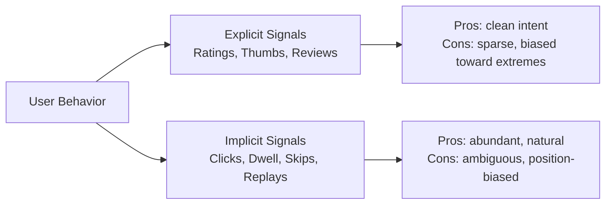
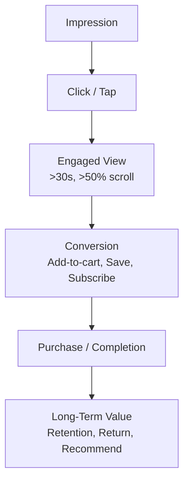

> *"Tell me what you optimize for, and I'll tell you what users will do."*

## Introduction

Before architecture, before features, before metrics — what is the model **predicting**? The choice of label is the most consequential decision in a recommender. It encodes what "good" means to the product. Get it wrong and a brilliant model will reliably produce brilliant garbage.

This post unpacks **explicit** vs **implicit** signals, the difference between **click**, **conversion**, **engagement**, and **satisfaction**, and how to build robust multi-signal labels.

## 1. Explicit vs Implicit



### Explicit feedback
User *intentionally* says they liked or disliked something: 5-star ratings, thumbs up/down, hearts, saves, written reviews.

### Implicit feedback
User behavior *implies* preference without an intentional signal: click, watch >30s, scroll past, abandon cart, return next day.

| Aspect | Explicit | Implicit |
|---|---|---|
| Volume | ~1% of users | 100% of users |
| Noise | Low but selection-biased | High but representative |
| Negative signal | Available (1-star) | Inferred (skip, low dwell) |
| Cold start | Possible via prompts | Requires observation |
| Latency to label | Long (review later) | Instant (click now) |

## 2. The Hierarchy of Signals



The **higher up the funnel**, the more abundant but noisier the signal. The **deeper**, the rarer but more aligned with business value.

> **Rule of thumb:** train on the deepest signal you have enough of, and use higher-funnel signals as auxiliary tasks (Blog 12: MMoE).

## 3. Common Targets and Their Quirks

### 3.1 Binary Click
$$y \in \{0, 1\}$$
- **Easy** to model with logistic regression / NN classifier.
- **Position biased** (Blog 17). Top slots get inflated CTR.
- Doesn't distinguish a casual tap from a deep engagement.

### 3.2 Conversion (CVR)
$$y = 1 \text{ iff click} \to \text{purchase/signup}$$
- High business signal.
- Severe **class imbalance** (~0.1–3%) — use focal loss, downsampling, calibration.
- Conversion can happen days later — needs **attribution windowing**.

### 3.3 Dwell Time / Watch Time
Continuous, log-normal. YouTube famously optimizes log(watch time).
- Captures *quality* of engagement.
- Heavy-tailed → log-transform.
- Bots and autoplay can game it.

### 3.4 Rating
$y \in \{1, ..., 5\}$ or $\{-1, +1\}$ (thumbs).
- Sparse — most users never rate.
- Distribution is bimodal (people rate when extreme).

### 3.5 Multi-Signal Composite
Many production systems use weighted sums:
$$y = w_{\text{click}} \cdot \text{click} + w_{\text{watch}} \cdot \log(\text{watch}) + w_{\text{share}} \cdot \text{share} - w_{\text{skip}} \cdot \text{skip}$$

The weights are tuned via online A/B with the long-term metric (retention) as ground truth.

## 4. Implicit Negative Sampling

Implicit data has no clear negatives. Options:

| Strategy | When |
|---|---|
| **Uniform random items** | Quick baseline (BPR, ALS) |
| **Popularity-weighted** | Tighter decision boundary, more useful negatives |
| **In-batch negatives** | Standard in two-tower (Blog 09) |
| **Hard negatives** (mined via approximate NN) | Big lift but unstable; gradient-stop tricks needed |
| **Exposure-aware negatives** (shown but not clicked) | Closest to causal; suffers from position bias |

```python
import numpy as np

def sample_negatives(user_pos_items, n_items, k=4, strategy="uniform", item_pop=None):
    negs = []
    while len(negs) < k:
        if strategy == "uniform":
            cand = np.random.randint(0, n_items)
        else:  # popularity
            cand = np.random.choice(n_items, p=item_pop)
        if cand not in user_pos_items:
            negs.append(cand)
    return negs
```

## 5. Delayed Feedback

For conversions, the label may arrive **days** after the impression. Two approaches:

- **Delayed feedback model (DFM)**: joint model of conversion probability and conversion delay (Chapelle 2014).
- **Importance sampling correction**: reweight to undo the delay-truncation bias.

## 6. Counterfactual Labels

The "true" label you want is *would the user have clicked if shown?* — counterfactual. You observe only what was shown. See Blog 17 for IPS, DR, and propensity scoring.

## 7. Code: Build a Multi-Signal Label on MovieLens 25M

```python
import pandas as pd

ratings = pd.read_csv("ratings.csv")  # MovieLens 25M
tags = pd.read_csv("tags.csv")
# We treat: rating >= 4 as positive, tag as engagement boost
ratings["pos"] = (ratings["rating"] >= 4).astype(int)
tags["tagged"] = 1
tagged = tags.groupby(["userId", "movieId"])["tagged"].max().reset_index()
df = ratings.merge(tagged, on=["userId", "movieId"], how="left").fillna(0)

# Composite label
df["label"] = (0.6 * df["pos"] + 0.4 * df["tagged"]).clip(0, 1)
print(df.head())
```

For implicit-only datasets like RetailRocket:
```python
events = pd.read_csv("events.csv")
weights = {"view": 1, "addtocart": 5, "transaction": 25}
events["w"] = events["event"].map(weights)
labels = events.groupby(["visitorid", "itemid"])["w"].sum().reset_index()
```

## 8. Calibration Matters

If your model serves multi-stage pipelines (e.g., ad auction, slate optimizer), scores must be **probabilities**, not just rank-correct. Use:
- **Platt scaling** or **isotonic regression** on a holdout.
- Periodic **temperature scaling** for deep models.

```python
from sklearn.isotonic import IsotonicRegression
cal = IsotonicRegression(out_of_bounds="clip").fit(p_raw, y_true)
p_cal = cal.transform(p_raw)
```

## 9. Pros & Cons by Target Choice

| Target | Pros | Cons | Best for |
|---|---|---|---|
| Explicit rating | Clean preference | Sparse, biased | Cold start, niche tastes |
| Click | Abundant | Position-biased, shallow | First-stage ranking |
| Dwell / watch time | Quality signal | Manipulable | Feeds, video |
| Conversion | Business-aligned | Imbalanced, delayed | E-commerce, subscriptions |
| Composite | Captures multiple goals | Weight tuning | Most large-scale prod systems |
| LTV | True north | High variance, slow | Long-term planning |

## 10. Production Tips

1. **Always log impressions and outcomes** — without impressions you can't build negatives.
2. **Trace every conversion** to the impression that caused it; this is your **attribution model**.
3. Use **multiple targets** with multi-task heads (Blog 12) so you don't lock into one signal.
4. **Re-derive labels** as your product changes (e.g., when you switch from "save" to "follow").
5. Track **label drift** — what counted as positive 6 months ago may not now.

## 11. Public Datasets

- **MovieLens** (explicit ratings + tags) — https://grouplens.org/datasets/movielens/
- **Amazon Reviews 2018** (explicit ratings + reviews) — https://nijianmo.github.io/amazon/
- **RetailRocket** (implicit funnel: view → cart → purchase) — https://www.kaggle.com/datasets/retailrocket/ecommerce-dataset
- **Criteo Sponsored Search** (implicit + delayed conversions) — https://ailab.criteo.com/
- **Yoochoose / RecSys Challenge 2015** (clicks + buys) — https://recsys.acm.org/recsys15/challenge/

## 12. Further Reading

- Hu, Koren, Volinsky, *Collaborative Filtering for Implicit Feedback Datasets* (ICDM 2008)
- Chapelle, *Modeling Delayed Feedback in Display Advertising* (KDD 2014)
- Covington et al., *Deep Neural Networks for YouTube Recommendations* (RecSys 2016)
- Ma et al., *Entire Space Multi-Task Model: ESMM* (SIGIR 2018)
