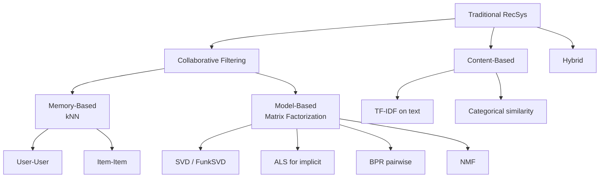

> *"The classics still ship a lot of revenue. Know them cold."*

## Introduction

Before deep learning ate the world, recommender systems were powered by **collaborative filtering (CF)**, **content-based filtering**, and **matrix factorization**. These methods remain the production backbone in many shops because they are fast, interpretable, robust on small data, and a strong baseline you must beat.

This post walks through CF (memory-based and model-based), content-based, hybrid methods, and matrix factorization with code on MovieLens.

## 1. Family Tree



## 2. Collaborative Filtering: Memory-Based

### 2.1 User-User CF
Predict user $u$'s rating for item $i$ as a weighted average of similar users' ratings:

$$\hat r_{ui} = \bar r_u + \frac{\sum_{v \in N_k(u)} \text{sim}(u,v) (r_{vi} - \bar r_v)}{\sum_{v \in N_k(u)} |\text{sim}(u,v)|}$$

Similarity is usually **cosine** or **Pearson correlation** on overlapping ratings.

### 2.2 Item-Item CF (Amazon, 2003)
Predict from items the user already rated:

$$\hat r_{ui} = \frac{\sum_{j \in N_k(i)} \text{sim}(i, j) \cdot r_{uj}}{\sum_{j} |\text{sim}(i,j)|}$$

**Why item-item won:** item catalogs are smaller and more stable than user bases, similarities can be precomputed offline.

### Pros & Cons of kNN CF

| Pros | Cons |
|---|---|
| Easy to explain ("because you liked X") | Sparse → noisy similarities |
| No training, just precomputation | Doesn't scale gracefully past ~10M items |
| Adapts instantly to new ratings | Cold start for new users/items |
| Robust on dense subgraphs | Popularity bias |

### Code: Item-Item CF on MovieLens 1M

```python
# pip install pandas scipy scikit-learn
import pandas as pd
from scipy.sparse import csr_matrix
from sklearn.metrics.pairwise import cosine_similarity

ratings = pd.read_csv("ratings.dat", sep="::",
                     names=["user", "item", "rating", "ts"],
                     engine="python")
user_idx = {u: i for i, u in enumerate(ratings["user"].unique())}
item_idx = {it: i for i, it in enumerate(ratings["item"].unique())}
n_u, n_i = len(user_idx), len(item_idx)

mat = csr_matrix(
    (ratings["rating"].values,
     ([user_idx[u] for u in ratings["user"]],
      [item_idx[it] for it in ratings["item"]])),
    shape=(n_u, n_i)
)

sim = cosine_similarity(mat.T, dense_output=False)  # item x item

def recommend(user, k=10):
    u = user_idx[user]
    user_vec = mat[u].toarray().ravel()
    scores = sim.dot(user_vec)
    scores[user_vec > 0] = -1   # mask already-rated
    return scores.argsort()[::-1][:k]
```

## 3. Matrix Factorization

The big idea: approximate the sparse user-item matrix as the product of two low-rank matrices $P \in \mathbb{R}^{|U| \times d}$ and $Q \in \mathbb{R}^{|I| \times d}$:

$$\hat r_{ui} = p_u^\top q_i$$

### 3.1 FunkSVD (Netflix Prize, 2006)
Optimize MSE with SGD:

$$\min_{P,Q} \sum_{(u,i) \in \Omega} (r_{ui} - p_u^\top q_i)^2 + \lambda (\|p_u\|^2 + \|q_i\|^2)$$

### 3.2 ALS for Implicit Feedback (Hu, Koren, Volinsky 2008)
For implicit signals (clicks, plays), define confidence $c_{ui} = 1 + \alpha r_{ui}$ and preference $p_{ui} = \mathbb{1}[r_{ui} > 0]$:

$$\min_{P,Q} \sum_{u,i} c_{ui} (p_{ui} - p_u^\top q_i)^2 + \lambda(\|P\|^2+\|Q\|^2)$$

Solved by alternating: hold $Q$ fixed, solve closed-form for $P$, swap.

### 3.3 BPR (Bayesian Personalized Ranking, Rendle 2009)
Pairwise: positive $i$ ranked above negative $j$:

$$\max \sum_{(u, i^+, j^-)} \log \sigma(p_u^\top q_{i^+} - p_u^\top q_{j^-})$$

```python
# pip install implicit
import implicit
from scipy.sparse import csr_matrix

# Build user x item matrix of binary or count interactions
model = implicit.als.AlternatingLeastSquares(
    factors=64, regularization=0.01, iterations=20, alpha=40.0)
model.fit(mat)

# Top-10 recommendations for user 0
ids, scores = model.recommend(0, mat[0], N=10, filter_already_liked_items=True)
```

### Pros & Cons of MF

| Pros | Cons |
|---|---|
| Captures latent structure | Cold start (no embeddings for new entities) |
| Compact, fast inference | Linear in features only |
| Easy to extend (biases, time decay) | Hard to add side features cleanly |

## 4. Content-Based Filtering

Build profiles from item content (text, tags, images), then recommend items similar to those the user has liked.

### 4.1 TF-IDF + Cosine

$$\text{sim}(u, i) = \cos(\bar v_u, v_i), \quad \bar v_u = \frac{1}{|I_u|}\sum_{j \in I_u} v_j$$

```python
from sklearn.feature_extraction.text import TfidfVectorizer
from sklearn.metrics.pairwise import cosine_similarity
import numpy as np

movies = pd.read_csv("movies.csv")  # MovieLens
movies["text"] = movies["title"] + " " + movies["genres"].str.replace("|", " ")
tfidf = TfidfVectorizer(stop_words="english").fit_transform(movies["text"])
sim = cosine_similarity(tfidf)

def content_recs(item_id, k=10):
    idx = movies.index[movies["movieId"] == item_id][0]
    scores = sim[idx]
    top = np.argsort(scores)[::-1][1:k+1]
    return movies.iloc[top]
```

### Pros & Cons

| Pros | Cons |
|---|---|
| Handles **item cold start** | Limited by quality of content features |
| Explainable ("similar to X you liked") | No serendipity — recs are too similar |
| Independent of user base size | Requires content extraction pipeline |

## 5. Hybrid Methods

### 5.1 Weighted hybrid
$\hat s = \alpha \cdot s_{\text{CF}} + (1-\alpha) \cdot s_{\text{CB}}$

### 5.2 Feature-augmented MF
Treat content vectors as priors for item embeddings (e.g., **CTR** — Wang & Blei 2011).

### 5.3 LightFM
Combines MF with feature embeddings — handles cold start.

```python
# pip install lightfm
from lightfm import LightFM
from lightfm.data import Dataset
from lightfm.evaluation import precision_at_k

ds = Dataset()
ds.fit(users=ratings["user"], items=ratings["item"],
       item_features=movies["genres"].str.split("|").explode().unique())
(interactions, _) = ds.build_interactions(
    ratings[["user", "item"]].itertuples(index=False))
model = LightFM(loss="warp", no_components=64)
model.fit(interactions, epochs=20, num_threads=4)
print("precision@10:", precision_at_k(model, interactions, k=10).mean())
```

## 6. When to Use What

| Scenario | Choose |
|---|---|
| <100K interactions, sparse | Item-item CF, TF-IDF CB |
| Implicit signals at scale | ALS (`implicit`) |
| Ranking objective, pairwise data | BPR (`implicit`) |
| Need side features, cold start | LightFM, hybrid |
| Latent factor exploration | FunkSVD |

## 7. Production Tips

- Precompute item-item similarity **once a day**; serve from KV store.
- For ALS, **regularize aggressively** on long-tail items.
- **Time-decay** ratings: $w_{ui} = e^{-\lambda (t_{\text{now}} - t_{ui})}$.
- Mix CF and CB to bridge cold-start without changing UX.
- Keep CF as a **fallback** when the deep model is degraded.

## 8. Pitfalls

1. Computing similarity on raw counts instead of TF-IDF or BM25 — popularity dominates.
2. Using random splits instead of time-based for evaluation.
3. Not subtracting user bias before computing similarity (some users rate everything 5).
4. Treating implicit clicks as ratings (use ALS for implicit).
5. Forgetting to filter already-interacted items at inference.

## 9. Public Datasets

- **MovieLens** — https://grouplens.org/datasets/movielens/ (canonical for CF)
- **BookCrossing** — http://www2.informatik.uni-freiburg.de/~cziegler/BX/
- **Amazon Reviews** — https://nijianmo.github.io/amazon/ (CB rich content)
- **Last.fm** — http://ocelma.net/MusicRecommendationDataset/
- **Jester Jokes** — https://eigentaste.berkeley.edu/dataset/

## 10. Further Reading

- Koren, Bell, Volinsky, *Matrix Factorization Techniques for Recommender Systems* (IEEE Computer 2009)
- Sarwar et al., *Item-Based Collaborative Filtering Recommendation Algorithms* (WWW 2001)
- Rendle, *BPR: Bayesian Personalized Ranking* (UAI 2009)
- Hu et al., *Collaborative Filtering for Implicit Feedback Datasets* (ICDM 2008)
- Pazzani & Billsus, *Content-Based Recommendation Systems* (2007)
