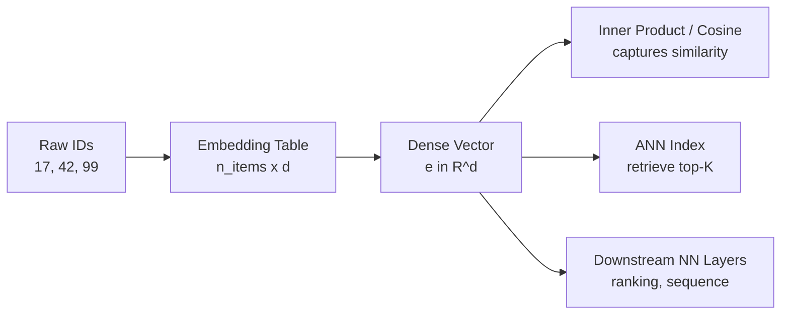
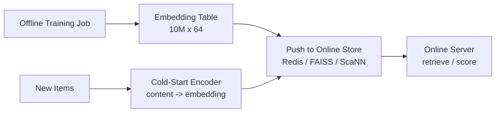

> *"Embeddings turned the entire field of RecSys into geometry."*

## Introduction

Embeddings are dense, learned vector representations of users, items, words, or any discrete entity. They power every modern retrieval system: two-tower retrieval, vector search, semantic recommendation, transformer rankers — none of them exist without embeddings.

This post walks through the embedding revolution: **Word2Vec**, **GloVe**, **fastText**, then how the same recipe was repurposed for items (**item2vec**, **prod2vec**), and what makes a good embedding in production.

## 1. Why Embeddings Work

Discrete IDs (item_42, user_7) have no structure. Embeddings map them to $\mathbb{R}^d$ where geometric relations capture semantics — cosine similarity equals "relatedness".



## 2. Word2Vec (Mikolov 2013)

Two variants:

- **Skip-gram**: predict context words from a target word
- **CBOW**: predict target word from context

Skip-gram with **negative sampling** is the standard:

$$\mathcal L = \log \sigma(v_c^\top v_w) + \sum_{j=1}^k \mathbb{E}_{w_j \sim P_n}[\log \sigma(-v_{w_j}^\top v_w)]$$

```python
# pip install gensim
from gensim.models import Word2Vec

sentences = [["king", "queen", "royal"], ["man", "woman", "person"]]
model = Word2Vec(sentences, vector_size=100, window=5, min_count=1,
                 sg=1,   # skip-gram
                 negative=5, epochs=10)
print(model.wv.most_similar("king"))
```

**Trivia:** `king - man + woman ≈ queen` — analogies emerge from training, not by design.

## 3. GloVe (Pennington 2014)

Factorize the **log co-occurrence matrix**:

$$\mathcal L = \sum_{i,j} f(X_{ij}) (v_i^\top v_j + b_i + b_j - \log X_{ij})^2$$

GloVe is **global** (uses full corpus stats) vs Word2Vec's **local** windows. In practice both give similar quality on standard tasks.

## 4. fastText (Bojanowski 2017)

Adds **subword n-grams** so OOV words and morphology are handled. Embedding of a word = sum of its char-n-gram embeddings. Critical for languages with rich morphology and for cold-start on new tokens.

## 5. item2vec / prod2vec (Barkan & Koenigstein 2016, Grbovic 2015)

Insight: treat **user sessions as sentences**, **items as words**. Train Word2Vec on click streams.

```python
sessions = [
    ["item_3", "item_8", "item_42"],
    ["item_8", "item_9", "item_11", "item_3"],
    # ...
]
model = Word2Vec(sessions, vector_size=64, window=5, sg=1, negative=10, epochs=20)
print(model.wv.most_similar("item_3", topn=10))
```

Airbnb's *real-time listings embeddings* (Grbovic, KDD 2018) extended this with:
- **Booked listing as global context** (positive forced into every window)
- **Same-market negative sampling** for tighter neighborhoods
- **Type embeddings** for cold-start listings

### Pros & Cons of session-based embeddings

| Pros | Cons |
|---|---|
| Trivial to scale (gensim, Spark) | No collaborative-filtering signal across users |
| Captures co-occurrence directly | Sequence order lost (mostly) |
| Strong cold-start with subword/metadata | Doesn't model time gaps |

## 6. Doc2Vec, StarSpace, fastFM

- **Doc2Vec** (Le & Mikolov 2014): add a paragraph vector — embed users by treating "user_id" as a tag on all their sessions.
- **StarSpace** (Facebook 2017): general framework for embedding anything via entity-pair losses.
- **fastFM**: factorization machines for ID + feature embeddings.

## 7. Modern Embeddings: Transformers and Beyond

Today, embeddings come from:

- **Sentence-Transformers / SimCSE** for text
- **CLIP** for images & text in joint space
- **Two-tower DNNs** (Blog 09) for personalized retrieval
- **Generative LLM-derived embeddings** (Blog 15)

The principles are the same — distance corresponds to semantic relatedness.

## 8. Training-Time Tricks

### 8.1 Negative Sampling Distribution
Use $P_n(w) \propto f(w)^{3/4}$ — softer than unigram, sharper than uniform.

### 8.2 Subsampling Frequent Items
Drop very common items with probability $1 - \sqrt{t/f}$. Prevents popular items from dominating gradients.

### 8.3 Dim Choice
Typical: 32 to 256. Bigger isn't always better — diminishing returns past 128 for most catalogs. **Memory** at serving time often forces $d \leq 64$ for billion-item catalogs.

### 8.4 Initialization
Xavier for dense; uniform $\pm 0.5/d$ for embeddings.

## 9. Evaluating Embeddings

- **Intrinsic**: nearest neighbors, analogy tasks, clustering quality.
- **Extrinsic**: plug into a downstream model (ranker, retriever) and measure NDCG.
- **Cluster visualization** with UMAP / t-SNE — but treat with care, they distort distances.

```python
import umap, matplotlib.pyplot as plt
emb = model.wv.vectors
um = umap.UMAP(n_neighbors=15, min_dist=0.1).fit_transform(emb[:5000])
plt.scatter(um[:,0], um[:,1], s=1); plt.show()
```

## 10. Embeddings in Production



- **Refresh cadence**: daily or hourly retraining; **incremental updates** for hot items.
- **Versioning**: never overwrite — A/B compare versions in parallel.
- **Coverage**: hash unknown IDs to bucketed embeddings.
- **Dimensions per use case**: 32 for retrieval (memory), 128–256 for ranking.

## 11. End-to-End: prod2vec on RetailRocket

```python
import pandas as pd
from gensim.models import Word2Vec

events = pd.read_csv("events.csv")
events = events.sort_values(["visitorid", "timestamp"])
sessions = (events.groupby("visitorid")["itemid"]
                  .agg(list).tolist())
sessions = [list(map(str, s)) for s in sessions if len(s) >= 2]

model = Word2Vec(sessions, vector_size=64, window=5, sg=1, negative=20,
                 ns_exponent=0.75, epochs=10, workers=4, min_count=5)

# Recommend: for a given item, nearest neighbors
print(model.wv.most_similar("273944", topn=10))

# Recommend for a user: average their item embeddings
import numpy as np
user_items = [str(i) for i in events[events["visitorid"] == 102019]["itemid"]]
user_vec = np.mean([model.wv[i] for i in user_items if i in model.wv], axis=0)
print(model.wv.similar_by_vector(user_vec, topn=10))
```

## 12. Pitfalls

| Pitfall | Fix |
|---|---|
| Including rare items → noisy vectors | `min_count >= 5` |
| Treating embedding cosine as a probability | Calibrate, or use it only for ranking |
| Updating embeddings without snapshot tests | Track nearest-neighbor stability |
| Random init each retrain → unstable downstream | Warm-start from previous run |
| Not L2-normalizing before ANN | Most ANN libs assume cosine = inner product on unit sphere |

## 13. Public Datasets

- **Wikipedia / Common Crawl** (Word2Vec, GloVe baselines)
- **Amazon Reviews 2018** — co-purchase graphs for item2vec — https://nijianmo.github.io/amazon/
- **MovieLens tag-genome** — semantic item tags — https://grouplens.org/datasets/movielens/tag-genome/
- **Last.fm sessions** — http://ocelma.net/MusicRecommendationDataset/
- **Spotify MPD** — playlist sequences perfect for song2vec — https://www.aicrowd.com/challenges/spotify-million-playlist-dataset-challenge

## 14. Further Reading

- Mikolov et al., *Distributed Representations of Words and Phrases* (NeurIPS 2013)
- Pennington et al., *GloVe* (EMNLP 2014)
- Bojanowski et al., *Enriching Word Vectors with Subword Information* (2017)
- Grbovic et al., *Real-time Personalization using Embeddings for Search Ranking at Airbnb* (KDD 2018) — must-read
- Barkan & Koenigstein, *Item2Vec* (MLSP 2016)
- Reimers & Gurevych, *Sentence-BERT* (EMNLP 2019)
