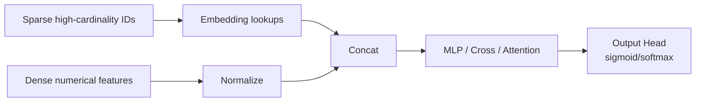
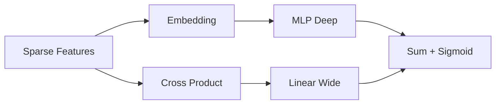

> *"The decade that turned recommendation from matrix algebra into model engineering."*

## Introduction

Around 2016, deep learning swept through RecSys. **Neural Collaborative Filtering (NCF)**, **Wide & Deep**, **DeepFM**, and **YouTubeDNN** redefined how the field thought about user-item modeling. They unified retrieval, ranking, side features, and cross effects into a single trainable pipeline.

This post is your guided tour of the foundational neural recommenders: when they shine, where they fail, and how to train them.

## 1. Why Neural?



Neural models give us:
- Automatic **feature interactions** (no hand-crafted crosses)
- Native handling of **multi-modal** features (text, image embeddings)
- **End-to-end** training of representations
- Ability to share layers across **multi-task heads** (Blog 12)

## 2. Neural Collaborative Filtering (NCF, He et al. 2017)

The first big neural CF paper. Replaces the dot product of MF with an MLP:

$$\hat r_{ui} = \sigma(h^\top \phi([p_u, q_i]))$$

Variants:
- **GMF**: generalized MF — element-wise product then linear (≈ MF)
- **MLP**: concat then MLP
- **NeuMF**: concat of GMF and MLP outputs before the final head

### PyTorch Skeleton
```python
import torch, torch.nn as nn

class NeuMF(nn.Module):
    def __init__(self, n_users, n_items, d=32):
        super().__init__()
        self.u_gmf = nn.Embedding(n_users, d)
        self.i_gmf = nn.Embedding(n_items, d)
        self.u_mlp = nn.Embedding(n_users, d)
        self.i_mlp = nn.Embedding(n_items, d)
        self.mlp = nn.Sequential(
            nn.Linear(2*d, 64), nn.ReLU(),
            nn.Linear(64, 32), nn.ReLU())
        self.out = nn.Linear(d + 32, 1)

    def forward(self, u, i):
        gmf = self.u_gmf(u) * self.i_gmf(i)
        mlp = self.mlp(torch.cat([self.u_mlp(u), self.i_mlp(i)], 1))
        return torch.sigmoid(self.out(torch.cat([gmf, mlp], 1))).squeeze(-1)
```

### Pros & Cons

| Pros | Cons |
|---|---|
| Easy entry to neural recs | Subsequent work (Rendle 2020) showed MF with right tuning often matches NeuMF |
| Composable with side features | No explicit modeling of feature interactions |
| Trains in seconds on MovieLens | Cold start unsolved |

## 3. Wide & Deep (Google, 2016)

Combines:
- **Wide** part: linear model on cross-product features → memorization
- **Deep** part: MLP on embeddings → generalization

$$P(y=1) = \sigma(w_{\text{wide}}^\top [x, \phi(x)] + w_{\text{deep}}^\top a^{(L)} + b)$$



Used at Google Play. The "wide" arm learns rules ("if app_X installed AND age_18-24 → click"), the deep arm generalizes to unseen combinations.

### Pros & Cons

| Pros | Cons |
|---|---|
| Both memorization & generalization | Wide arm needs feature engineering |
| Battle-tested in prod | Two optimizers (FTRL + Adam) is fiddly |

## 4. DeepFM (Huawei, 2017)

Replaces the Wide arm with a **Factorization Machine** so all 2nd-order interactions are learned automatically:

$$\hat y = \sigma\left(w_0 + \sum_i w_i x_i + \sum_{i<j} \langle v_i, v_j \rangle x_i x_j + \text{MLP}([v_1, \ldots, v_n])\right)$$

The FM and DNN **share embeddings** — that's the magic. No feature engineering.

### PyTorch sketch
```python
class DeepFM(nn.Module):
    def __init__(self, field_dims, k=8, hidden=(64,32)):
        super().__init__()
        self.embed = nn.ModuleList([nn.Embedding(d, k) for d in field_dims])
        self.linear = nn.ModuleList([nn.Embedding(d, 1) for d in field_dims])
        layers, in_dim = [], k * len(field_dims)
        for h in hidden:
            layers += [nn.Linear(in_dim, h), nn.ReLU(), nn.Dropout(0.2)]
            in_dim = h
        layers += [nn.Linear(in_dim, 1)]
        self.mlp = nn.Sequential(*layers)

    def forward(self, x):  # x: [B, n_fields] long
        e = torch.stack([emb(x[:, i]) for i, emb in enumerate(self.embed)], 1)  # B, F, k
        linear = sum(emb(x[:, i]) for i, emb in enumerate(self.linear)).squeeze(-1)
        sum_sq = e.sum(1)**2
        sq_sum = (e**2).sum(1)
        fm = 0.5 * (sum_sq - sq_sum).sum(1, keepdim=True)
        deep = self.mlp(e.flatten(1))
        return torch.sigmoid(linear.unsqueeze(-1) + fm + deep).squeeze(-1)
```

### Pros & Cons

| Pros | Cons |
|---|---|
| No manual crossing | Quadratic FM cost on many fields |
| Shared embeddings = fewer params | Still 2nd-order only — beat by AutoInt/xDeepFM (Blog 07) |

## 5. YouTube DNN (Covington 2016)

Two networks:

1. **Candidate generation**: multi-class softmax over the catalog (sampled). Treats it as extreme classification.
2. **Ranking**: deep MLP scoring (impression, candidate, context) for expected watch time.

Key features used at YouTube:
- User history (avg of last-N video embeddings)
- Search tokens
- "Example age" feature to learn freshness without leaking it

This is one of the most-cited industry papers — read it twice.

## 6. AutoRec (Sedhain 2015)

Autoencoders for CF: reconstruct the user-item interaction vector through a bottleneck. Surprisingly competitive baseline. Variant: **Mult-VAE** (Liang 2018) uses a variational autoencoder with multinomial likelihood — strong on implicit feedback.

```python
class MultVAE(nn.Module):
    def __init__(self, n_items, d=200):
        super().__init__()
        self.enc = nn.Sequential(nn.Linear(n_items, 600), nn.Tanh(), nn.Linear(600, 2*d))
        self.dec = nn.Sequential(nn.Linear(d, 600), nn.Tanh(), nn.Linear(600, n_items))
        self.d = d

    def forward(self, x):  # x: B x n_items normalized
        mu_logvar = self.enc(x)
        mu, logvar = mu_logvar.chunk(2, dim=1)
        z = mu + torch.randn_like(mu) * (0.5 * logvar).exp()
        return self.dec(z), mu, logvar
```

## 7. DSSM / Two-Tower (Microsoft, 2013)

Separate encoders for query/user and item, trained with cosine + softmax. The forefather of two-tower retrieval — full treatment in [Blog 09](./09-two-tower.md).

## 8. Pros & Cons of Neural Models Overall

| Pros | Cons |
|---|---|
| End-to-end learnable representations | Hungry for data |
| Side features integrated naturally | Hungry for GPUs / TPUs |
| Composable into multi-task systems | Less interpretable than MF or kNN |
| State-of-the-art when paired with right losses | More moving parts — easier to ship a regression |

## 9. Training Recipe

```python
# Training loop sketch
opt = torch.optim.Adam(model.parameters(), lr=1e-3, weight_decay=1e-6)
bce = nn.BCELoss()
for epoch in range(20):
    for u, i, y in loader:
        u, i, y = u.cuda(), i.cuda(), y.float().cuda()
        opt.zero_grad()
        p = model(u, i)
        loss = bce(p, y)
        loss.backward()
        opt.step()
```

**Tips:**
- Train with **implicit positives + sampled negatives** for top-K tasks
- Use **BPR or sampled softmax** when output space is huge
- **Embedding L2** regularization, not weight L2
- Monitor **GAUC** + LogLoss in tandem; if AUC up but LogLoss up → calibration broken
- **Early stopping** on a time-based holdout

## 10. When to Use What

| Setup | Choose |
|---|---|
| Small data (<1M interactions) | MF / ALS, sometimes NeuMF |
| Mid (1M–100M) with side features | DeepFM, Wide&Deep |
| Huge catalog, candidate generation | YouTube DNN / Two-tower |
| Implicit feedback at scale | Mult-VAE, ALS, BPR |
| Need interactions explicitly | DeepFM → xDeepFM → AutoInt |

## 11. Production Tips

- **Serve embeddings**, not the full model, for retrieval.
- Use **mixed precision** (fp16/bf16) — 2× throughput, no accuracy loss.
- **Sharded embedding tables** for catalogs >10M items.
- Re-train **daily** (warm-start), retrain **from scratch monthly**.
- Always log **feature values + predicted score + serving model version**.

## 12. Pitfalls

1. **Embedding collapse** when too few epochs or zero L2 reg.
2. Forgetting to mask **already-interacted** items at inference.
3. Treating dot product output as a calibrated probability.
4. **Train/serve skew** on categorical hashing seeds.
5. Using global random splits → temporal leakage. Always split by time.

## 13. Public Datasets

- **MovieLens 1M/25M** — https://grouplens.org/datasets/movielens/
- **Criteo CTR** — https://www.kaggle.com/c/criteo-display-ad-challenge
- **Avazu CTR** — https://www.kaggle.com/c/avazu-ctr-prediction
- **Amazon Reviews 2018** — https://nijianmo.github.io/amazon/
- **Pinterest dataset** (for graph + image features)

## 14. Further Reading

- He et al., *Neural Collaborative Filtering* (WWW 2017)
- Cheng et al., *Wide & Deep Learning for Recommender Systems* (DLRS 2016)
- Guo et al., *DeepFM* (IJCAI 2017)
- Covington et al., *Deep Neural Networks for YouTube Recommendations* (RecSys 2016)
- Sedhain et al., *AutoRec* (WWW 2015)
- Liang et al., *Variational Autoencoders for Collaborative Filtering* (WWW 2018)
- Rendle et al., *Neural Collaborative Filtering vs Matrix Factorization Revisited* (RecSys 2020) — important counterpoint
