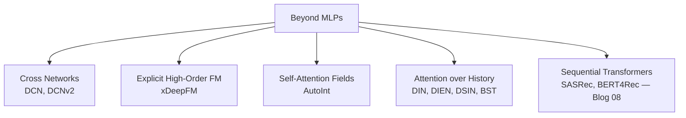
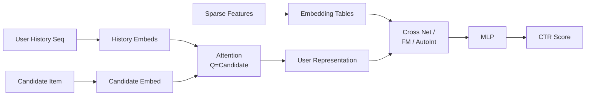

> *"When MLPs aren't enough — learning the right interactions explicitly."*

## Introduction

Vanilla MLPs in deep recommenders learn feature interactions only implicitly and inefficiently. A series of architectures fixed this: **DCN** does multiplicative cross terms, **xDeepFM** combines explicit and implicit, **AutoInt** uses self-attention over fields, **DIN/DIEN** model user interest as attention over historical behavior. These models are the workhorses of Alibaba/ByteDance/Kuaishou-scale CTR systems.

## 1. Map of the Territory



## 2. DCN: Deep & Cross Network (Wang 2017, v2 in 2020)

Replaces the wide arm of Wide&Deep with a **cross network** of L layers:

$$x_{l+1} = x_0 (W_l x_l + b_l) + x_l$$

Each layer adds an explicit polynomial degree. L layers → (L+1)-th order interactions.

**DCN-v2** improves with a low-rank factorization $W_l = U_l V_l^\top$:

```python
import torch.nn as nn, torch

class CrossNetV2(nn.Module):
    def __init__(self, dim, n_layers=3, rank=16):
        super().__init__()
        self.U = nn.ParameterList([nn.Parameter(torch.randn(dim, rank)*0.01) for _ in range(n_layers)])
        self.V = nn.ParameterList([nn.Parameter(torch.randn(rank, dim)*0.01) for _ in range(n_layers)])
        self.b = nn.ParameterList([nn.Parameter(torch.zeros(dim)) for _ in range(n_layers)])

    def forward(self, x0):
        x = x0
        for U, V, b in zip(self.U, self.V, self.b):
            x = x0 * (V.T @ (U @ x.T)).T + b + x
        return x
```

**Pros:** explicit polynomial interactions, fewer params than DNN of equivalent expressivity.
**Cons:** still combines all fields uniformly — AutoInt addresses this.

## 3. xDeepFM (Lian 2018)

Adds a **Compressed Interaction Network (CIN)** that learns explicit **vector-wise** high-order interactions (vs DCN's bit-wise).

$$X^k_h = \sum_{i,j} W^{k,h}_{ij} (X^{k-1}_i \odot X^0_j)$$

CIN + DNN + linear, jointly trained.

**Pros:** vector-wise interactions, often higher CTR vs DeepFM.
**Cons:** CIN is expensive — quadratic in number of feature maps per layer.

## 4. AutoInt (Song 2019)

Multi-head **self-attention** over feature embeddings (treating fields as tokens):

$$\text{Att}(Q,K,V) = \text{softmax}(QK^\top / \sqrt{d}) V$$

The model **learns which field interactions matter** rather than enumerating all pairs.

```python
class AutoInt(nn.Module):
    def __init__(self, field_dims, d=16, heads=2, blocks=3):
        super().__init__()
        self.embeds = nn.ModuleList([nn.Embedding(n, d) for n in field_dims])
        enc = nn.TransformerEncoderLayer(d_model=d, nhead=heads, dim_feedforward=64,
                                         batch_first=True, dropout=0.1)
        self.transformer = nn.TransformerEncoder(enc, num_layers=blocks)
        self.out = nn.Linear(d * len(field_dims), 1)

    def forward(self, x):  # x: [B, F]
        e = torch.stack([emb(x[:, i]) for i, emb in enumerate(self.embeds)], 1)  # B, F, d
        h = self.transformer(e)                  # B, F, d
        return torch.sigmoid(self.out(h.flatten(1))).squeeze(-1)
```

**Pros:** interpretable attention weights, automatic feature selection.
**Cons:** more parameters, careful tuning required.

## 5. DIN: Deep Interest Network (Alibaba 2018)

Key idea: a user's interest is **specific to the candidate**. Use attention over historical items, with the candidate as the query:

$$a_i = \text{softmax}\left( \text{MLP}(e_i, e_{\text{cand}}, e_i \odot e_{\text{cand}}, e_i - e_{\text{cand}}) \right)$$

$$v_{\text{user}} = \sum_i a_i e_i$$

```python
class DIN(nn.Module):
    def __init__(self, n_items, d=32):
        super().__init__()
        self.item_emb = nn.Embedding(n_items, d)
        self.att_mlp = nn.Sequential(nn.Linear(4*d, 64), nn.ReLU(), nn.Linear(64, 1))
        self.scorer = nn.Sequential(nn.Linear(2*d, 64), nn.ReLU(), nn.Linear(64, 1))

    def forward(self, hist, cand):  # hist: B,L  cand: B
        h_emb = self.item_emb(hist)             # B, L, d
        c_emb = self.item_emb(cand).unsqueeze(1).expand_as(h_emb)
        a_in = torch.cat([h_emb, c_emb, h_emb*c_emb, h_emb-c_emb], -1)
        a = self.att_mlp(a_in).squeeze(-1).softmax(-1)
        u_emb = (a.unsqueeze(-1) * h_emb).sum(1)  # B, d
        return torch.sigmoid(self.scorer(torch.cat([u_emb, self.item_emb(cand)], -1))).squeeze(-1)
```

**Variants:**
- **DIEN**: GRU + attention to model interest *evolution*
- **DSIN**: divides history into sessions; intra-session transformer + inter-session interaction
- **BST** (Behavior Sequence Transformer): replaces GRU/attention with a Transformer block

**Pros:** state-of-the-art for industrial CTR.
**Cons:** sequence length L drives serving latency — typically L=50–500.

## 6. Comparison Table

| Model | Interaction Modeling | Sequence-aware | Strength | Weakness |
|---|---|---|---|---|
| DeepFM | 2nd-order auto + MLP | ✗ | Simple, strong baseline | Quadratic FM cost |
| DCN-v2 | Explicit polynomial | ✗ | Compact, easy to train | All-field interactions |
| xDeepFM | Vector-wise explicit | ✗ | High lift in ads | Heavy compute |
| AutoInt | Self-attention over fields | ✗ | Interpretable | More params |
| DIN | Attention over history | ✓ | Industry SOTA CTR | Latency scales w/ L |
| DIEN | GRU + attention | ✓ | Models interest drift | Complex training |
| BST | Transformer over history | ✓ | Cleanest formulation | Compute heavy |

## 7. Architecture Diagram



## 8. Training Tips

- **Bucketize numerical features**, then embed. Almost always lifts vs raw normalization.
- For DIN-style models, **mask padding** in attention.
- Use **sampled softmax** when the output space is large (item-id classification head).
- **Gradient clipping** at 1.0 stabilizes attention models.
- **Adam + warmup** for transformer-based variants.

## 9. End-to-End: DCN-v2 on Criteo

```python
# pip install torch pandas pyarrow
import pandas as pd, torch
from torch.utils.data import DataLoader, TensorDataset

df = pd.read_parquet("criteo_subsample.parquet")  # 1M rows ~ enough
cat_cols = [c for c in df.columns if c.startswith("C")]
num_cols = [c for c in df.columns if c.startswith("I")]

# Hash trick on categoricals
for c in cat_cols:
    df[c] = df[c].fillna("MISS").astype(str).apply(lambda x: hash(x) % 100_000)
df[num_cols] = df[num_cols].fillna(0).pipe(lambda x: (x.clip(lower=0)+1).pow(0.5))

X_cat = torch.tensor(df[cat_cols].values, dtype=torch.long)
X_num = torch.tensor(df[num_cols].values, dtype=torch.float)
y = torch.tensor(df["label"].values, dtype=torch.float)

class DCNv2(torch.nn.Module):
    def __init__(self, n_cat, hash_size=100_000, d=16):
        super().__init__()
        self.emb = torch.nn.ModuleList([torch.nn.Embedding(hash_size, d) for _ in range(n_cat)])
        in_dim = n_cat * d + 13
        self.cross = CrossNetV2(in_dim, n_layers=3, rank=16)
        self.deep = torch.nn.Sequential(
            torch.nn.Linear(in_dim, 256), torch.nn.ReLU(),
            torch.nn.Linear(256, 128), torch.nn.ReLU())
        self.head = torch.nn.Linear(in_dim + 128, 1)

    def forward(self, xc, xn):
        e = torch.cat([emb(xc[:, i]) for i, emb in enumerate(self.emb)], 1)
        x0 = torch.cat([e, xn], 1)
        return torch.sigmoid(self.head(torch.cat([self.cross(x0), self.deep(x0)], 1))).squeeze(-1)

model = DCNv2(n_cat=len(cat_cols)).cuda()
opt = torch.optim.Adam(model.parameters(), lr=1e-3)
ds = DataLoader(TensorDataset(X_cat, X_num, y), batch_size=4096, shuffle=True)
for epoch in range(3):
    for xc, xn, yy in ds:
        xc, xn, yy = xc.cuda(), xn.cuda(), yy.cuda()
        p = model(xc, xn)
        loss = torch.nn.functional.binary_cross_entropy(p, yy)
        opt.zero_grad(); loss.backward(); opt.step()
```

## 10. Production Tips

- For DIN-family, **cache user history embeddings** so only the candidate side is computed per request.
- **TensorRT / ONNX** for ranking models — 3–5× speedup typical.
- Distillation: train a heavy AutoInt then distill into a smaller MLP for tight-SLO ranking.
- **Knowledge distillation** from a deep teacher into a shallow student improves p99 latency dramatically.

## 11. Pitfalls

1. Hash collisions on categorical IDs — use 100K+ buckets per high-cardinality field.
2. Forgetting to use **layer norm** in transformer-based variants — training diverges.
3. Treating CTR head output as **calibrated** without temperature scaling.
4. Position bias confounds attention — always include position as a feature *or* model it explicitly (Blog 17).

## 12. Public Datasets

- **Taobao Ad Display/Click** — https://tianchi.aliyun.com/dataset/56 (DIN's canonical eval)
- **Criteo** — https://www.kaggle.com/c/criteo-display-ad-challenge
- **Avazu** — https://www.kaggle.com/c/avazu-ctr-prediction
- **Amazon Books / Electronics** — https://nijianmo.github.io/amazon/ (used in DIEN paper)
- **iPinYou** — http://contest.ipinyou.com/

## 13. Further Reading

- Wang et al., *Deep & Cross Network (DCN)* (ADKDD 2017) and *DCN-v2* (WWW 2021)
- Lian et al., *xDeepFM* (KDD 2018)
- Song et al., *AutoInt* (CIKM 2019)
- Zhou et al., *DIN: Deep Interest Network for CTR Prediction* (KDD 2018)
- Zhou et al., *DIEN: Deep Interest Evolution Network* (AAAI 2019)
- Feng et al., *DSIN* (IJCAI 2019)
- Chen et al., *Behavior Sequence Transformer (BST)* (DLP-KDD 2019)
