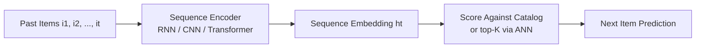
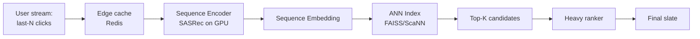

> *"Users aren't bags of items. They're trajectories."*

## Introduction

Static models treat a user as an unordered set of past interactions. But order **matters**: what you watched 30 seconds ago predicts the next view more than what you watched 30 days ago. **Sequential recommenders** treat user behavior as a sequence and predict the next item. This post covers RNN-, CNN-, and Transformer-based sequential models and how to deploy them.

## 1. Why Sequence-Aware



Use cases:
- News feeds (TikTok, X)
- E-commerce ("just-browsed" personalization)
- Music streaming (next track)
- Session-based recs for anonymous users

## 2. GRU4Rec (Hidasi 2015)

First strong neural session-based model. RNN over the click sequence:

$$h_t = \text{GRU}(x_t, h_{t-1}), \quad \hat y = \text{softmax}(W h_t)$$

With **session-parallel mini-batches** (one batch row = one ongoing session) and **TOP1/BPR-max** losses for ranking.

```python
import torch.nn as nn

class GRU4Rec(nn.Module):
    def __init__(self, n_items, d=64):
        super().__init__()
        self.emb = nn.Embedding(n_items, d)
        self.gru = nn.GRU(d, d, batch_first=True)
        self.out = nn.Linear(d, n_items)

    def forward(self, x):  # x: B, L
        h, _ = self.gru(self.emb(x))
        return self.out(h[:, -1])  # next-item logits
```

**Pros:** simple, fast, good baseline.
**Cons:** vanishing gradient on long sequences; can't see long-range dependencies cleanly.

## 3. SASRec: Self-Attentive Sequential Rec (Kang & McAuley 2018)

Replace RNN with a causal Transformer decoder. Predict next item with masked self-attention over history.

$$Z = \text{LayerNorm}(E + \text{PosEmb}); \quad H = \text{TransformerBlocks}(Z); \quad p(i | h) \propto e_i^\top h_t$$

```python
class SASRec(nn.Module):
    def __init__(self, n_items, max_len=50, d=64, heads=2, blocks=2):
        super().__init__()
        self.item_emb = nn.Embedding(n_items + 1, d, padding_idx=0)  # 0 = pad
        self.pos_emb = nn.Embedding(max_len, d)
        layer = nn.TransformerEncoderLayer(d, heads, 4*d, batch_first=True, dropout=0.2)
        self.transformer = nn.TransformerEncoder(layer, num_layers=blocks)
        self.max_len = max_len

    def forward(self, seq):  # B, L
        L = seq.size(1)
        mask = torch.triu(torch.ones(L, L, device=seq.device), 1).bool()
        pos = torch.arange(L, device=seq.device).expand_as(seq)
        x = self.item_emb(seq) + self.pos_emb(pos)
        h = self.transformer(x, mask=mask)
        return h            # B, L, d   (score against all items with dot product)
```

**Pros:** captures long-range dependencies, parallel training, strong empirically.
**Cons:** unidirectional — can't peek future context (intentional for causal).

## 4. BERT4Rec (Sun 2019)

Bidirectional masked transformer — the BERT recipe applied to user behavior:

- Randomly **mask** items in a sequence.
- Predict masked items from both sides.
- At inference, append a `[mask]` at the end and predict the next item.

$$\mathcal L = \sum_{i \in \text{masked}} -\log p(i_t | \text{seq}_{\setminus t})$$

**Pros:** bidirectional context improves accuracy.
**Cons:** train-test mismatch (mask at end vs random); slightly more compute.

## 5. Other Notable Sequential Models

| Model | Idea |
|---|---|
| **Caser** (Tang 2018) | CNN over the sequence (horizontal + vertical filters) — fast |
| **NextItNet** (Yuan 2019) | Dilated 1D convs for long sequences |
| **STAMP** (Liu 2018) | Attention with explicit short-term last-click bias |
| **GRU4Rec+** | Improved data augmentation + sampling |
| **TiSASRec** | SASRec + time interval embeddings |
| **DIN/DIEN/BST** | Industrial CTR-side sequence models (Blog 07) |
| **CL4SRec / DuoRec** | Contrastive learning for sequential recs |

## 6. Comparison

| Model | Architecture | Long-range | Bidirectional | Notes |
|---|---|---|---|---|
| GRU4Rec | GRU | Limited | ✗ | Baseline, fast |
| Caser | CNN | Limited | ✗ | Cheap inference |
| SASRec | Transformer | ✓ | ✗ | SOTA-ish, causal |
| BERT4Rec | Transformer | ✓ | ✓ | Strong but slower |
| TiSASRec | Transformer + time | ✓ | ✗ | Adds gap info |

## 7. End-to-End: Train SASRec on MovieLens 1M

```python
import pandas as pd, torch, numpy as np
from torch.utils.data import DataLoader, Dataset

ratings = pd.read_csv("ratings.dat", sep="::",
                     names=["user","item","rating","ts"], engine="python")
ratings = ratings.sort_values(["user","ts"])
user_seqs = ratings.groupby("user")["item"].apply(list).to_dict()

n_items = ratings["item"].max() + 1
MAX_LEN = 50

class SeqDataset(Dataset):
    def __init__(self, seqs):
        self.seqs = [s for s in seqs.values() if len(s) >= 3]
    def __len__(self): return len(self.seqs)
    def __getitem__(self, idx):
        s = self.seqs[idx][-MAX_LEN-1:]
        s = [0]*(MAX_LEN+1 - len(s)) + s
        return torch.tensor(s[:-1]), torch.tensor(s[1:])

loader = DataLoader(SeqDataset(user_seqs), batch_size=128, shuffle=True)
model = SASRec(n_items, max_len=MAX_LEN, d=64).cuda()
opt = torch.optim.Adam(model.parameters(), lr=1e-3)
ce = torch.nn.CrossEntropyLoss(ignore_index=0)

for epoch in range(10):
    for x, y in loader:
        x, y = x.cuda(), y.cuda()
        h = model(x)                                  # B, L, d
        logits = h @ model.item_emb.weight.T          # B, L, n_items
        loss = ce(logits.reshape(-1, n_items), y.reshape(-1))
        opt.zero_grad(); loss.backward(); opt.step()
```

## 8. Production Architecture



- **Stateful serving**: cache the encoder's output; only re-run when history changes.
- **Truncate** sequences to last-N (commonly N=50 or 200). Beyond ~500, returns diminish.
- For **anonymous sessions**, use SASRec/BERT4Rec directly. For logged-in users, combine with a long-term user embedding.

## 9. Pros & Cons Overall

| Pros | Cons |
|---|---|
| Captures temporal dynamics | More compute than static models |
| Works for anonymous sessions | Sensitive to noisy clicks |
| Naturally handles "what just happened?" | Needs ordered logs (must capture timestamps cleanly) |
| Strong evaluation on NDCG/HR | Cold start still hard |

## 10. Tips

- **Reverse-position embeddings** sometimes help — distance from the *end* matters most.
- **Augment** with item dropout / item replacement for regularization.
- Mix **contrastive learning** (CL4SRec) for low-data settings.
- For very long sequences, use **memory-efficient attention** (FlashAttention) or **sliding window**.

## 11. Pitfalls

1. **Leakage**: when splitting by sequence, the test "next" item must not be in train history.
2. **Random splits** for sequential models = nonsense.
3. Padding tokens leaking into attention — always use attention masks.
4. Treating mask token confidence as inference signal (BERT4Rec).
5. Ignoring time gaps — a click 5 minutes after vs 5 days after is not the same.

## 12. Public Datasets

- **MovieLens 1M / 25M** — temporal — https://grouplens.org/datasets/movielens/
- **Amazon Reviews 2018** — has per-user timestamps — https://nijianmo.github.io/amazon/
- **Yelp Open** — temporal reviews — https://www.yelp.com/dataset
- **Steam reviews** — game sequences — https://www.kaggle.com/datasets/tamber/steam-video-games
- **Diginetica / Yoochoose** — session-based RecSys Challenges — https://recsys.acm.org/
- **Tmall** — https://tianchi.aliyun.com/dataset/

## 13. Further Reading

- Hidasi et al., *Session-based Recommendations with Recurrent Neural Networks* (ICLR 2016)
- Kang & McAuley, *Self-Attentive Sequential Recommendation (SASRec)* (ICDM 2018)
- Sun et al., *BERT4Rec* (CIKM 2019)
- Tang & Wang, *Caser: Personalized Top-N Recommendation* (WSDM 2018)
- Yuan et al., *A Simple Convolutional Generative Network for Next Item Recommendation (NextItNet)* (WSDM 2019)
- Xie et al., *Contrastive Learning for Sequential Recommendation (CL4SRec)* (ICDE 2022)
