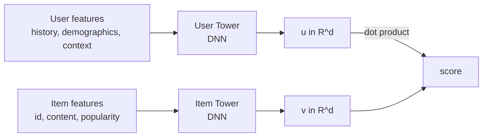
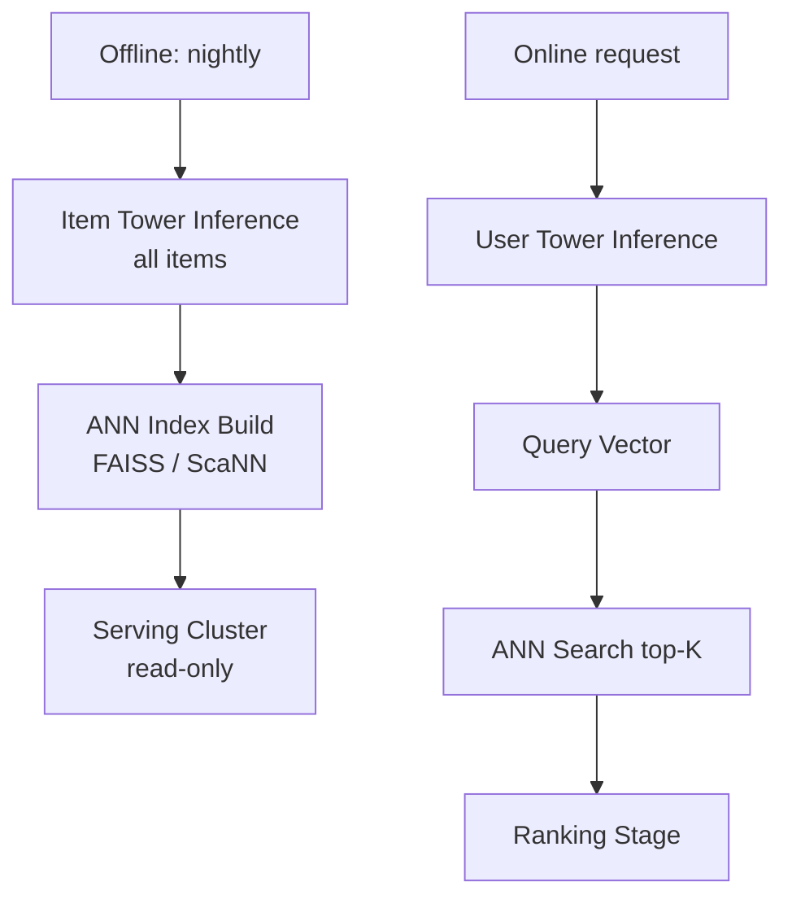

> *"YouTube, Pinterest, Amazon, Spotify, ByteDance — they all run two towers."*

## Introduction

Modern recommenders are **multi-stage pipelines**: retrieval narrows a billion-item catalog to hundreds; ranking picks the final order. The dominant retrieval architecture is the **two-tower neural network** — a user encoder and an item encoder that produce embeddings whose dot product approximates relevance. With an ANN index (Blog 16), this scales to billions of items at single-digit-millisecond latency.

## 1. The Two-Tower Idea



At training time both towers update. At serving time:
- **Item tower** runs **offline** for the entire catalog → embeddings indexed in ANN (FAISS/ScaNN/HNSW).
- **User tower** runs **online** per request → produces query vector.
- ANN search returns top-K candidates.

## 2. The Loss: Sampled Softmax

The objective is to maximize $p(\text{positive item} | u)$ out of all items. Full softmax is intractable when $|I| > 10^6$. Solutions:

### 2.1 In-Batch Negatives
Treat all other items in the mini-batch as negatives:

$$\mathcal L = -\log \frac{e^{u^\top v^+}}{\sum_{v \in \text{batch}} e^{u^\top v}}$$

Fast, but biased toward popular items (which appear in batches more often). Fix via **logQ correction** (Yi et al. 2019 — YouTube):

$$s'_{ij} = u_i^\top v_j - \log Q(v_j)$$

where $Q(v_j)$ is the sampling probability (estimated by streaming counts).

### 2.2 Sampled Softmax / Negative Sampling
Sample $k$ items per positive from a proposal distribution (uniform or popularity^0.75).

### 2.3 Triplet / Margin Losses
Pairwise hinge:
$$\mathcal L = \max(0, m - u^\top v^+ + u^\top v^-)$$

Often used with **hard-negative mining** for fine-tuning after warm in-batch training.

## 3. Architecture Variants

| Variant | Difference |
|---|---|
| **YouTubeDNN (2016)** | Single user tower; output layer = softmax over items |
| **MIND** (Alibaba 2019) | User has *multiple* interest vectors via capsules |
| **ComiRec** (Cen 2020) | Multi-interest via self-attention |
| **Mixed-negative-sampling (Yang 2020)** | Combines in-batch + uniform sampled |
| **DAT** (Yu 2021) | Dual augmented two-tower for sparse signals |

## 4. PyTorch Implementation Skeleton

```python
import torch, torch.nn as nn, torch.nn.functional as F

class Tower(nn.Module):
    def __init__(self, n_ids, n_dense, d=64, hidden=(256, 128)):
        super().__init__()
        self.id_emb = nn.Embedding(n_ids, 32)
        in_dim = 32 + n_dense
        layers = []
        for h in hidden:
            layers += [nn.Linear(in_dim, h), nn.ReLU(), nn.Dropout(0.1)]
            in_dim = h
        layers += [nn.Linear(in_dim, d)]
        self.mlp = nn.Sequential(*layers)

    def forward(self, ids, dense):
        x = torch.cat([self.id_emb(ids), dense], 1)
        return F.normalize(self.mlp(x), dim=-1)  # unit vectors → cosine

class TwoTower(nn.Module):
    def __init__(self, n_users, n_items, d=64):
        super().__init__()
        self.user_tower = Tower(n_users, n_dense=4, d=d)
        self.item_tower = Tower(n_items, n_dense=4, d=d)

    def forward(self, uid, udense, iid, idense):
        u = self.user_tower(uid, udense)
        v = self.item_tower(iid, idense)
        return u, v

def in_batch_loss(u, v, temperature=0.07):
    logits = (u @ v.T) / temperature       # B x B; diagonal = positives
    labels = torch.arange(u.size(0), device=u.device)
    return F.cross_entropy(logits, labels)
```

For logQ correction, subtract $\log \hat Q(j)$ from each column before softmax.

## 5. Serving Pipeline



- Item embeddings rebuilt **daily**, hot items **hourly**.
- User tower is small enough (a few hundred KFLOPs) to run on CPU.
- ANN index served sharded across nodes; brute-force fallback for new items.

## 6. Pros & Cons

| Pros | Cons |
|---|---|
| Scales to billions of items | Limited expressivity (no late interaction) |
| Decouples user/item inference | Loses fine-grained feature crosses |
| Pluggable into any ANN | Sampling bias if not corrected |
| Easy multi-task extension | Cold start needs content-rich item tower |

## 7. Training Tips

- **Normalize** embeddings; use cosine + temperature instead of raw dot product.
- **Temperature** $\tau \in [0.05, 0.2]$ — critical hyperparam.
- **Mix easy + hard negatives** (Yang 2020) for stable training.
- **Stop-gradient** on item tower for the negative branch of contrastive loss can stabilize.
- Use **gradient cache** (Gao 2021) to scale batch size beyond GPU memory — bigger batch = better in-batch negatives.

## 8. Cold-Start Friendly Design

Item tower should **never depend solely on item_id**. Include:
- Text/title embeddings
- Image embeddings (CLIP)
- Category, brand, price
- Time-since-creation

A new item gets a useful embedding the moment it's published.

## 9. End-to-End: MovieLens Two-Tower with TF-Recommenders

```python
# pip install tensorflow tensorflow-recommenders
import tensorflow as tf
import tensorflow_recommenders as tfrs
import pandas as pd

ratings = pd.read_csv("ratings.csv")  # MovieLens 25M
ds = tf.data.Dataset.from_tensor_slices({
    "user_id": ratings["userId"].astype(str).values,
    "movie_id": ratings["movieId"].astype(str).values,
}).batch(4096)

user_vocab = tf.keras.layers.StringLookup()
user_vocab.adapt(ratings["userId"].astype(str).unique())
item_vocab = tf.keras.layers.StringLookup()
item_vocab.adapt(ratings["movieId"].astype(str).unique())

class UserTower(tf.keras.Model):
    def __init__(self):
        super().__init__()
        self.emb = tf.keras.Sequential([user_vocab, tf.keras.layers.Embedding(user_vocab.vocab_size(), 64)])
    def call(self, x): return self.emb(x)

class ItemTower(tf.keras.Model):
    def __init__(self):
        super().__init__()
        self.emb = tf.keras.Sequential([item_vocab, tf.keras.layers.Embedding(item_vocab.vocab_size(), 64)])
    def call(self, x): return self.emb(x)

item_ds = ds.map(lambda x: x["movie_id"])
task = tfrs.tasks.Retrieval(metrics=tfrs.metrics.FactorizedTopK(item_ds.batch(128).map(ItemTower())))

class Model(tfrs.Model):
    def __init__(self):
        super().__init__()
        self.user = UserTower()
        self.item = ItemTower()
        self.task = task
    def compute_loss(self, x, training=False):
        return self.task(self.user(x["user_id"]), self.item(x["movie_id"]))

m = Model()
m.compile(optimizer=tf.keras.optimizers.Adagrad(0.1))
m.fit(ds, epochs=3)
```

## 10. Pitfalls

1. **No log-Q correction** → biased toward popular items.
2. Item embeddings staled because retraining frequency too low.
3. Forgetting to **L2-normalize** before pushing to ANN — distance metric mismatch.
4. Coupling user features that change every request (e.g., current query) into the offline-cached embedding.
5. Different feature pipelines for training vs serving — feature store solves this (Blog 22).

## 11. Public Datasets

- **MovieLens** — https://grouplens.org/datasets/movielens/ (great for TF-Recommenders demos)
- **Amazon Reviews 2018** — https://nijianmo.github.io/amazon/ (rich item features)
- **Yelp** — https://www.yelp.com/dataset
- **MIND News** — https://msnews.github.io/ (large, two-tower friendly)
- **Spotify MPD** — https://www.aicrowd.com/challenges/spotify-million-playlist-dataset-challenge

## 12. Further Reading

- Covington et al., *Deep Neural Networks for YouTube Recommendations* (RecSys 2016) — foundational
- Yi et al., *Sampling-Bias-Corrected Neural Modeling for Large Corpus Item Recommendations* (RecSys 2019)
- Yang et al., *Mixed Negative Sampling for Learning Two-Tower Neural Networks in Recommendations* (WWW 2020)
- Li et al., *MIND: Multi-Interest Network with Dynamic Routing* (CIKM 2019)
- Karpukhin et al., *Dense Passage Retrieval (DPR)* (EMNLP 2020) — related QA two-tower
- Gao et al., *GradCache: Scaling Deep Contrastive Learning* (2021)
