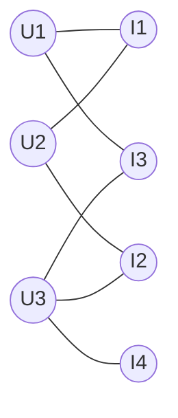

> *"Every recommender is a graph problem in disguise."*

## Introduction

A recommender system **is** a bipartite graph: users on one side, items on the other, interactions as edges. **Graph Neural Networks (GNNs)** explicitly model this and propagate information through multi-hop neighborhoods, capturing high-order user-item-user-item collaborative signals that vanilla MF misses.

This post covers the GNN family that's now standard in production: **GCN**, **GraphSAGE**, **PinSage** (Pinterest), **LightGCN**, **NGCF**, plus knowledge-graph methods.

## 1. The Bipartite View



**2-hop neighborhood** of $U_1$ = items $U_1$ liked → other users who liked them → those users' other items. This is the "users like you also liked" structure, expressed in graph terms.

## 2. Graph Convolution (GCN, Kipf 2017)

Layerwise propagation:

$$H^{(l+1)} = \sigma(\tilde D^{-1/2} \tilde A \tilde D^{-1/2} H^{(l)} W^{(l)})$$

where $\tilde A = A + I$ (self-loops), $\tilde D$ is its degree matrix.

Intuition: each node's new representation = weighted average of neighbors + itself, transformed.

## 3. GraphSAGE (Hamilton 2017)

GCN requires the full adjacency — doesn't scale. GraphSAGE samples neighborhoods:

1. **Sample** $K$ neighbors per node per layer.
2. **Aggregate**: $h_v^{(l+1)} = \sigma(W \cdot [h_v^{(l)} \; \| \; \text{AGG}(\{h_u^{(l)}, u \in \mathcal N(v)\})])$
3. Aggregators: mean, max-pool, LSTM.

```python
import torch, torch.nn as nn

class SAGEConv(nn.Module):
    def __init__(self, in_d, out_d):
        super().__init__()
        self.linear = nn.Linear(2*in_d, out_d)

    def forward(self, h, neighbors):
        agg = neighbors.mean(dim=1)            # mean aggregator
        return torch.relu(self.linear(torch.cat([h, agg], -1)))
```

## 4. PinSage (Ying 2018) — Pinterest's RecSys

The first paper to deploy GraphSAGE at billion-pin scale. Key engineering:

- **Random walks** to estimate visit counts; use top-T as neighborhood (importance-based, not uniform).
- **Hard-negative mining** via curriculum (start easy, ramp up).
- **MapReduce inference** over the full graph.

Loss: max-margin
$$\mathcal L = \sum \max(0, z_q^\top z_n - z_q^\top z_p + \Delta)$$

Powers Pinterest's "more like this" — billions of recommendations daily.

## 5. NGCF and LightGCN

- **NGCF** (Wang 2019): adds feature transformation + nonlinearity to bipartite CF.
- **LightGCN** (He 2020): **removes** the transformations — turns out they hurt CF.

LightGCN propagation:

$$e_u^{(l+1)} = \sum_{i \in \mathcal N_u} \frac{1}{\sqrt{|\mathcal N_u||\mathcal N_i|}} e_i^{(l)}$$

Final embedding = mean of layers. Trivially simple, beat NGCF, became the standard CF-GNN baseline.

```python
class LightGCN(nn.Module):
    def __init__(self, n_users, n_items, d=64, K=3):
        super().__init__()
        self.E = nn.Embedding(n_users + n_items, d)
        self.K = K
        nn.init.normal_(self.E.weight, std=0.1)

    def forward(self, norm_adj):  # sparse normalized adj (U+I) x (U+I)
        E = [self.E.weight]
        for _ in range(self.K):
            E.append(torch.sparse.mm(norm_adj, E[-1]))
        return torch.stack(E, 0).mean(0)
```

## 6. Knowledge-Graph–Aware Recs

Items often have a **knowledge graph** (brand, author, category, relations). Methods:

- **KGAT** (Wang 2019): attention over KG triples.
- **RippleNet** (Wang 2018): propagate user preference along KG paths.
- **CKE**: jointly factorize CF + KG embeddings (TransR).

Useful when content metadata is rich (e.g., Amazon: product → brand → category).

## 7. Pros & Cons

| Pros | Cons |
|---|---|
| Captures **high-order** collaborative signals | Training on huge graphs is engineering-heavy |
| Cold-start friendly with content features | GNN inference is the bottleneck — need efficient sampling |
| Strong empirical results on academic benchmarks | Over-smoothing past 3–4 layers |
| Unifies heterogeneous data (KG, social, content) | Production deployment harder than MF |

## 8. End-to-End: LightGCN on MovieLens with PyG

```python
# pip install torch torch-geometric
import torch
from torch_geometric.data import Data
from torch_geometric.utils import structured_negative_sampling
import pandas as pd

ratings = pd.read_csv("ratings.csv")
ratings = ratings[ratings["rating"] >= 4]  # implicit positives

u_idx = {u: i for i, u in enumerate(ratings["userId"].unique())}
i_idx = {it: i for i, it in enumerate(ratings["movieId"].unique())}
n_u, n_i = len(u_idx), len(i_idx)

src = torch.tensor([u_idx[u] for u in ratings["userId"]])
dst = torch.tensor([i_idx[m] + n_u for m in ratings["movieId"]])
edge_index = torch.stack([torch.cat([src, dst]), torch.cat([dst, src])])  # undirected

import scipy.sparse as sp
A = sp.coo_matrix((torch.ones(edge_index.size(1)), edge_index.numpy()),
                  shape=(n_u + n_i, n_u + n_i))
deg = sp.diags(1.0 / (A.sum(1).A.ravel()**0.5 + 1e-8))
norm_adj = (deg @ A @ deg).tocoo()
indices = torch.tensor([norm_adj.row, norm_adj.col], dtype=torch.long)
values = torch.tensor(norm_adj.data, dtype=torch.float)
norm_adj_t = torch.sparse_coo_tensor(indices, values, (n_u+n_i, n_u+n_i))

model = LightGCN(n_u, n_i, d=64, K=3)
opt = torch.optim.Adam(model.parameters(), lr=1e-3, weight_decay=1e-4)

for epoch in range(20):
    E = model(norm_adj_t)
    u, p, n = structured_negative_sampling(edge_index[:, :edge_index.size(1)//2])
    loss = -torch.log(torch.sigmoid((E[u]*E[p+n_u]).sum(1) - (E[u]*E[n+n_u]).sum(1))).mean()
    opt.zero_grad(); loss.backward(); opt.step()
```

## 9. System Design Notes

- **Edge sampling** at scale: precompute neighborhoods on Spark; cache top-K neighbors per node.
- **Embedding tables** on parameter servers for billion-node graphs (Pinterest, Alibaba).
- **Online updates**: when a new interaction arrives, propagate only to relevant subgraph; use diffusion approximations.
- Hybrid: GNN-derived embedding + ID embedding → ranker.

## 10. Pitfalls

1. **Over-smoothing**: beyond 4 layers, all nodes look the same. LightGCN's layer averaging helps.
2. **Neighborhood explosion**: 3-hop from a popular node touches the whole graph. Sample or use PageRank-style truncation.
3. **Edge leakage** in eval — make sure test edges are removed before computing the normalized adjacency.
4. **Forgetting reverse edges** in bipartite graphs — must be symmetric or aggregator breaks.
5. Treating GNN embeddings as plug-and-play for ranking without fine-tuning.

## 11. Public Datasets

- **MovieLens** — bipartite CF — https://grouplens.org/datasets/movielens/
- **Pinterest** — research dump (~100K boards) — https://sites.google.com/site/xueatalphabeta/dataset
- **Yelp** — user-business + social — https://www.yelp.com/dataset
- **Amazon Reviews** — co-purchase graph — https://nijianmo.github.io/amazon/
- **OGB Recommendation** — large benchmark — https://ogb.stanford.edu/docs/linkprop/
- **Last.fm** — social + listening — http://ocelma.net/MusicRecommendationDataset/

## 12. Further Reading

- Kipf & Welling, *Semi-Supervised Classification with Graph Convolutional Networks* (ICLR 2017)
- Hamilton et al., *Inductive Representation Learning on Large Graphs (GraphSAGE)* (NeurIPS 2017)
- Ying et al., *Graph Convolutional Neural Networks for Web-Scale Recommender Systems (PinSage)* (KDD 2018)
- Wang et al., *Neural Graph Collaborative Filtering (NGCF)* (SIGIR 2019)
- He et al., *LightGCN* (SIGIR 2020)
- Wang et al., *KGAT* (KDD 2019)
- Veličković et al., *Graph Attention Networks (GAT)* (ICLR 2018)
