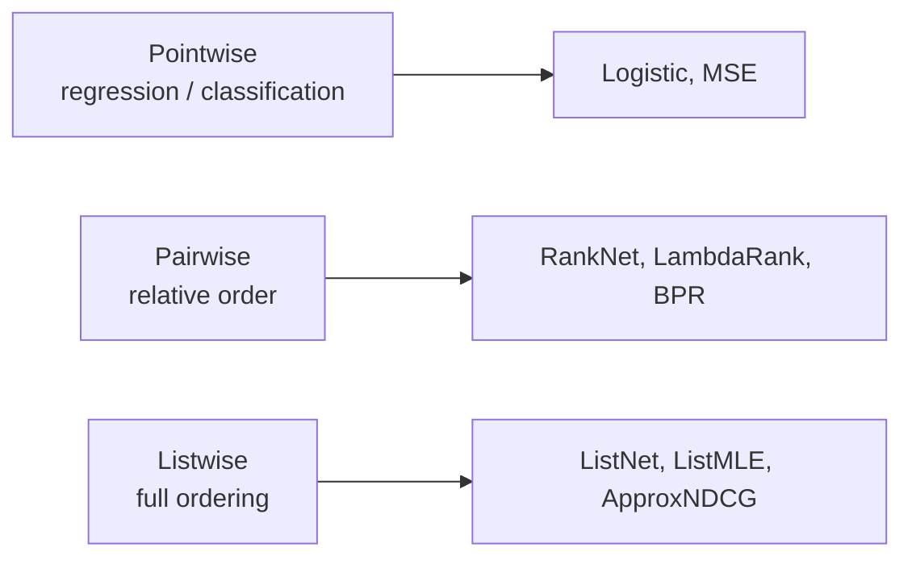
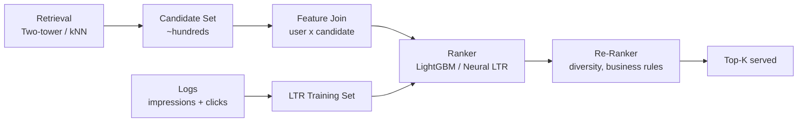

> *"The right loss matters more than the right architecture."*

## Introduction

Once you have candidates, you need to **order** them. **Learning-to-Rank (LTR)** is the family of algorithms that optimize ordering rather than per-item scores. Three loss families dominate: **pointwise**, **pairwise**, and **listwise**. The most-deployed flavors — **LambdaRank**, **LambdaMART** (via LightGBM/XGBoost) — power Bing, LinkedIn, Yelp, Spotify, and countless search and ranking surfaces.

## 1. Three Loss Families



### Pointwise
Predict score independently per item. Simple, calibrated. Doesn't directly optimize ordering.

### Pairwise
Penalize inversions: given $(q, i^+, i^-)$, push $s_{i^+} > s_{i^-}$.

$$\mathcal L_{\text{RankNet}} = \log(1 + e^{-(s^+ - s^-)})$$

### Listwise
Treats the whole ranking as a sample. Optimizes NDCG-like metrics (often via differentiable proxies).

## 2. RankNet → LambdaRank → LambdaMART

**RankNet** (Burges 2005) used a neural net + pairwise log-loss.
**LambdaRank** observed: we don't need a smooth loss — we need its **gradient**. Multiply the RankNet gradient by $|\Delta \text{NDCG}|$ — the change in NDCG if the two items swap:

$$\lambda_{ij} = \frac{\partial L}{\partial s_i} = \frac{-\sigma}{1 + e^{\sigma(s_i - s_j)}} \cdot |\Delta \text{NDCG}_{ij}|$$

This **directly optimizes NDCG** despite NDCG being non-differentiable. **LambdaMART** = LambdaRank + GBDT (Friedman). It's been the **king of LTR** for over a decade.

## 3. LightGBM and XGBoost LTR

Both support pairwise / lambdarank objectives natively, with **group** structure for query-aware ranking.

### LightGBM

```python
# pip install lightgbm pandas scikit-learn
import lightgbm as lgb
import pandas as pd

# Each row: features + relevance + qid (query/user)
df = pd.read_parquet("yahoo_ltr.parquet")
df = df.sort_values("qid")
X = df.drop(columns=["rel", "qid"])
y = df["rel"]
group = df.groupby("qid").size().values    # items per query

model = lgb.LGBMRanker(
    objective="lambdarank",
    metric="ndcg",
    ndcg_eval_at=[1, 5, 10],
    n_estimators=500,
    learning_rate=0.05,
    num_leaves=63,
    min_child_samples=20,
)
model.fit(X, y, group=group, eval_set=[(X, y)], eval_group=[group])

# Predict scores; sort within each qid
df["score"] = model.predict(X)
ranked = df.sort_values(["qid", "score"], ascending=[True, False])
```

### XGBoost

```python
import xgboost as xgb
dtrain = xgb.DMatrix(X, label=y)
dtrain.set_group(group)
params = {
    "objective": "rank:pairwise",   # or "rank:ndcg", "rank:map"
    "eta": 0.1, "max_depth": 6,
    "eval_metric": "ndcg@10",
}
model = xgb.train(params, dtrain, num_boost_round=500)
```

## 4. Listwise Losses

### ListNet (Cao 2007)
Defines **top-1 probability** over a list using softmax of scores, minimizes KL divergence vs ground-truth distribution.

### ListMLE
Maximum likelihood of the ground-truth permutation under the Plackett-Luce model.

### ApproxNDCG (Qin 2010)
Smooth, differentiable approximation of NDCG via sigmoid-based rank indicators. Used by some neural rankers.

### Softmax Cross-Entropy (TF-Ranking)
$$\mathcal L = -\sum_i y_i \log \frac{e^{s_i}}{\sum_j e^{s_j}}$$
Simple, surprisingly competitive listwise loss.

## 5. Neural LTR

When features include heavy embeddings (text, image), tree-based LTR struggles. Neural rankers shine:

- **DeepRank, DeepLTR**: MLP + softmax cross-entropy
- **Transformer rankers** (e.g., BERT-base cross-encoders) — slow but accurate
- **TF-Ranking** library (Google) — Keras-native LTR

```python
import torch.nn as nn, torch

class ListwiseRanker(nn.Module):
    def __init__(self, in_dim, hidden=(128, 64)):
        super().__init__()
        layers, d = [], in_dim
        for h in hidden:
            layers += [nn.Linear(d, h), nn.ReLU(), nn.Dropout(0.1)]
            d = h
        layers += [nn.Linear(d, 1)]
        self.mlp = nn.Sequential(*layers)

    def forward(self, x):   # x: B, K, F (K items per query)
        return self.mlp(x).squeeze(-1)  # B, K

def listwise_softmax_ce(scores, labels):  # both B, K
    return -(labels * torch.log_softmax(scores, dim=-1)).sum(-1).mean()
```

## 6. Pros & Cons Comparison

| Loss family | Pros | Cons |
|---|---|---|
| Pointwise | Simple, calibrated | Doesn't optimize ordering |
| Pairwise (RankNet/LambdaRank) | Strong empirical, easy with GBDT | $O(K^2)$ pairs per query |
| Listwise | Directly aligned with metrics | More complex, gradient estimation harder |
| LambdaMART | SOTA on tabular features, easy to deploy | Hard to leverage embeddings/text |
| Neural listwise | Embeds text/image natively | Needs more data |

## 7. End-to-End: LambdaMART on MSLR-WEB10K

```python
import lightgbm as lgb
from sklearn.datasets import load_svmlight_file
import numpy as np

# Download MSLR-WEB10K from https://www.microsoft.com/en-us/research/project/mslr/
X_tr, y_tr, qid_tr = load_svmlight_file("train.txt", query_id=True)
X_va, y_va, qid_va = load_svmlight_file("vali.txt",  query_id=True)

def to_group(qids):
    _, counts = np.unique(qids, return_counts=True)
    return counts

m = lgb.LGBMRanker(objective="lambdarank", metric="ndcg",
                   ndcg_eval_at=[1,3,5,10], n_estimators=1000,
                   learning_rate=0.05, num_leaves=255, min_data_in_leaf=20)
m.fit(X_tr, y_tr, group=to_group(qid_tr),
      eval_set=[(X_va, y_va)], eval_group=[to_group(qid_va)],
      callbacks=[lgb.early_stopping(50)])
```

## 8. Production Notes



- **Group by request/session** for training; never mix queries.
- **Feature parity**: serving features must match training features bit-for-bit.
- **Calibrate** scores if downstream needs probabilities.
- **Reduce K** before ranker — 500 candidates is plenty; 5000 is wasteful.
- Tree ranker fits in MB and serves at <1ms; neural ranker may need GPU.

## 9. Pitfalls

1. Forgetting `group=` — LightGBM will silently train a useless model.
2. Using NDCG on test set sliced differently from training (different queries).
3. **Severe label imbalance** (many irrelevants, few relevants) — use weighted sampling or focal pairwise.
4. **Position bias** in click logs — IPS weighting (Blog 17).
5. Tuning on average NDCG@10 while users care about NDCG@1 (a different model wins).

## 10. Public Datasets

- **MSLR-WEB10K / 30K** (Microsoft) — https://www.microsoft.com/en-us/research/project/mslr/
- **Yahoo Learning to Rank Challenge** — https://webscope.sandbox.yahoo.com/
- **LETOR 4.0** — https://www.microsoft.com/en-us/research/project/letor/
- **Istella LETOR** — http://quickrank.isti.cnr.it/istella-dataset/
- **TREC Deep Learning** — https://microsoft.github.io/msmarco/

## 11. Further Reading

- Burges, *From RankNet to LambdaRank to LambdaMART: An Overview* (Microsoft TR 2010)
- Friedman, *Greedy Function Approximation: A Gradient Boosting Machine* (2001)
- Cao et al., *ListNet: Learning to Rank — From Pairwise Approach to Listwise* (ICML 2007)
- Qin et al., *A General Approximation Framework for Direct Optimization of IR Measures* (Inform. Retrieval 2010)
- Han et al., *Learning-to-Rank with BERT in TF-Ranking* (2020)
- Joachims et al., *Unbiased Learning-to-Rank with Biased Feedback* (WSDM 2017) — Blog 17 setup
