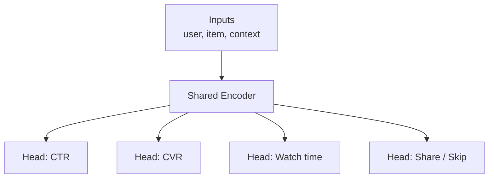
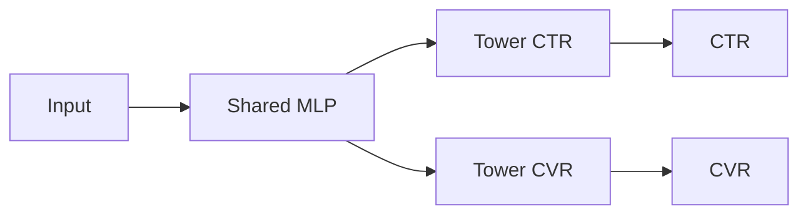
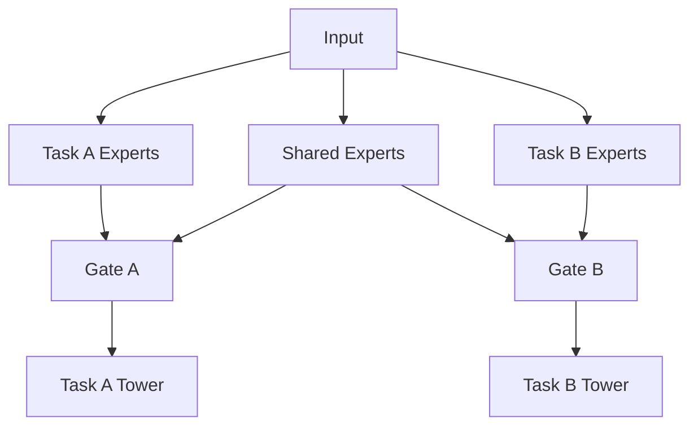

> *"One head can predict CTR. Reality predicts CTR, CVR, dwell, share, and skip — all at once."*

## Introduction

Real recommenders optimize **multiple objectives**: click, watch time, conversion, share, skip, complaint. Building one model per objective wastes compute and ignores correlations. **Multi-task learning (MTL)** with shared representations + task-specific heads lets a single network learn all of them — better, with less data per task.

This post covers shared-bottom, **MMoE**, **PLE**, **ESMM**, and how to balance gradient conflicts.

## 1. The Multi-Task Setup



Why MTL works:
- **Implicit regularization**: tasks act as priors for each other.
- **Better representations**: e.g., watch time signal disambiguates noisy clicks.
- **Compute amortization**: one forward pass per request.

Why MTL fails:
- **Negative transfer** when tasks pull representations in conflicting directions.
- Heads with **different scales / loss magnitudes** dominate gradients.

## 2. Shared-Bottom (Baseline)



Simple but prone to negative transfer when tasks are unrelated.

## 3. MMoE: Multi-gate Mixture-of-Experts (Ma 2018, Google)

Replace the shared bottom with a set of **expert networks**. Each task has a **gate** that learns a soft mixture over experts.

$$y_t = h_t\left(\sum_{e=1}^E g_t^e(x) \cdot f_e(x)\right), \quad g_t(x) = \text{softmax}(W_t x)$$

```python
import torch, torch.nn as nn, torch.nn.functional as F

class MMoE(nn.Module):
    def __init__(self, in_dim, n_experts=4, expert_h=128, task_h=64, n_tasks=2):
        super().__init__()
        self.experts = nn.ModuleList([
            nn.Sequential(nn.Linear(in_dim, expert_h), nn.ReLU(),
                          nn.Linear(expert_h, expert_h), nn.ReLU())
            for _ in range(n_experts)])
        self.gates = nn.ModuleList([nn.Linear(in_dim, n_experts) for _ in range(n_tasks)])
        self.towers = nn.ModuleList([
            nn.Sequential(nn.Linear(expert_h, task_h), nn.ReLU(),
                          nn.Linear(task_h, 1)) for _ in range(n_tasks)])

    def forward(self, x):
        E = torch.stack([e(x) for e in self.experts], 1)        # B, E, H
        outs = []
        for gate, tower in zip(self.gates, self.towers):
            g = F.softmax(gate(x), dim=-1)                      # B, E
            mix = (g.unsqueeze(-1) * E).sum(1)                  # B, H
            outs.append(tower(mix).squeeze(-1))
        return outs   # list of B-sized outputs
```

**Pros:** experts can specialize; gates absorb conflict.
**Cons:** "expert collapse" if gates always pick the same expert; harder than shared-bottom to tune.

## 4. PLE: Progressive Layered Extraction (Tang 2020, Tencent)

PLE fixes a subtle issue with MMoE: **all experts are shared**, but tasks may need their **own** experts too. PLE has:

- **Task-specific experts** (only for one task)
- **Shared experts** (across all)
- **Multi-level extraction**: stack PLE blocks to refine representations.



**Pros:** explicit task isolation prevents negative transfer.
**Cons:** more parameters, slower training.

## 5. ESMM: Entire Space Multi-Task Model (Ma 2018, Alibaba)

Solves a specific RecSys problem: **CVR is observed only after clicks**, so naive CVR models train on a biased subspace.

ESMM models the **chain**: $p(\text{click})$ and $p(\text{conv} | \text{click})$, training jointly on **impressions** (all data) using only $p(\text{click})$ and $p(\text{click} \cap \text{conv})$ losses.

$$p(\text{conv}|x) = p(\text{click}|x) \cdot p(\text{conv}|\text{click}, x)$$

ESMM is **the standard CVR model in industry**.

## 6. Loss Weighting

When losses have different magnitudes, gradients of one task dominate. Strategies:

### 6.1 Uncertainty Weighting (Kendall 2018)
$$\mathcal L = \sum_t \frac{1}{2\sigma_t^2} \mathcal L_t + \log \sigma_t$$

Learn $\sigma_t$ per task — heavier tasks get smaller weights automatically.

### 6.2 GradNorm
Adjust task weights so gradient norms across tasks are balanced.

### 6.3 PCGrad
Project conflicting gradients onto each other's null space.

```python
import torch
class UncertaintyMTLLoss(torch.nn.Module):
    def __init__(self, n_tasks):
        super().__init__()
        self.log_sigma = torch.nn.Parameter(torch.zeros(n_tasks))
    def forward(self, losses):
        total = 0
        for i, l in enumerate(losses):
            total += 0.5 * torch.exp(-self.log_sigma[i]) * l + 0.5 * self.log_sigma[i]
        return total
```

## 7. End-to-End: MMoE on MovieLens with CTR + 4-star prediction

```python
import torch, torch.nn as nn, pandas as pd
from torch.utils.data import DataLoader, TensorDataset

r = pd.read_csv("ratings.csv")
r["click"] = 1                          # all rows are "viewed"
r["high"]  = (r["rating"] >= 4).astype(int)
# Fake negative impressions (downsample)
neg = r.sample(frac=0.5).assign(click=0, high=0, rating=0)
df = pd.concat([r, neg]).sample(frac=1).reset_index(drop=True)

x = torch.tensor(df[["userId","movieId"]].values, dtype=torch.long)
y1 = torch.tensor(df["click"].values, dtype=torch.float)
y2 = torch.tensor(df["high"].values, dtype=torch.float)

class FeatEmb(nn.Module):
    def __init__(self, n_u, n_i, d=32):
        super().__init__()
        self.u, self.i = nn.Embedding(n_u, d), nn.Embedding(n_i, d)
    def forward(self, x): return torch.cat([self.u(x[:,0]), self.i(x[:,1])], -1)

n_u, n_i = df["userId"].max()+1, df["movieId"].max()+1
feat = FeatEmb(n_u, n_i)
model = MMoE(in_dim=64, n_experts=4, n_tasks=2)
mtl_loss = UncertaintyMTLLoss(2)
opt = torch.optim.Adam(list(feat.parameters())+list(model.parameters())+list(mtl_loss.parameters()), lr=1e-3)
bce = nn.BCEWithLogitsLoss()
loader = DataLoader(TensorDataset(x, y1, y2), batch_size=2048, shuffle=True)

for epoch in range(3):
    for xb, yb1, yb2 in loader:
        emb = feat(xb)
        p1, p2 = model(emb)
        loss = mtl_loss([bce(p1, yb1), bce(p2, yb2)])
        opt.zero_grad(); loss.backward(); opt.step()
```

## 8. When to Use What

| Setup | Choose |
|---|---|
| 2 closely-related tasks | Shared-bottom |
| Many tasks, mixed relatedness | MMoE |
| Strong task conflict, scale matters | PLE |
| CVR + CTR specifically | ESMM |
| Wildly different loss scales | Uncertainty weighting on top |

## 9. Production Notes

- One forward pass — many heads — means **shared GPU usage**: huge serving savings.
- Train tasks at **different cadences** if needed (e.g., CTR daily, CVR weekly).
- Heads can be served from different model versions when retrained independently — care with feature parity.
- For ranking, downstream **weight combine**: $\text{score} = w_1 \cdot \text{CTR} + w_2 \cdot \text{CVR} \cdot \text{LTV} + \ldots$ — weights chosen online via A/B.

## 10. Pros & Cons Summary

| Model | Pros | Cons |
|---|---|---|
| Shared-bottom | Simple | Negative transfer |
| MMoE | Soft expert sharing | Expert collapse risk |
| PLE | Task isolation + shared | More params/compute |
| ESMM | Solves CVR sample bias | Specific to chained tasks |

## 11. Pitfalls

1. Ignoring **loss scale** — one head silently dominates.
2. Training all heads on the same subset — defeats MTL purpose.
3. Forgetting **task-specific dropout / regularization**.
4. Evaluating each head **in isolation** when production combines them.
5. Re-deploying every time only one task's data changed — modularize.

## 12. Public Datasets

- **AliCCP (Alibaba CTR/CVR)** — multi-task — https://tianchi.aliyun.com/dataset/408
- **Kuairand** — multi-feedback (watch, like, share) — https://kuairand.com/
- **MovieLens** — fake multi-task by deriving rating + high/low — https://grouplens.org/datasets/movielens/
- **MIND News** — click + dwell — https://msnews.github.io/
- **Census-Income & UCI multi-task benchmarks** — for tabular MMoE experiments

## 13. Further Reading

- Ma et al., *Modeling Task Relationships in Multi-task Learning with Multi-gate Mixture-of-Experts (MMoE)* (KDD 2018)
- Tang et al., *Progressive Layered Extraction (PLE)* (RecSys 2020 Best Paper)
- Ma et al., *ESMM: Entire Space Multi-Task Model* (SIGIR 2018)
- Kendall et al., *Multi-Task Learning Using Uncertainty to Weigh Losses* (CVPR 2018)
- Yu et al., *Gradient Surgery for Multi-Task Learning (PCGrad)* (NeurIPS 2020)
- Chen et al., *GradNorm* (ICML 2018)
