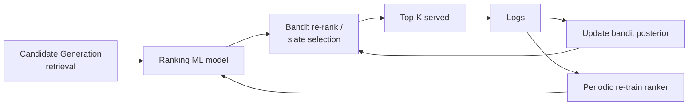

> *"Exploit what you know, but never stop exploring."*

## Introduction

Recommender systems face a fundamental tension: **exploit** items known to work, or **explore** items whose reward is uncertain. Multi-Armed Bandits (MAB) provide a principled, online, low-overhead framework for this — useful for cold start, content marketing, ad creative selection, and any setting where you can afford to learn from each impression.

This post covers $\varepsilon$-greedy, UCB, Thompson sampling, contextual bandits (LinUCB, LinTS), and how they map onto real recommender architectures.

## 1. The Setup


At each step $t$: pick arm $a_t \in A$, observe reward $r_t$, update beliefs. Goal: **minimize regret** vs the optimal arm:

$$R_T = T \mu^* - \sum_{t=1}^T \mathbb E[r_t]$$

In recsys terms: arms = items (or candidate models, or layouts), reward = CTR / conversion / dwell.

## 2. Classic Algorithms

### 2.1 $\varepsilon$-greedy
With probability $1-\varepsilon$, pick the arm with highest empirical mean; with $\varepsilon$, pick uniformly random.
- **Pros:** trivial.
- **Cons:** random exploration ignores uncertainty. Constant $\varepsilon$ → linear regret; needs decay.

### 2.2 UCB1 (Auer 2002)
Pick the arm maximizing:
$$\bar r_a + \sqrt{\frac{2 \log t}{n_a}}$$

Optimistic in the face of uncertainty. **Sub-linear regret** $O(\sqrt{T \log T})$.

### 2.3 Thompson Sampling (TS)
Maintain a posterior over each arm's reward. Sample from posterior, pick the arg-max. For Bernoulli rewards: Beta-Bernoulli conjugate is simple and effective.

$$\text{Beta}(\alpha_a, \beta_a) \to \tilde \mu_a \sim \text{Beta}; \quad a_t = \arg\max_a \tilde \mu_a$$

**Pros:** posterior-driven exploration; usually beats UCB empirically; simple to implement.

### Python: all three

```python
import numpy as np
n_arms = 10
np.random.seed(0)
true_p = np.random.uniform(0.1, 0.5, n_arms)
T = 10_000

# ε-greedy
counts = np.zeros(n_arms); means = np.zeros(n_arms)
def epsilon_greedy(eps=0.05):
    if np.random.rand() < eps: return np.random.randint(n_arms)
    return means.argmax()

# UCB1
def ucb(t):
    if (counts == 0).any(): return (counts == 0).argmax()
    return (means + np.sqrt(2*np.log(t+1)/counts)).argmax()

# Thompson (Beta-Bernoulli)
alpha = np.ones(n_arms); beta = np.ones(n_arms)
def thompson():
    return np.random.beta(alpha, beta).argmax()

reward = 0
for t in range(T):
    a = thompson()                       # swap for the others
    r = np.random.rand() < true_p[a]
    alpha[a] += r; beta[a] += (1 - r)
    counts[a] += 1; means[a] += (r - means[a]) / counts[a]
    reward += r
print("avg reward:", reward / T, "best possible:", true_p.max())
```

## 3. Contextual Bandits

Plain MAB ignores user state. **Contextual** bandits choose based on context $x_t$ (user features):

$$a_t = \arg\max_a f(x_t, a; \theta_a)$$

### LinUCB (Li 2010, Yahoo News)
Linear reward model per arm $a$: $r = x^\top \theta_a + \varepsilon$. Use ridge regression for $\theta_a$, add a confidence bonus:

$$a_t = \arg\max_a x^\top \hat \theta_a + \alpha \sqrt{x^\top A_a^{-1} x}$$

```python
class LinUCB:
    def __init__(self, n_arms, d, alpha=1.0):
        self.A = [np.eye(d) for _ in range(n_arms)]
        self.b = [np.zeros(d) for _ in range(n_arms)]
        self.alpha = alpha
    def select(self, x):
        scores = []
        for A, b in zip(self.A, self.b):
            theta = np.linalg.solve(A, b)
            scores.append(x @ theta + self.alpha * np.sqrt(x @ np.linalg.solve(A, x)))
        return int(np.argmax(scores))
    def update(self, a, x, r):
        self.A[a] += np.outer(x, x)
        self.b[a] += r * x
```

### LinTS (Linear Thompson Sampling)
Same model, sample $\tilde \theta_a$ from posterior $\mathcal N(\hat \theta_a, \sigma^2 A_a^{-1})$.

### Neural Contextual Bandits
For high-dimensional context: NeuralUCB, Neural-LinUCB, Neural-Thompson — use a neural network for $f$ with bootstrap or last-layer Bayesian heads.

## 4. Where Bandits Fit in Recommenders



Typical applications:
- **Cold-start items**: bandit assigns exploration budget to new items until enough impressions accumulate.
- **Ad creative selection**: pick which of 5 banners to show.
- **Module/layout selection**: which carousel goes top of page.
- **Re-ranking among ML candidates**: bandit re-weights top-N based on real-time feedback.

## 5. Bandits vs Full RL

| Aspect | Bandit | RL (Blog 14) |
|---|---|---|
| State transitions | None | Yes (action affects future) |
| Reward delay | Immediate | Can be long |
| Sample efficiency | Higher | Lower |
| Complexity | Low | High |

Bandits are the right abstraction when actions don't materially affect future user state. For long-term engagement, RL.

## 6. Pros & Cons

| Pros | Cons |
|---|---|
| Native exploration — solves cold start cheaply | Stateless: ignores long-term effects |
| Online learning, no large offline retrain needed | Naive variants suffer with very large arm spaces |
| Strong theoretical regret bounds | Contextual variants need feature engineering |
| Cheap to implement | Hard to debug — exploration randomness confounds metrics |

## 7. Production Tips

- **Decay** counts so stale arms don't dominate (e.g., exponential decay every day).
- **Floor exploration** at $\varepsilon \geq 0.01$ for monitoring purposes.
- **Group arms** by metadata for fewer effective arms in cold-start scenarios.
- Use **batched updates** (every K impressions) to control variance and log writes.
- **Off-policy evaluation** (Blog 17) to test bandit changes safely.

## 8. End-to-End: LinUCB on Synthetic News

```python
import numpy as np
n_arms, d = 20, 10
np.random.seed(0)
true_theta = np.random.randn(n_arms, d) * 0.5

def reward(x, a):
    return (x @ true_theta[a]) + 0.1 * np.random.randn()

bandit = LinUCB(n_arms, d, alpha=1.0)
total = 0
for t in range(20_000):
    x = np.random.randn(d)
    a = bandit.select(x)
    r = reward(x, a)
    bandit.update(a, x, r)
    total += r
print("Avg reward:", total / 20_000)
```

## 9. Pitfalls

1. Treating CTR as the bandit reward → reward inflation under position bias. Use **propensity-weighted** rewards.
2. **Delayed conversions** — bandit thinks an arm is bad before the reward arrives.
3. Forgetting to **log the propensity** $\pi(a|x)$ for off-policy evaluation.
4. Letting Thompson sampling explore the same poor arm by initializing $\alpha=\beta=1$ on millions of arms — use **informed priors**.
5. Comparing bandit vs static ranker without holdouts — they aren't measured the same way.

## 10. Public Datasets

- **Yahoo R6 News Recommendation logs** — bandit canonical dataset — https://webscope.sandbox.yahoo.com/catalog.php?datatype=r
- **Criteo's open contextual bandit dataset** — https://ailab.criteo.com/criteo-uplift-prediction-dataset/
- **MovieLens (simulated bandit)** — use ratings as reward and pretend it's bandit logged
- **OpenBandit Pipeline (ZOZO)** — open-source benchmark + datasets — https://github.com/st-tech/zr-obp

## 11. Further Reading

- Sutton & Barto, *Reinforcement Learning: An Introduction* (Ch. 2)
- Auer, *Finite-time Analysis of the Multiarmed Bandit Problem* (2002)
- Li et al., *A Contextual-Bandit Approach to Personalized News Article Recommendation (LinUCB)* (WWW 2010)
- Chapelle & Li, *An Empirical Evaluation of Thompson Sampling* (NeurIPS 2011)
- Zhou et al., *Neural Contextual Bandits with UCB Exploration (NeuralUCB)* (ICML 2020)
- Saito et al., *Open Bandit Dataset and Pipeline (OBP)* (NeurIPS 2021)
