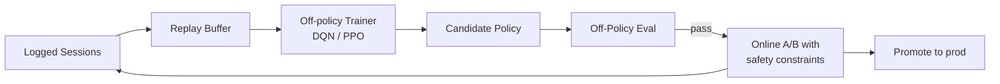

> *"Bandits optimize the next click. RL optimizes the next year."*

## Introduction

When the goal is **long-term engagement** — retention, lifetime value, user satisfaction across a session — the world is sequential and an action now affects the user's future state. That's the playground of **reinforcement learning (RL)**. RL has been deployed at YouTube, ByteDance, Alibaba, and Spotify for slate optimization, retention, and exploration policies.

This post is a practical tour of RL in RecSys: MDP formulation, DQN, policy gradients (REINFORCE, PPO), Slate-Q, and off-policy considerations.

## 1. RL Formulation for RecSys

State $s_t$: user representation (history + context) at time $t$.
Action $a_t$: recommend item(s).
Reward $r_t$: short-term (click, dwell) **plus** long-term (return next day, retention).
Transition: user updates state after seeing $a_t$ and reward.
Policy $\pi(a|s)$: how the recommender chooses.

Goal: maximize discounted future reward
$$J(\pi) = \mathbb E_\pi \left[ \sum_{t=0}^\infty \gamma^t r_t \right]$$

```mermaid
flowchart LR
    A[State st<br/>user history+context] --> B[Policy pi]
    B --> C[Action at<br/>recommend item / slate]
    C --> D[Environment<br/>user, app, world]
    D --> E[Reward rt<br/>+ next state s_{t+1}]
    E --> A
```

## 2. Value-Based: DQN for Recommendations

Learn $Q(s, a)$ — expected return of taking action $a$ in state $s$.
$$Q(s,a) \leftarrow Q(s,a) + \alpha \left( r + \gamma \max_{a'} Q(s', a') - Q(s,a) \right)$$

Trouble in RecSys: $|A|$ is millions. Solutions:
- **Action embedding** + parametric $Q(s, a) = f_\theta(s)^\top g_\phi(a)$
- **Restrict** action space to candidates from a retrieval stage

Good for **single-item recommendation** (Choi 2018, Zhao 2018 "DeepPage").

## 3. Policy Gradient: REINFORCE

Directly optimize $\pi_\theta(a|s)$:
$$\nabla_\theta J = \mathbb E[\nabla_\theta \log \pi_\theta(a|s) \cdot R]$$

Used famously by Chen et al. (2019) at **YouTube** for slate-aware recommendation. The trick: combine a top-K likelihood correction with off-policy IS weights to learn from logged data while still exploring.

### REINFORCE skeleton
```python
import torch, torch.nn as nn, torch.nn.functional as F
class PolicyNet(nn.Module):
    def __init__(self, d_state, n_items):
        super().__init__()
        self.f = nn.Sequential(nn.Linear(d_state, 256), nn.ReLU(), nn.Linear(256, n_items))
    def forward(self, s): return F.softmax(self.f(s), dim=-1)

policy = PolicyNet(64, 10_000)
opt = torch.optim.Adam(policy.parameters(), lr=1e-4)

def train_episode(s, a, r):    # batched: T x ...
    probs = policy(s)
    log_pi = torch.log(probs.gather(-1, a.unsqueeze(-1)).squeeze(-1) + 1e-8)
    loss = -(log_pi * r).mean()
    opt.zero_grad(); loss.backward(); opt.step()
```

## 4. Slate-Aware RL: SlateQ (Ie 2019 Google)

Recommend $K$ items, **a slate**. Naive Q is $|A|^K$ — intractable. SlateQ decomposes:

$$Q(s, \text{slate}) = \sum_{i \in \text{slate}} P(\text{user picks } i | s, \text{slate}) \cdot Q(s, i)$$

with a user choice model (e.g., conditional logit). Trains item-level Q, plus a slate-optimization step.

## 5. PPO and Actor-Critic

For continuous or high-dim action spaces (e.g., feed pacing, exploration temperature), **PPO** and **A3C/A2C** are stable choices. In RecSys these typically operate over **policy parameters** like the temperature for sampling, the diversity penalty, or session length budgets — meta-policies.

## 6. Off-Policy Evaluation (OPE)

You can't A/B every RL idea. OPE estimates a target policy's value from logged data of a behavior policy:

### Importance Sampling
$$\hat V(\pi_t) = \frac{1}{n}\sum_i \frac{\pi_t(a_i|s_i)}{\pi_b(a_i|s_i)} r_i$$

Variance can explode. Solutions:
- **Self-normalized IS**, **clipped IS**, **doubly-robust** estimators.
- **Fitted Q-Evaluation** for sequential settings.

See Blog 17 for fuller treatment.

## 7. RL System Architecture



- **Safety nets**: constrain exploration to a candidate set; guard with rules.
- **Slow rollout** with traffic ramp.
- **Conservative policy iteration** to avoid catastrophic regressions.

## 8. End-to-End: REINFORCE on a Simulated Session

```python
import torch, torch.nn.functional as F
import numpy as np

# Simulator: 100 items; reward depends on a hidden user preference vector
np.random.seed(0)
n_items, d = 100, 16
item_emb = torch.tensor(np.random.randn(n_items, d), dtype=torch.float32)

def user_state(seed):
    rng = np.random.RandomState(seed)
    return torch.tensor(rng.randn(d), dtype=torch.float32)

def reward_fn(state, item_idx):
    return torch.sigmoid((state * item_emb[item_idx]).sum())  # in (0,1)

class Pol(torch.nn.Module):
    def __init__(self):
        super().__init__()
        self.net = torch.nn.Sequential(torch.nn.Linear(d, 64), torch.nn.ReLU(),
                                       torch.nn.Linear(64, n_items))
    def forward(self, s): return F.softmax(self.net(s), -1)

pol = Pol()
opt = torch.optim.Adam(pol.parameters(), lr=1e-3)

for ep in range(500):
    s = user_state(ep)
    log_probs, rewards = [], []
    for t in range(10):                       # 10-step session
        probs = pol(s)
        a = torch.distributions.Categorical(probs).sample()
        r = reward_fn(s, a.item())
        log_probs.append(torch.log(probs[a] + 1e-9))
        rewards.append(r)
        s = 0.9*s + 0.1*item_emb[a]           # state shifts toward chosen item
    R = torch.tensor(rewards)
    G = torch.flip(torch.cumsum(torch.flip(R, [0]), 0), [0])  # returns
    G = (G - G.mean()) / (G.std() + 1e-6)
    loss = -(torch.stack(log_probs) * G).sum()
    opt.zero_grad(); loss.backward(); opt.step()
```

## 9. Pros & Cons

| Pros | Cons |
|---|---|
| Optimizes long-term reward, retention | Very sample-inefficient |
| Naturally handles slate / sequence | Off-policy bias is severe in production |
| Can incorporate exploration | Hard to debug; reward shaping is fiddly |
| Bridges to "agent" framing of recommenders | Safety constraints often dominate gains |

## 10. When (and When Not) to Use RL

Use RL when:
- You measurably care about a long-horizon reward (retention, LTV).
- You can run **simulators** or have a strong off-policy estimator.
- Your candidate space is bounded by retrieval.

Skip RL when:
- You have <100k sessions: bandits / supervised will outperform.
- Your reward is immediate and well-aligned: supervised CTR/CVR is simpler.
- You can't safely deploy exploratory policies.

## 11. Pitfalls

1. Mistaking **simulator artifacts** for policy improvements.
2. Reward shaping that introduces gameable shortcuts (e.g., long sessions full of skipping).
3. **Bias amplification** in off-policy training when behavior policy ≠ logged policy.
4. Not logging $\pi_b(a|s)$ — without it, IS-based OPE is impossible.
5. Letting the RL agent overwrite the ranker's gains — keep guardrails.

## 12. Public Datasets / Simulators

- **RecoGym** — OpenAI Gym for RecSys — https://github.com/criteo-research/reco-gym
- **RL4Rec / RecBole-RL** — frameworks with benchmarks — https://github.com/wuch15/RL4Rec
- **ZOZO Open Bandit Pipeline** — off-policy eval — https://github.com/st-tech/zr-obp
- **MovieLens** — train an offline DQN on it
- **Industrial logs** are the real treasure (proprietary)

## 13. Further Reading

- Sutton & Barto, *Reinforcement Learning: An Introduction* (2nd ed.)
- Chen et al., *Top-K Off-Policy Correction for a REINFORCE Recommender System* (WSDM 2019) — must-read YouTube paper
- Ie et al., *SlateQ* (IJCAI 2019)
- Zhao et al., *Recommendations with Negative Feedback via Pairwise Deep RL (DeepPage)* (KDD 2018)
- Munos et al., *Safe and Efficient Off-Policy RL (Retrace)* (NeurIPS 2016)
- Wang et al., *Reinforcement Learning for Recommender Systems: Survey* (arXiv 2021)
