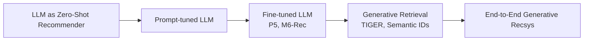
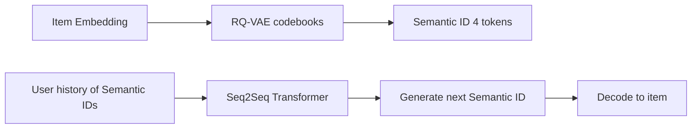

> *"The next paradigm: recommend by generating, not by scoring."*

## Introduction

Generative AI is reshaping RecSys. Instead of computing scores over a fixed catalog, models can **generate** item identifiers, **reason** about preferences in natural language, **explain** recommendations, and **bridge** zero-shot to new domains. This post covers LLM-based recommenders, **generative retrieval** (TIGER), **semantic IDs**, RAG for recsys, and the new hybrid pipelines.

## 1. The Spectrum of GenAI in RecSys



Each step replaces more of the classic pipeline with generation.

## 2. LLMs as Recommenders (Prompting)

Treat the LLM as a black-box recommender. Prompt with user history + ask for next-item prediction.

```python
from openai import OpenAI
client = OpenAI()

prompt = """
User watched the following movies (in order):
The Matrix, Inception, Interstellar, Tenet.

Recommend 5 next movies from this catalog:
[1: Memento, 2: Blade Runner 2049, 3: Top Gun, 4: Frozen, 5: The Prestige, 6: Notting Hill, 7: Arrival]

Answer with item ids only, ranked.
"""
resp = client.chat.completions.create(model="gpt-4o-mini",
                                      messages=[{"role":"user","content":prompt}])
print(resp.choices[0].message.content)
```

**Pros:** zero-shot, no training; explainable via prompts.
**Cons:** slow, expensive, no fine-grained personalization, hallucinates item ids.

## 3. Fine-Tuned LLM Recommenders

### P5 (Geng 2022)
Unifies CF, sequential, explanation, and rating tasks under one **text-to-text** transformer. Each task is recast as a prompt template:
> "Given user 17's history: [movie A, B, C], recommend the next 5 movies."

### M6-Rec (Cui 2022)
Multi-modal, fine-tuned on Alibaba data; handles text, image, and behavior tokens.

### TallRec / LLaRA
Adapter / LoRA fine-tune of LLaMA-class models on RecSys instructions.

### Pros & Cons

| Pros | Cons |
|---|---|
| Powerful contextual reasoning | Latency: ms per item × thousands of items |
| Easy cold-start via content | Item IDs as text → hallucination |
| Unified multi-task | Hard to align with click-level metrics |

## 4. Generative Retrieval: TIGER (Rajput 2023)

**The big idea:** assign each item a **Semantic ID** — a short sequence of codebook tokens (from RQ-VAE on item embeddings) — and train a Transformer to **generate** the next item's Semantic ID given user history.



**Why this matters:**
- ANN index → generation (no fixed catalog assumption).
- Zero-shot inference on **new items**: just compute their semantic id from content.
- Naturally handles **head-tail** balance via codebook sharing.

### Mini TIGER recipe (conceptual)
1. Train item embeddings (two-tower, CLIP, BERT).
2. Train RQ-VAE on those embeddings → each item gets $(c_1, c_2, c_3, c_4)$, each $c_i \in \{1..256\}$.
3. Train T5/decoder transformer on user-history token sequences → next-item tokens.
4. Generate top-K via beam search; decode to items.

```python
# Sketch of step 2 — Residual-Quantized VAE for semantic IDs
import torch, torch.nn as nn

class RQVAE(nn.Module):
    def __init__(self, d_in, levels=4, codebook_size=256, d_h=128):
        super().__init__()
        self.enc = nn.Sequential(nn.Linear(d_in, d_h), nn.ReLU(), nn.Linear(d_h, d_h))
        self.dec = nn.Sequential(nn.Linear(d_h, d_h), nn.ReLU(), nn.Linear(d_h, d_in))
        self.codebooks = nn.ParameterList(
            [nn.Parameter(torch.randn(codebook_size, d_h) * 0.05) for _ in range(levels)])

    def forward(self, x):
        z = self.enc(x); r = z; ids = []
        for cb in self.codebooks:
            d = (r.unsqueeze(1) - cb.unsqueeze(0)).pow(2).sum(-1)
            idx = d.argmin(-1); ids.append(idx)
            r = r - cb[idx]
        z_q = z - r
        return self.dec(z_q), ids
```

## 5. RAG for Recommendation

Retrieval-augmented generation: retrieve top candidates with a classical retriever, then have the LLM **reason, rank, and explain**.

```python
# Pseudocode
candidates = vector_db.search(user_query, top_k=50)
prompt = f"User profile: {profile}\nCandidates: {candidates}\nRank these and give a one-line reason for top 5."
ranked = llm.generate(prompt)
```

Great for **explainable recommendations** and **complex queries** ("I want a cozy book like the one I read last week, under 300 pages").

## 6. Personalized Embeddings from LLMs

Drop in an LLM-derived **content embedding** for items and users:
- `text-embedding-3-small` or sentence-transformers
- Encode user as concatenated history text
- Use for two-tower / ANN retrieval

```python
from sentence_transformers import SentenceTransformer
m = SentenceTransformer("sentence-transformers/all-mpnet-base-v2")
item_vec = m.encode("Action sci-fi movie about time travel and dreams")
```

## 7. Generative Re-Ranking

LLM as a re-ranker over candidates (Sun 2023 *LLM-Rec*). Pairwise/listwise prompts beat zero-shot pointwise.

## 8. Cold Start & Domain Transfer

LLMs **shine** when:
- Item has no interactions yet (semantic content → recommendations day-1).
- Cross-domain (recommend music for someone with only book history).
- Long-tail discovery via semantic similarity that CF can't see.

## 9. Pros & Cons of GenAI Recsys

| Pros | Cons |
|---|---|
| Zero-shot, multi-domain | Latency & cost gap vs traditional retrievers |
| Strong cold-start | ID hallucination unless constrained decoding |
| Natural language explanations | Hard to optimize CTR/CVR directly |
| Aligns with multi-modal content | Privacy: LLMs are memorization-prone |

## 10. System Design


- Constrained decoding (Outlines / vLLM grammars) prevents hallucination.
- Run LLM only on **top of funnel** to keep cost manageable.
- Cache semantic IDs of items; only refresh for content changes.

## 11. End-to-End Lightweight: LLM Re-Ranker on MovieLens

```python
import pandas as pd
from sentence_transformers import SentenceTransformer, util

m = SentenceTransformer("all-MiniLM-L6-v2")
movies = pd.read_csv("movies.csv")
movies["emb"] = list(m.encode(movies["title"] + " " + movies["genres"], show_progress_bar=True))

def user_emb(history_ids):
    titles = movies.set_index("movieId").loc[history_ids, "title"].tolist()
    return m.encode(" ; ".join(titles))

def recommend(history_ids, k=10):
    u = user_emb(history_ids)
    sims = util.cos_sim(u, movies["emb"].tolist())[0].cpu().numpy()
    top = sims.argsort()[::-1][:k]
    return movies.iloc[top]

print(recommend([1, 2, 3], k=10))
```

## 12. Pitfalls

1. Using raw GPT outputs as ranking signal without **score calibration**.
2. Letting the LLM **hallucinate** item IDs — always validate against catalog.
3. Cost spirals — measure cost-per-query before scaling.
4. Privacy: never prompt with PII unless your provider supports it under your contract.
5. **Eval theater**: LLM recs look good in demos but underperform on long-tail clicks vs tuned two-tower.

## 13. Public Datasets

- **MovieLens** — easy LLM prompting eval — https://grouplens.org/datasets/movielens/
- **Amazon Reviews 2018** — rich text — https://nijianmo.github.io/amazon/
- **MIND News** — language-heavy items — https://msnews.github.io/
- **Spotify MPD** — playlists as titled text — https://www.aicrowd.com/challenges/spotify-million-playlist-dataset-challenge
- **GoodReads** — long descriptions — https://mengtingwan.github.io/data/goodreads.html

## 14. Further Reading

- Geng et al., *P5: Pretrain, Personalized Prompt, Predict Paradigm* (RecSys 2022)
- Cui et al., *M6-Rec* (KDD 2022)
- Rajput et al., *Recommender Systems with Generative Retrieval (TIGER)* (NeurIPS 2023)
- Hou et al., *Large Language Models are Zero-Shot Rankers for RecSys* (ECIR 2024)
- Sun et al., *Is ChatGPT Good at Search? Investigating LLMs as Re-Ranking Agents* (EMNLP 2023)
- Bao et al., *TallRec* (RecSys 2023)
- Lin et al., *How Can RecSys Benefit from LLMs: A Survey* (TKDE 2024)
