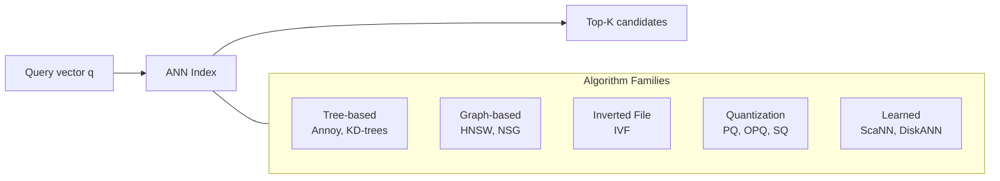
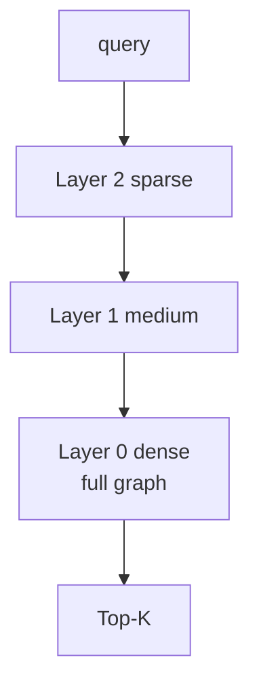
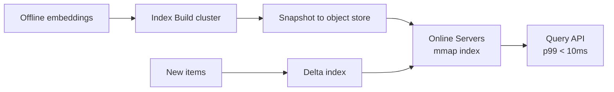

> *"Two-tower models would not exist without ANN. They're inseparable."*

## Introduction

Once you have embeddings, you need to find the **nearest neighbors** at scale — billions of items, sub-millisecond per query. This is **Approximate Nearest Neighbor (ANN)** search. This post covers the dominant algorithms (HNSW, IVF, PQ, ScaNN), the libraries (FAISS, hnswlib, Annoy, ScaNN, Milvus), and how to make the recall/latency tradeoff explicit.

## 1. The ANN Landscape



Indexes trade **recall** vs **QPS** vs **memory** vs **build time** vs **update support**.

## 2. Exact vs Approximate

Exact NN cost: $O(n d)$ per query. For 100M items × 128d, that's 12.8 GB of FLOPs per query — impossible at <10ms.

Approximate methods give 95–99% recall with 100–1000× speedup.

## 3. HNSW (Malkov & Yashunin 2018)

Hierarchical Navigable Small World graphs. Multi-layer proximity graph: top layers sparse for fast routing, bottom layer dense for precise search.



- **Recall ≥ 0.95** typical
- **Build**: parallel insertion, $O(n \log n)$
- **Search**: $O(\log n)$
- **Memory heavy**: graph + vectors live in RAM
- **No native updates** in most libs (rebuild or insert-only)

### hnswlib
```python
# pip install hnswlib
import hnswlib, numpy as np

dim, n = 64, 1_000_000
data = np.random.randn(n, dim).astype("float32")

p = hnswlib.Index(space="cosine", dim=dim)
p.init_index(max_elements=n, ef_construction=200, M=16)
p.add_items(data, np.arange(n))
p.set_ef(64)             # higher → more recall, slower

q = np.random.randn(10, dim).astype("float32")
ids, dists = p.knn_query(q, k=10)
```

## 4. FAISS (Facebook 2017)

The Swiss-army knife of ANN. Supports: flat (exact), IVF, IVF-PQ, OPQ, HNSW, GPU.

### Index recipes

| Index | When |
|---|---|
| `IndexFlatIP` / `IndexFlatL2` | <1M vectors, exact baseline |
| `IndexHNSWFlat` | High recall, RAM-bound |
| `IndexIVFFlat` | 10M–100M, RAM ok |
| `IndexIVFPQ` | Massive: billions, RAM-tight |
| `IndexIVFScalarQuantizer` | Middle ground |
| `IndexBinaryHash` | Binary embeddings |

### IVF-PQ Recipe
```python
# pip install faiss-cpu (or faiss-gpu)
import faiss, numpy as np
dim, n, nlist, m, nbits = 128, 1_000_000, 1024, 16, 8

xb = np.random.randn(n, dim).astype("float32")
quantizer = faiss.IndexFlatL2(dim)
index = faiss.IndexIVFPQ(quantizer, dim, nlist, m, nbits)
index.train(xb[:200_000])
index.add(xb)
index.nprobe = 32        # 1 = fastest, nlist = exact

q = np.random.randn(5, dim).astype("float32")
D, I = index.search(q, 10)
```

PQ compresses each vector into $m \cdot \text{nbits}$ bits — billions of items in <100GB of RAM.

## 5. ScaNN (Google 2020)

Adds **anisotropic quantization**: weights MSE so high-inner-product directions are preserved. Often Pareto-best on recall/latency at huge scale.

```python
# pip install scann
import scann, numpy as np
xb = np.random.randn(1_000_000, 128).astype("float32")
xb /= np.linalg.norm(xb, axis=1, keepdims=True)

searcher = (scann.scann_ops_pybind.builder(xb, 10, "dot_product")
            .tree(num_leaves=2000, num_leaves_to_search=100, training_sample_size=250_000)
            .score_ah(2, anisotropic_quantization_threshold=0.2)
            .reorder(100)
            .build())

q = np.random.randn(8, 128).astype("float32")
q /= np.linalg.norm(q, axis=1, keepdims=True)
neighbors, distances = searcher.search_batched(q)
```

## 6. Annoy (Spotify)

Forest of random projection trees. Simple, file-backed (mmap), no GPU. Lower recall than HNSW/ScaNN but **trivial to deploy** and fast cold-start.

```python
# pip install annoy
from annoy import AnnoyIndex
t = AnnoyIndex(128, "angular")
for i, v in enumerate(xb): t.add_item(i, v)
t.build(50)              # n_trees
t.save("idx.ann")
print(t.get_nns_by_vector(xb[0], 10, include_distances=True))
```

## 7. Choosing an Index

| Need | Pick |
|---|---|
| Highest recall, smallish dataset (≤10M) | HNSW (hnswlib / FAISS) |
| Massive scale, RAM-tight | FAISS IVF-PQ / DiskANN |
| TPU/GPU-ready, top-tier perf | ScaNN |
| Easy mmap deploy, simple | Annoy |
| Distributed, managed | Milvus, Vespa, Qdrant, Weaviate, Pinecone |
| Filtering by metadata | Vespa, Qdrant, Weaviate |

## 8. Hybrid Search: Dense + Sparse

For text: combine dense (embedding) with sparse (BM25 / SPLADE). Reciprocal Rank Fusion (RRF):
$$\text{score}_i = \sum_{r \in \text{rankers}} \frac{1}{k + r(i)}, \quad k=60$$

Critical for recall on rare queries.

## 9. Production Considerations



- **Two-stage**: ANN top-K → exact re-score on candidates.
- **Periodic re-indexing** vs **incremental updates**.
- **Sharding**: split items by hash; query all shards; merge.
- **Filtering**: post-filter (cheap, fewer results) vs pre-filter via index partitions (complex, more results).
- **Memory**: PQ for storage, full-precision rerank for top-100.

## 10. Recall vs Latency Curve

Build the **recall-latency curve** for every new model:

```python
import numpy as np
recalls, latencies = [], []
for ef in [16, 32, 64, 128, 256, 512]:
    p.set_ef(ef)
    # measure
    import time; t = time.time()
    ids, _ = p.knn_query(q, k=10)
    latencies.append((time.time()-t)/len(q))
    # compute recall vs ground truth
```

Plot — pick the operating point that fits your SLO.

## 11. Updates and Freshness

| Index | Insert | Delete | Re-build cost |
|---|---|---|---|
| FAISS Flat | O(1) | O(n) | minimal |
| FAISS IVF | O(1) per add (no rebalance) | tombstone | re-train if cluster drift |
| HNSW (hnswlib) | O(log n) | tombstone, recall drops over time | weekly/monthly rebuild |
| ScaNN | re-build | re-build | hours for 100M |
| Annoy | re-build | re-build | minutes for 1M |

For fast-moving catalogs, run a **delta index** for new items and a base index for the bulk.

## 12. Pitfalls

1. **Forgetting to normalize** vectors for cosine — silently uses Euclidean.
2. Wrong **metric** (inner product vs L2) — they're not interchangeable for normalized vs unnormalized vectors.
3. Training PQ codebooks on a sample that's not representative.
4. Setting `nprobe` too low → poor recall.
5. Trying to **filter by attribute** on an unfiltered index — use a database that supports it.
6. Treating ANN distances as model scores — re-score with the model on the top-N.

## 13. End-to-End: MovieLens with FAISS HNSW

```python
import numpy as np, faiss, pandas as pd
from sentence_transformers import SentenceTransformer

movies = pd.read_csv("movies.csv")
model = SentenceTransformer("all-MiniLM-L6-v2")
emb = model.encode((movies["title"]+" "+movies["genres"]).tolist(),
                   normalize_embeddings=True, show_progress_bar=True).astype("float32")

index = faiss.IndexHNSWFlat(emb.shape[1], 32)
index.hnsw.efConstruction = 200
index.add(emb)

faiss.normalize_L2(emb)
q = emb[movies.index[movies["title"].str.contains("Matrix")][0]:][:1]
D, I = index.search(q, 10)
print(movies.iloc[I[0]][["title","genres"]])
```

## 14. Public Datasets

- **SIFT1M / SIFT1B** — canonical ANN benchmark — http://corpus-texmex.irisa.fr/
- **Deep1B / Deep10M** — https://research.yandex.com/datasets/biganns
- **Glove vectors** — http://nlp.stanford.edu/data/glove.6B.zip
- **MSMARCO Passage** — IR with dense + sparse — https://microsoft.github.io/msmarco/
- **Wikipedia embeddings** — https://wikipedia2vec.github.io/

## 15. Further Reading

- Malkov & Yashunin, *Efficient and robust approximate nearest neighbor search using HNSW* (TPAMI 2018)
- Johnson, Douze, Jégou, *Billion-Scale Similarity Search with GPUs (FAISS)* (2017)
- Guo et al., *Accelerating Large-Scale Inference with Anisotropic Vector Quantization (ScaNN)* (ICML 2020)
- Subramanya et al., *DiskANN: Fast Accurate Billion-point Nearest Neighbor Search on a Single Node* (NeurIPS 2019)
- Aumüller, Bernhardsson, Faithfull, *ANN-Benchmarks* — https://ann-benchmarks.com/
