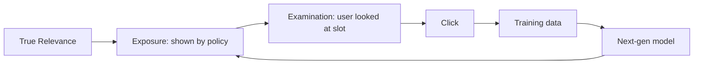

> *"Your click log is not your data. It's your model's old recommendations."*

## Introduction

In production recommenders, the data you collect is the data your **current** policy chose to show. Train on it naively and you'll train a model that loves whatever the old model loved — biases and all. The two largest culprits are **position bias** (top slots get inflated CTR) and **exposure bias** (you only see clicks for items you showed). This post covers click models, **Inverse Propensity Scoring (IPS)**, **Doubly Robust (DR)** estimation, and how to use them for unbiased training and off-policy evaluation.

## 1. The Bias Diagram



Click ≠ relevance. Click = exposure × examination × relevance. Without correcting, learned scores conflate all three.

## 2. Click Models

### 2.1 Position-Based Model (PBM)
$$P(\text{click} | u, i, k) = \theta_k \cdot \gamma_{u, i}$$

$\theta_k$ = examination probability at position $k$ (slot-dependent, user-independent).
$\gamma_{u,i}$ = relevance.

### 2.2 Cascade Model
User scans top-down; clicks the first relevant; stops. Implies dependence between positions.

### 2.3 DBN / UBM
More complex models (Dependent Click Model, User Browsing Model) add satisfaction parameters.

PBM is the workhorse — simple, surprisingly effective.

## 3. Estimating Position Bias

### Result Randomization
Swap two positions randomly for a fraction of traffic. Compare CTR:

$$\hat \theta_k / \hat \theta_1 = \frac{\text{CTR at slot }k}{\text{CTR at slot }1}\Bigg|_{\text{same item, randomized}}$$

The cheapest robust method.

### EM with PBM
Iterate between estimating $\theta_k$ and $\gamma_{u,i}$ on observed clicks.

### RegressionEM (Wang 2018)
Combine PBM with a click model so you fit position bias and relevance jointly.

```python
import numpy as np
# Inputs: positions[i], clicks[i], item_relevance_model(i)
# Iterative EM for PBM
def estimate_pbm(positions, clicks, theta_init=None, n_iter=20, K=10):
    theta = np.ones(K) if theta_init is None else theta_init.copy()
    rel = clicks.copy().astype(float)
    for _ in range(n_iter):
        # E-step: expected exam given click
        e_click = theta[positions] * rel
        # M-step
        for k in range(K):
            mask = positions == k
            theta[k] = (rel[mask] * e_click[mask] / max(e_click[mask].mean(), 1e-6)).mean()
        theta /= theta[0]    # normalize so theta_1 = 1
    return theta
```

## 4. Inverse Propensity Scoring (IPS)

If we knew $P(\text{exam}_k) = \theta_k$, we could **weight** each example by $1/\theta_k$ to un-bias it:

$$\mathcal L_{\text{IPS}} = \sum_{(u,i,k,c)} \frac{c}{\theta_k} \log p_\theta(c | u, i)$$

**Pros:** unbiased in expectation.
**Cons:** variance explodes for small $\theta_k$ (bottom slots).

### Clipped IPS
Cap weights $w = \min(1/\theta_k, M)$. Trade some bias for sanity.

## 5. Doubly Robust (DR)

Combine a **reward model** $\hat r(u, i)$ with IPS:

$$\hat V_{\text{DR}} = \mathbb E_{(u,i,c)}\left[\hat r(u,i) + \frac{c - \hat r(u,i)}{\theta(u,i)}\right]$$

Unbiased if either $\hat r$ or $\theta$ is correct. **Lower variance** than IPS.

```python
def dr_estimate(reward_model, propensity, logged):
    """ logged: list of (x, a, r, prop) """
    estimates = []
    for x, a, r, p in logged:
        rhat = reward_model.predict(x, a)
        estimates.append(rhat + (r - rhat) / max(p, 1e-3))
    return np.mean(estimates)
```

## 6. Counterfactual Evaluation (Off-Policy)

Evaluate a new policy $\pi_t$ using logs from old $\pi_b$:

$$\hat V(\pi_t) = \frac{1}{n}\sum_i \frac{\pi_t(a_i|x_i)}{\pi_b(a_i|x_i)} r_i$$

Requirements:
- Log $\pi_b(a|x)$ for every served example.
- Behavior policy must have **support** over the actions the new policy proposes (no $\pi_b = 0$ where $\pi_t > 0$).

Variants:
- **Self-Normalized IPS** (SNIPS): stable.
- **DR**: lower variance.
- **CRM** (Counterfactual Risk Minimization, Swaminathan & Joachims): trains directly.

## 7. Unbiased Learning to Rank (ULTR)

For ranking, IPS is integrated into the loss. The famous Joachims paper (WSDM 2017) used:

$$\mathcal L = \sum_q \sum_{i \in \text{clicks}(q)} \frac{1}{\hat \theta_{k_i}} \text{pair-loss}(i, q)$$

## 8. PyTorch: Pairwise LTR with IPS

```python
import torch
def ips_pairwise_loss(scores, clicks, positions, theta, margin=0.0):
    # scores: B; clicks: B (0/1); positions: B (int); theta: K-vector
    pos = clicks == 1
    neg = clicks == 0
    if pos.sum() == 0 or neg.sum() == 0: return torch.tensor(0.)
    w = 1.0 / theta[positions[pos]]
    diff = scores[pos].unsqueeze(1) - scores[neg].unsqueeze(0)
    loss = torch.log1p(torch.exp(-diff + margin)).mean(1) * w
    return loss.mean()
```

## 9. Reducing Position Bias by Design

Engineering options:
- **Position feature** at training, dropped at serving (Cheng 2016, Wide&Deep ad-rec) — model learns to "subtract" position effect.
- **Adversarial debiasing**: discourage the encoder from carrying position info.
- **Two-tower**: position is *not* in the user/item tower → can't influence retrieval.
- **Randomized exploration** budget for measurement.

## 10. The Loop

```mermaid
flowchart TB
    A[Live policy pi_b<br/>logs clicks + propensities] --> B[Estimate theta_k<br/>via randomization]
    B --> C[Train pi_t with IPS / DR]
    C --> D[Offline OPE: V(pi_t)]
    D -->|safe| E[Online A/B vs pi_b]
    E -->|win| F[Promote: pi_b ← pi_t]
    F --> A
```

This is **counterfactual MLOps**.

## 11. Pros & Cons

| Method | Pros | Cons |
|---|---|---|
| Position-feature dropout | Cheap, simple | Assumes linear position effect |
| IPS | Unbiased | High variance |
| Clipped/SNIPS | Stable | Slightly biased |
| DR | Lower variance, robust | Needs a reward model |
| CRM | End-to-end unbiased policy | Heavier training |

## 12. Practical Tips

- Run a small **randomization slice** (1–2% traffic) constantly — gives unbiased eval set forever.
- Log full **propensity vector** for top-K, not just the chosen action.
- Cap IPS weights at the 99th percentile — variance collapses, bias is tiny.
- Always report **CIs / bootstrap** on OPE estimates — IPS variance is huge.
- Test **policy disagreement** rates between $\pi_b$ and $\pi_t$ — if too low, OPE is uninformative.

## 13. End-to-End: PBM Estimation + IPS Loss on Synthetic Logs

```python
import numpy as np, torch
np.random.seed(0)
K, n = 10, 200_000
true_theta = np.linspace(1.0, 0.1, K)
true_rel = np.random.uniform(size=1000)
data = []
for _ in range(n):
    item = np.random.randint(0, 1000)
    pos = np.random.randint(0, K)
    p_click = true_theta[pos] * true_rel[item]
    data.append((item, pos, int(np.random.rand() < p_click)))

# Estimate theta via EM (using observed click positions)
pos_clicks = np.zeros(K); pos_impr = np.zeros(K)
for i, p, c in data:
    pos_impr[p] += 1; pos_clicks[p] += c
theta_hat = (pos_clicks / pos_impr); theta_hat /= theta_hat[0]
print("theta_hat", np.round(theta_hat, 2))

# Train a relevance model with IPS-weighted log loss
items = torch.tensor([d[0] for d in data])
pos = torch.tensor([d[1] for d in data])
c = torch.tensor([d[2] for d in data], dtype=torch.float)
emb = torch.nn.Embedding(1000, 1)
opt = torch.optim.Adam(emb.parameters(), lr=1e-2)
for epoch in range(3):
    s = torch.sigmoid(emb(items)).squeeze()
    w = torch.tensor(1.0 / theta_hat[pos.numpy()], dtype=torch.float)
    loss = -(w * (c*torch.log(s+1e-9) + (1-c)*torch.log(1-s+1e-9))).mean()
    opt.zero_grad(); loss.backward(); opt.step()
print("Top-5 estimated relevant items:", emb.weight.detach().squeeze().argsort(descending=True)[:5])
```

## 14. Pitfalls

1. Estimating $\theta$ on logs **without randomization** → circular reasoning (current model decides positions).
2. Using IPS without **clipping** → wild variance, unstable training.
3. Treating CTR data as ground-truth relevance.
4. Forgetting to **log propensity** at serving — can't do anything without it.
5. Comparing $\pi_t$ with $\pi_b$ that have very different support — OPE is meaningless.

## 15. Public Datasets

- **Yahoo R6** — logged bandit with randomization — https://webscope.sandbox.yahoo.com/
- **Criteo Counterfactual Eval Dataset** — https://ailab.criteo.com/
- **ZOZO Open Bandit Dataset** — https://github.com/st-tech/zr-obp
- **MSLR + simulated clicks** for ULTR — https://www.microsoft.com/en-us/research/project/mslr/
- **TripClick** — search logs — https://tripdatabase.github.io/tripclick/

## 16. Further Reading

- Joachims et al., *Unbiased Learning-to-Rank with Biased Feedback* (WSDM 2017)
- Wang et al., *Position Bias Estimation for Unbiased LTR in Personal Search* (WSDM 2018)
- Ai et al., *Unbiased LTR with Unbiased Propensity Estimation* (SIGIR 2018)
- Chapelle et al., *Click Models for Web Search* (Morgan & Claypool 2015)
- Dudík, Langford, Li, *Doubly Robust Policy Evaluation and Learning* (ICML 2011)
- Saito et al., *Off-Policy Evaluation: A Survey* (OBP 2021)
- Chen et al., *Top-K Off-Policy Correction for a REINFORCE Recommender* (WSDM 2019)
