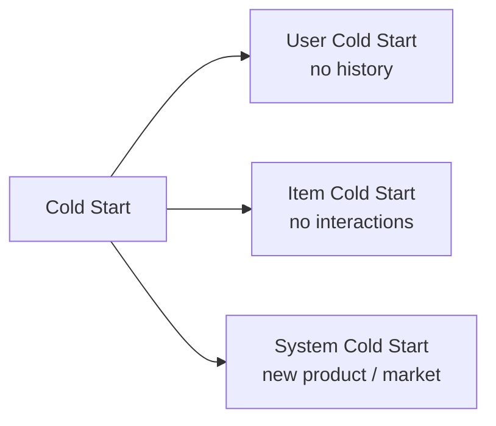
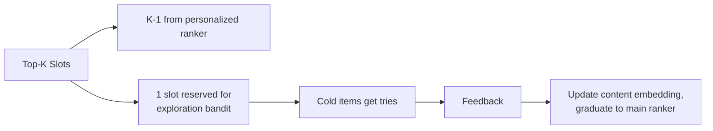

> *"Every system starts cold. The question is how it warms up."*

## Introduction

The **cold-start problem** is the gravitational center of every new product feature:
- **New user** — no history.
- **New item** — no interactions.
- **New context** — new locale, new device, new query type.
- **Niche / rare segment** — a user or item in a long-tail category the model rarely sees.
- **Preference drift** — an existing user or item whose behavior changes enough that prior history misleads.

Without a strategy, classical CF or two-tower models silently degrade to popularity recommendations. This post catalogs the techniques that work: content features, meta-learning, prompts, bandit exploration, and design choices that keep cold-start cheap.

## 1. Three Flavors of Cold Start



| Flavor | Symptom | Typical fix |
|---|---|---|
| User | Recs are popularity-only | Onboarding, demographic priors, contextual bandits |
| Item | New items never surface | Content embeddings, exploration budget |
| System | Everything sparse | Bootstrap from external data / pretrained content models |

## 2. User Cold Start

### 2.1 Onboarding / Preference Elicitation
Pick a small set of high-information items and ask: "Which of these have you used / liked?"

Information-theoretic selection: pick items that maximally split user clusters.

```python
import numpy as np
# Cluster users; pick items that best discriminate clusters
def best_onboarding_items(user_emb, item_emb, k=5):
    # KMeans clusters as discrete user types
    from sklearn.cluster import KMeans
    km = KMeans(n_clusters=8).fit(user_emb)
    centroids = km.cluster_centers_                    # 8, d
    scores = item_emb @ centroids.T                    # n_items, 8
    diversity = scores.std(axis=1)                     # high std = informative
    return np.argsort(diversity)[::-1][:k]
```

### 2.2 Demographic Priors
Use age/country/device to set a prior embedding for new users; warm-start their personalization.

### 2.3 Implicit Context
First click is gold — first session is platinum. **Session-based models** (Blog 08) shine for cold users.

## 3. Item Cold Start

### 3.1 Content-Based Encoders
Item embedding $= f(\text{title}, \text{image}, \text{category}, \text{price}, \ldots)$. No item-id dependence.

```python
from sentence_transformers import SentenceTransformer
m = SentenceTransformer("all-mpnet-base-v2")
def item_vec(meta):
    text = f"{meta['title']}. Brand: {meta['brand']}. Category: {meta['cat']}."
    return m.encode(text, normalize_embeddings=True)
```

Two-tower retrieval (Blog 09) with a **content-only item tower** gives new items a useful embedding day-1.

### 3.2 LightFM / Hybrid
Combines MF with content features — new items get embeddings via metadata.

### 3.3 Exploration Budget
Reserve a slot in top-K for new items; use a bandit (Blog 13) to allocate.



### 3.4 Knowledge Graph / Category Priors
Inherit embedding from siblings: new product in "running shoes" starts near other running shoes.

## 4. Meta-Learning Approaches

Train models that *adapt fast* to new users/items with few interactions:

- **MAML for RecSys**: outer loop = users, inner loop = a few gradient steps on a new user (Vartak 2017, Lee 2019 *MeLU*).
- **Reptile**, **ANIL** variants.

```python
# MAML pseudocode for user cold start
def maml_step(model, support, query, inner_lr=0.01):
    # Inner loop: adapt to support set
    fast_weights = {k: v.clone() for k, v in model.named_parameters()}
    for x, y in support:
        loss = bce(model.forward_with(fast_weights, x), y)
        grads = torch.autograd.grad(loss, fast_weights.values(), create_graph=True)
        fast_weights = {k: w - inner_lr*g for (k, w), g in zip(fast_weights.items(), grads)}
    # Outer loop: evaluate on query
    loss = bce(model.forward_with(fast_weights, query.x), query.y)
    return loss
```

## 5. Cross-Domain Transfer

If you launch books and you already have movies: shared user → leverage existing embeddings. Methods:

- Shared user encoder across domains.
- Domain-adversarial training.
- LLM bridge (Blog 15): same user, same natural-language description → re-encode for new catalog.

## 6. LLMs for Zero-Shot Cold Start

Prompt-based cold start (Blog 15) is uniquely powerful: you can recommend a brand-new book to a brand-new user given only "I liked Atomic Habits and Deep Work." Pair with constrained decoding to anchor to your catalog.

## 7. Production Patterns

### Slate composition
```
Top-K slate = max(0, K - exploration_budget) personalized
            + exploration_budget cold items (ranked by bandit / content prior)
```

### Two-stage retrieval
- Stage A: classic two-tower (warm items)
- Stage B: content-based ANN (cold items)
- Merge with adaptive weights based on user's signal density

### Staged promotion
Promote items from "cold-exploration pool" to "warm pool" once they hit X impressions or Y clicks. Avoids cold items hogging slots forever.

## 8. Pros & Cons

| Strategy | Pros | Cons |
|---|---|---|
| Content embeddings | Day-1 coverage | Limited by content quality |
| Onboarding flow | Strong signal | UX friction |
| Bandit exploration | Native warmup | Slot tax on slate quality |
| Meta-learning | Sample-efficient | Complex training |
| LLM bootstrap | Zero-shot, semantic | Cost & latency |

## 9. Cold-Start Metric Slicing

Always evaluate slices:
- Users with <5 interactions
- Items <7 days old
- New countries / locales
- New device types

If your aggregate NDCG goes up but cold slices drop, your model is over-fitting to warm users — common failure mode.

## 10. End-to-End: Content-Only Item Tower for Cold Items

```python
import torch, torch.nn as nn, pandas as pd
from sentence_transformers import SentenceTransformer

items = pd.read_csv("movies.csv")
sbert = SentenceTransformer("all-MiniLM-L6-v2")
text_emb = torch.tensor(
    sbert.encode((items["title"]+" "+items["genres"]).tolist(),
                 normalize_embeddings=True),
    dtype=torch.float32)

class ContentItemTower(nn.Module):
    def __init__(self, in_d=384, out_d=64):
        super().__init__()
        self.mlp = nn.Sequential(nn.Linear(in_d, 256), nn.ReLU(),
                                 nn.Linear(256, out_d))
    def forward(self, x): return torch.nn.functional.normalize(self.mlp(x), dim=-1)

item_tower = ContentItemTower()
# Train user tower against this item tower via in-batch negatives;
# new items never trained on still get a useful embedding via their text.
```

## 11. Pitfalls

1. Over-relying on **popularity** as a cold-start fallback — feedback loop snowballs.
2. Onboarding only at sign-up — re-elicit when behavior is sparse.
3. Letting cold-exploration slots eat too much CTR — set a strict ceiling.
4. Different cold-start path in eval vs prod (e.g., padded zeros vs random) — train/serve skew.
5. Not measuring **time-to-personalization** (the metric of how fast new users get good recs).

## 12. Public Datasets for Cold-Start Eval

- **MovieLens** with a temporal split — measure newly added items
- **Amazon Reviews 2018** — item launch dates available — https://nijianmo.github.io/amazon/
- **H&M Personalized Fashion** (KDD'22 / Kaggle) — cold-item heavy — https://www.kaggle.com/c/h-and-m-personalized-fashion-recommendations
- **MIND News** — high item churn — https://msnews.github.io/
- **Yelp** — new businesses come online weekly


## 13. Classical Strategies & Methods (Primer)

Before the deep-learning toolkit above, a few classical strategies remain the backbone of any cold-start plan, and they compose well with everything else in this post.

**Strategies.** Hybrid recommenders combine collaborative filtering with content-based, demographic, or knowledge-based filtering so that a missing signal in one channel is covered by another. *Active learning* asks the user to rate a small, carefully chosen set of items (the onboarding flow in §2.1). *Transfer learning* leverages data from a related domain or source (cross-domain transfer, §5). *Ensemble methods* blend several models so their strengths complement each other and the system degrades gracefully when any one signal is sparse.

**Methods.** The strategies above are realized with familiar building blocks: *matrix factorization* decomposes the user–item matrix into latent factors to predict missing interactions; *clustering* groups similar users or items so a newcomer inherits its neighbors' preferences; *nearest-neighbor* surfaces items liked by the most similar users or items; and *deep learning* learns nonlinear patterns and content embeddings that generalize to unseen users and items.

## 14. Opportunities in Cold Start

Cold start is not only a problem to be mitigated — it is also leverage. The need to serve users and items with no history *forces* the system to explore, and disciplined exploration is how a recommender discovers new preferences instead of overfitting to the popular and familiar. Treated well, cold start widens catalog coverage, surfaces fresh and diverse items, and turns onboarding into a trust-building moment: a user who is asked thoughtfully and rewarded with relevant recommendations early is a user who stays. The same exploration budget that "pays a tax" on a single slate is the mechanism that keeps the whole system from collapsing into a popularity feedback loop.

## 15. Further Reading

- Schein et al., *Methods and Metrics for Cold-Start Recommendations* (SIGIR 2002)
- Vartak et al., *A Meta-Learning Perspective on Cold-Start Recommendations* (NIPS 2017)
- Lee et al., *MeLU* (KDD 2019)
- Kula, *LightFM* (2015) — content + CF hybrid
- Lika et al., *Facing the cold start problem in recommender systems* (Expert Systems 2014)
- Hou et al., *Large Language Models are Zero-Shot Rankers for RecSys* (ECIR 2024) — LLM-based cold start
- [What are the challenges and opportunities of using collaborative filtering for cold start users? (LinkedIn)](https://www.linkedin.com/advice/0/what-challenges-opportunities-using-collaborative)
