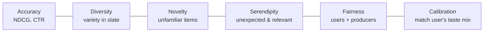

> *"Accuracy alone makes echo chambers. The best feeds know when to surprise you."*

## Introduction

Recommender systems optimized purely for predicted clicks converge to **filter bubbles**, **popularity dominance**, and **demographic unfairness**. Real products need to balance accuracy with **diversity**, **novelty**, **serendipity**, and **fairness** — both for users (better experience) and for content producers (fair exposure).

This post covers re-ranking strategies (MMR, DPP), exposure-aware fairness, calibrated recommendations, and how to measure beyond accuracy.

## 1. The Beyond-Accuracy Goals



Each is a different lens; they often conflict pairwise.

## 2. Diversity Metrics

### Intra-List Diversity (ILD)
$$\text{ILD}(L) = \frac{2}{|L|(|L|-1)} \sum_{i,j \in L, i<j} d(i, j)$$

where $d$ is a distance (1 − cosine similarity, or categorical Jaccard).

### Category Coverage
Fraction of distinct categories in the slate.

### Gini / Long-Tail Share
Catalog-wide: how spread is your recommendation traffic? Lower Gini → fairer to long-tail items.

## 3. Re-Ranking for Diversity

### MMR — Maximal Marginal Relevance (Carbonell 1998)
$$\text{MMR} = \arg\max_{i \in C \setminus L}\left[\lambda \cdot s_i - (1-\lambda) \max_{j \in L} \text{sim}(i, j)\right]$$

Greedy: at each step pick the item that's relevant but dissimilar to already-selected.

```python
import numpy as np

def mmr_rerank(candidates, scores, sim, k=10, lam=0.7):
    selected, remaining = [], list(range(len(candidates)))
    while len(selected) < k and remaining:
        if not selected:
            i = int(np.argmax(scores[remaining]))
        else:
            max_sim = sim[np.ix_(remaining, selected)].max(axis=1)
            obj = lam * scores[remaining] - (1 - lam) * max_sim
            i = int(np.argmax(obj))
        selected.append(remaining.pop(i))
    return [candidates[i] for i in selected]
```

### Determinantal Point Processes (DPP)
Probabilistic models that score sets by a determinant of a kernel matrix $L$:

$$P(L_S) \propto \det(L_S)$$

The determinant rewards diverse subsets — high-volume parallelepipeds. Used at YouTube for slate diversity (Wilhelm 2018).

```python
import numpy as np
def greedy_dpp(L_kernel, k):
    """Greedy MAP for DPP using sequential Cholesky updates."""
    N = L_kernel.shape[0]
    cis = np.zeros((k, N))
    di2s = np.diag(L_kernel).copy()
    selected = []
    for i in range(k):
        j = int(np.argmax(di2s))
        selected.append(j)
        L_ji = L_kernel[j]
        if i > 0:
            eis = (L_ji - cis[:i, :].T @ cis[:i, j]) / np.sqrt(di2s[j])
        else:
            eis = L_ji / np.sqrt(di2s[j])
        cis[i] = eis
        di2s -= eis**2
        di2s[j] = -np.inf
    return selected
```

### Submodular Set Functions
Generalize MMR/DPP — anything that exhibits diminishing returns can be greedily optimized with a $1 - 1/e$ guarantee.

## 4. Calibrated Recommendations (Steck 2018)

If a user historically watches 60% drama / 30% comedy / 10% horror, the slate should reflect that mix — not just push the highest-scoring drama.

Formally, pick $L$ to minimize KL divergence between user's category histogram and the slate's:

$$D_{KL}(p_u \| q_L)$$

Beautiful technique — combats the "rabbit hole" effect where models reinforce strongest signals.

## 5. Serendipity

Serendipity ≈ relevance × unexpectedness. Heuristic:

$$\text{Sere}(L, u) = \frac{1}{|L|}\sum_{i \in L} \text{rel}(u, i) \cdot \text{unexp}(i, u)$$

where unexp = 1 − similarity to user's average history.

Tricky to evaluate offline — usually validated via user studies.

## 6. Fairness for Producers

### Equal Exposure
Each item gets a share of exposure proportional to its merit:

$$\frac{\text{Exposure}_i}{\text{Merit}_i} \approx \text{const}$$

### Group Fairness
Items grouped by protected attribute (gender of author, country of origin). Constraints:

- **Demographic parity**: equal exposure per group.
- **Equal opportunity**: equal click-through *given* relevance.

### Stochastic Rankings (Singh & Joachims 2018)
Sample rankings from a distribution that satisfies fairness constraints in expectation.

## 7. Fairness for Users

- **Recommendation quality parity** across demographic slices.
- **Avoidance of harmful recommendations** (radicalization, addictive content).
- **Privacy-preserving recommendations** (differentially private MF).

## 8. Pros & Cons

| Method | Pros | Cons |
|---|---|---|
| MMR | Simple, plug-in | Doesn't model set-level utility |
| DPP | Principled set diversity | Kernel design hard |
| Calibration | Matches user taste profile | Requires reliable category labels |
| Stochastic ranking | Strong fairness guarantees | Click variance up |

## 9. Production Integration


Re-rank stage is **cheap** — pure-logic, runs on CPU, easy to A/B independently of the model.

## 10. End-to-End: MMR + Calibration on MovieLens

```python
import pandas as pd, numpy as np
from sklearn.metrics.pairwise import cosine_similarity

movies = pd.read_csv("movies.csv")
genres = movies["genres"].str.get_dummies("|").values   # n x g
sim = cosine_similarity(genres)

# Assume scores from your model
scores = np.random.rand(len(movies))

# User's profile (e.g., from their history's genre mean)
user_profile = np.array([0.5, 0.3, 0.2] + [0]*(genres.shape[1]-3))
user_profile /= user_profile.sum()

# Calibrated MMR
def cal_mmr(scores, sim, user_profile, item_genres, k=10, lam=0.6, beta=0.2):
    chosen = []
    cand = list(range(len(scores)))
    while len(chosen) < k:
        best, best_obj = None, -1e9
        for i in cand:
            div = (max((sim[i, j] for j in chosen), default=0)) if chosen else 0
            slate_dist = item_genres[chosen + [i]].mean(0) if chosen else item_genres[i]
            slate_dist = slate_dist / max(slate_dist.sum(), 1e-9)
            kl = np.sum(user_profile * (np.log(user_profile + 1e-9) - np.log(slate_dist + 1e-9)))
            obj = lam*scores[i] - (1-lam)*div - beta*kl
            if obj > best_obj: best, best_obj = i, obj
        chosen.append(best); cand.remove(best)
    return chosen

top = cal_mmr(scores, sim, user_profile, genres, k=10)
print(movies.iloc[top][["title","genres"]])
```

## 11. Pitfalls

1. Adding diversity without measuring **opportunity cost** in CTR.
2. Treating category labels as ground truth when they're noisy (multi-label, missing).
3. Diversity at slate but **not over time** — boring sessions for repeat users.
4. Fairness intervention without causal analysis — may shift bias rather than fix it.
5. Calibration to wrong reference distribution (global popularity vs personal taste).

## 12. Public Datasets

- **MovieLens** — clean category labels — https://grouplens.org/datasets/movielens/
- **Spotify MPD** — diverse playlists — https://www.aicrowd.com/challenges/spotify-million-playlist-dataset-challenge
- **MovieLens-Fairness** — added demographic — https://github.com/google-research-datasets/movielens-fairness
- **Last.fm 360K** — popularity bias studies — http://ocelma.net/MusicRecommendationDataset/
- **Amazon Books** — author/publisher fairness — https://nijianmo.github.io/amazon/

## 13. Further Reading

- Carbonell & Goldstein, *The Use of MMR* (SIGIR 1998)
- Steck, *Calibrated Recommendations* (RecSys 2018)
- Kulesza & Taskar, *Determinantal Point Processes for Machine Learning* (NOW 2012)
- Wilhelm et al., *Practical Diversified Recommendations on YouTube with DPP* (CIKM 2018)
- Singh & Joachims, *Fairness of Exposure in Rankings* (KDD 2018)
- Mehrotra et al., *Towards a Fair Marketplace: Counterfactual Evaluation of the Trade-off between Relevance, Fairness and Satisfaction* (CIKM 2018)
