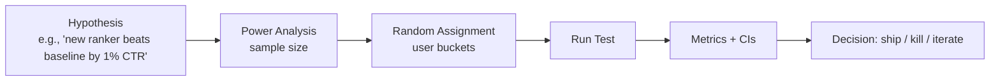

> *"Models ship in code, but win or lose in experiments."*

## Introduction

Every model change must prove itself online. This post covers the design and analysis of A/B tests for recommenders: sample size, variance reduction (CUPED), interleaving, sequential testing, sensitive metrics, novelty effects, and how to read a "flat" experiment correctly.

## 1. The A/B Test Stack



## 2. Randomization Unit

Almost always **user**, not request. Request-level randomization causes:
- Memory effects (model A then B in same session pollutes both)
- Wrong variance (correlated requests inflate apparent significance)

**Sticky bucketing**: hash user_id → bucket so the same user always sees the same arm. Bucket once, reuse forever.

## 3. Sample Size & Power

For a binary metric $p$ with effect $\Delta$, two-sided $\alpha=0.05$, power $1-\beta=0.8$:

$$n \approx \frac{(z_{1-\alpha/2} + z_{1-\beta})^2 \cdot 2 p (1-p)}{\Delta^2}$$

For continuous: replace $p(1-p)$ with $\sigma^2$.

```python
import math
def sample_size(p, mde, alpha=0.05, power=0.8):
    from scipy.stats import norm
    z_a = norm.ppf(1 - alpha/2); z_b = norm.ppf(power)
    return math.ceil(2 * p*(1-p) * (z_a + z_b)**2 / mde**2)

print(sample_size(p=0.05, mde=0.001))   # 5% baseline, 0.1pp lift target
```

**Reality check**: low-CTR products (ads at 1%) need millions of users per arm to detect a 1% relative lift. Sensible MDE = 1–5% relative on top-line metric.

## 4. Variance Reduction

### CUPED (Microsoft / Bing 2013)
Use pre-experiment data $X$ as covariate; adjust metric $Y$:

$$\tilde Y = Y - \theta (X - \bar X), \quad \theta = \frac{\text{Cov}(X, Y)}{\text{Var}(X)}$$

Variance drops by $1 - \rho^2$; for retention-like metrics, $\rho \approx 0.7$ → 50% variance reduction → 2× faster experiments.

```python
import numpy as np
def cuped(Y, X):
    theta = np.cov(X, Y)[0, 1] / np.var(X)
    return Y - theta * (X - X.mean())
```

### Stratified Sampling
Bucket users by stratum (country, OS, cohort); randomize within. Lowers variance from heterogeneity.

### Triggered Analysis
Only count users who **could be affected** by the change. Reduces noise dramatically.

## 5. Interleaving (for ranking changes)

Show users a **mixed** result list from A and B; record which side gets the click. Same user is their own control → 10–100× more sensitive than A/B.

Team Draft Interleaving: alternate which model picks the next slot.

**Pros:** ultra-sensitive, fast.
**Cons:** only measures *preference*, not impact on long-term metrics.

## 6. Sequential / Multi-Arm Testing

Peeking at fixed-horizon p-values inflates false positives. Solutions:

- **Sequential probability ratio tests (SPRT)**
- **Always-valid p-values** (Johari et al. 2017)
- **Bayesian A/B**: track $P(\Delta > 0 | \text{data})$ — stop when threshold crossed.

```python
from scipy.stats import beta
import numpy as np

def bayes_decision(s_a, n_a, s_b, n_b, samples=50_000, prob_thr=0.95):
    pa = beta.rvs(1+s_a, 1+n_a-s_a, size=samples)
    pb = beta.rvs(1+s_b, 1+n_b-s_b, size=samples)
    return (pb > pa).mean()             # P(B > A)
```

## 7. Metrics You Watch in a RecSys Test

| Tier | Metric |
|---|---|
| North-star | DAU/MAU, 28-day retention |
| Engagement | Session length, sessions/user, time spent |
| Conversion | CTR, CVR, GMV, ARPU |
| Diversity / quality | ILD, catalog coverage, % long-tail clicks |
| Health / guardrails | p95/p99 latency, errors, ad load, content moderation rates |

Track them all simultaneously. A 2% CTR lift with a 5% latency regression is not a win.

## 8. Novelty & Primacy Effects

New things get clicked because they're new. Always:

- Run **at least 2 weeks** (or one user-cycle longer than typical session).
- **Compare day-1 vs day-14 deltas** — if they shrink, novelty effect is in play.
- Use **first-time-exposed vs steady-state** splits.

## 9. Multi-Treatment & Holdouts

- **Multi-arm tests** with Bonferroni or BH corrections.
- **Long-term holdout** (1–5% never exposed to any change) — measure cumulative product impact.
- **Cohort analysis**: new users vs power users may react opposite ways.

## 10. SRM, Heterogeneity, and Diagnostics

- **Sample Ratio Mismatch (SRM)**: assigned 50/50, observed 49/51 → randomization is broken; investigate before reading results.
- **CI overlap** doesn't mean equivalent; use proper **equivalence tests**.
- **Heterogeneous treatment effects (HTE)**: average flat, but power users lift 10% — slice by activity tier.

## 11. End-to-End: A/B Analysis with CUPED

```python
import numpy as np, pandas as pd
from scipy.stats import ttest_ind

# Simulate: pre-period metric correlated with current period
np.random.seed(0)
n = 50_000
pre = np.random.gamma(2, 2, n*2)               # both arms
y = pre*0.7 + np.random.normal(0, 1, n*2)
y[n:] += 0.05                                   # treatment lift
df = pd.DataFrame({"y": y, "pre": pre, "arm": ["A"]*n+["B"]*n})

# Vanilla
t, p = ttest_ind(df[df.arm=="A"]["y"], df[df.arm=="B"]["y"])
print(f"Vanilla: t={t:.2f} p={p:.4g}")

# CUPED
theta = df[["pre","y"]].cov().iloc[0,1] / df["pre"].var()
df["y_adj"] = df["y"] - theta*(df["pre"]-df["pre"].mean())
t, p = ttest_ind(df[df.arm=="A"]["y_adj"], df[df.arm=="B"]["y_adj"])
print(f"CUPED:   t={t:.2f} p={p:.4g}")
```

## 12. Pros & Cons by Method

| Method | Pros | Cons |
|---|---|---|
| Vanilla A/B | Simple, well-understood | Slow at low effect sizes |
| CUPED | 50%+ variance reduction free | Needs pre-period data |
| Interleaving | Ultra-sensitive | Only ordinal preference info |
| Bayesian | Continuous monitoring, intuitive output | Prior sensitivity |
| Sequential | Faster stops on big effects | Stricter analysis required |

## 13. Pitfalls

1. **Peeking** at p-values without sequential corrections.
2. Treating bucket = 1% as enough for top-line — minimum bucket usually 5–10%.
3. Ignoring **interaction** between concurrent experiments — orthogonalize via factorial design.
4. Comparing different **user populations** ("treatment shifted ineligible users out").
5. **Network / spillover** effects (social features, marketplaces).
6. Ignoring the **engineering / serving cost** of small lifts — what's the ROI?

## 14. Public Datasets / Tools

- **GrowthBook** open-source experimentation — https://www.growthbook.io/
- **Optimizely Stats Engine** writeups
- **Microsoft ExP** blog — case studies
- **CUPED reference implementation** — https://github.com/microsoft/EvalRS
- **Causal ML library (Uber)** — HTE/heterogeneity — https://github.com/uber/causalml

## 15. Further Reading

- Kohavi, Tang, Xu, *Trustworthy Online Controlled Experiments* (Cambridge 2020) — the book
- Deng, Xu, Kohavi, Walker, *Improving the Sensitivity of Online Controlled Experiments by Utilizing Pre-Experiment Data (CUPED)* (WSDM 2013)
- Johari et al., *Always Valid Inference: Continuous Monitoring of A/B Tests* (KDD 2017)
- Chapelle et al., *Large-Scale Validation and Analysis of Interleaved Search Evaluation* (TOIS 2012)
- Bakshy et al., *Designing and Deploying Online Field Experiments (PlanOut)* (KDD 2014)
