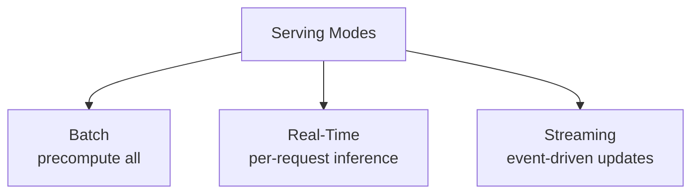
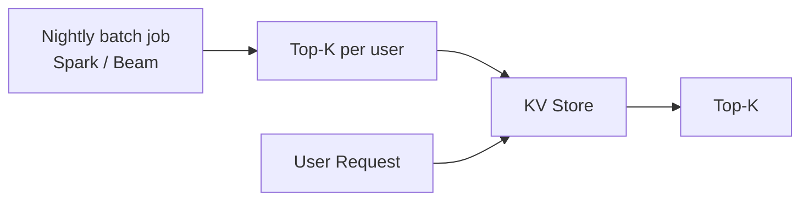
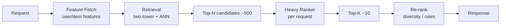
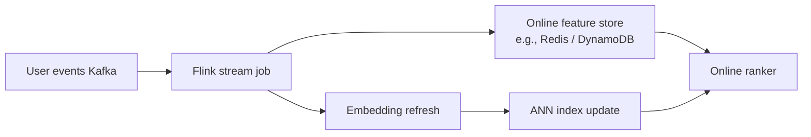
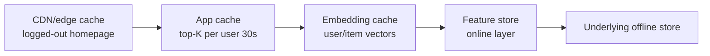
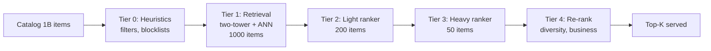

> *"The best model that misses its latency budget is the worst model in production."*

## Introduction

A recommender that's brilliant offline but blows the 200ms budget at request time gets rolled back. This post is about how recommendations get *served*: batch, real-time online, and streaming pipelines; the latency SLO math (p50, p95, p99); caching; multi-stage funnels; and the trade-offs each mode makes.

## 1. Three Serving Modes



| Mode | Freshness | Latency at request | Cost |
|---|---|---|---|
| Batch | Hours–days | <1ms (KV lookup) | Cheap compute, high storage cost |
| Real-time | Seconds | Tens of ms | high compute cost |
| Streaming | Sub-second | <10ms (cached) | Hybrid |

## 2. Batch Serving

Compute the top-K for every user once a day, store in a KV (DynamoDB, BigTable, Redis), look up at request.



### When to use
- Email/push (sends batched anyway)
- Long-tail surfaces with low traffic
- Cost-sensitive (huge user base, infrequent visits)

### Pros & Cons
| Pros | Cons |
|---|---|
| Latency near-zero | Stale within day |
| Easy to debug | Storage cost (millions of users × hundreds of items) |
| GPU friendly (big batches) | Wastes work for inactive users |

## 3. Real-Time Serving

Two-stage funnel: **retrieval** (ANN) → **ranking** (heavy model) → re-rank.



### Latency budget example (200ms total)
| Stage | Budget |
|---|---|
| Network in/out | 30ms |
| Feature fetch | 30ms |
| Retrieval (ANN) | 20ms |
| Ranking (CPU/GPU) | 60ms |
| Re-rank, business rules | 20ms |
| Headroom / variance | 40ms |

### Pros & Cons
| Pros | Cons |
|---|---|
| Fresh: includes last click | Compute scales with QPS |
| Personalizes context (location, query) | Must engineer for tail latency |
| Lets you re-rank by real-time signals | Harder to scale globally |

## 4. Streaming Serving

Async update pipelines (Kafka, Pulsar, Flink) keep features and embeddings fresh in seconds.



Examples: TikTok's For You, X/Twitter timeline. Engagement signals from last minute feed into the ranker for the next request.

### Pros & Cons
| Pros | Cons |
|---|---|
| Sub-second freshness | Engineering complexity (exactly-once, schema evolution) |
| Captures fast trends | Backpressure / lag debugging |
| Used in TikTok-style feeds | Cost & ops overhead |

## 5. Latency, Percentiles, and SLOs

- **p50 (median)** is for marketing decks.
- **p95 / p99** is what users actually feel under load.
- **p99.9** matters when you have millions of requests; tail latency cascades.

### Why tail matters
A page that fans out to 10 backends has a p95 page latency = p99.5 backend latency (roughly). Cut tails or your overall page latency tanks.

```python
# Quick latency analysis
import numpy as np
ts = np.array([...])  # request latencies in ms
for p in [50, 75, 95, 99, 99.9]:
    print(f"p{p}: {np.percentile(ts, p):.1f} ms")
```

### Strategies for tighter tails
- **Hedged requests**: send to 2 backends, take first response.
- **Timeouts + graceful degradation** (fall back to cached top-K).
- **Warm-up / load shedding** at autoscaler boundaries.
- **Quantization (int8)**, **distillation**, **TensorRT/ONNX**.
- **GC tuning** for JVM/Python; minimize allocations on hot path.

## 6. Caching Layers



- **Top-K cache** with short TTL (5–60s) cuts compute for active users.
- **Embedding cache** is huge — encoder is the slowest step.
- **Negative caches** (no recommendations for known-empty users) save round trips.
- Beware cache **invalidation** when models redeploy — version the cache key.

## 7. Multi-Stage Funnels

The standard production pattern:



Each tier cuts ~10×; total budget split accordingly.

## 8. Model Compression and Acceleration

| Technique | Typical gain |
|---|---|
| Knowledge distillation | 3–10× smaller |
| Quantization (int8 / fp16) | 2–4× throughput |
| Pruning | 1.5–3× |
| TensorRT / ONNX Runtime | 1.5–3× on GPU/CPU |
| Operator fusion (XLA, OneDNN) | 1.2–2× |
| Custom CUDA kernels (FlashAttention) | 2× for transformers |

Combine for 10–50× practical speedups vs naive PyTorch.

## 9. Service Topology

- **Embedding service**: stateless, GPU/CPU, autoscaled.
- **ANN service**: stateful (sharded by item hash), each shard holds part of the index.
- **Feature store online**: Redis/DynamoDB/Cassandra; consistent hash.
- **Ranker service**: stateless, GPU-backed for heavy models, CPU for tree ensembles.
- **Logger**: Kafka producer; never blocks the request.

## 10. End-to-End: FastAPI Two-Stage Recommender

```python
# pip install fastapi uvicorn faiss-cpu lightgbm
from fastapi import FastAPI
import numpy as np, faiss, lightgbm as lgb
import time

app = FastAPI()
DIM = 64
item_emb = np.load("item_emb.npy").astype("float32")
user_emb = np.load("user_emb.npy").astype("float32")
idx = faiss.IndexHNSWFlat(DIM, 32); idx.add(item_emb)
ranker = lgb.Booster(model_file="ranker.lgb")
features = np.load("user_item_features.npy")  # shape: n_users x n_items x F

@app.get("/recs/{user_id}")
def recs(user_id: int, k: int = 10):
    t0 = time.time()
    q = user_emb[user_id:user_id+1]
    D, I = idx.search(q, 200)         # retrieval
    cand = I[0]
    X = features[user_id, cand]       # batch fetch
    scores = ranker.predict(X)
    top = cand[np.argsort(-scores)[:k]]
    return {"items": top.tolist(), "latency_ms": (time.time()-t0)*1000}
```

Run: `uvicorn server:app --workers 4 --loop uvloop`

## 11. Cost Engineering

- Compute = QPS × per-request FLOPs / GPU throughput.
- **Auto-scale** to traffic patterns; consider **spot instances** for batch.
- **Distillation** is the cheapest compute saver — almost always worth it.
- Don't run the heavy ranker on items that **never make** top-K.

## 12. Pros & Cons by Mode

| Mode | Pros | Cons |
|---|---|---|
| Batch | Cheap, simple, low latency | Stale, storage heavy |
| Real-time | Fresh, contextual | Compute heavy, latency tail risk |
| Streaming | Sub-second freshness | Engineering complexity |
| Hybrid (most prod) | Pick best per surface | Complex orchestration |

## 13. Pitfalls

1. **No SLO**: "as fast as possible" ≠ a target. Pick a number.
2. Optimizing p50 while ignoring p99.
3. **Train/serve skew** because online features differ from training (Blog 22).
4. Forgetting **graceful degradation** — at p100 incident, what fallback?
5. **Cold caches** at deploy → spike in latency. Pre-warm.
6. Ignoring **timeouts** at every hop — one slow shard blocks the request.

## 14. Public Datasets / Benchmarks

- **MLPerf Inference** — https://mlcommons.org/en/inference-datacenter-31/
- **DCv2 Production CTR benchmark** — referenced in DCN-v2 paper
- **MovieLens-25M** with a synthetic 1000 RPS load test — pedagogical

## 15. Further Reading

- Covington et al., *Deep Neural Networks for YouTube Recommendations* (RecSys 2016) — masterclass in serving funnels
- Dean & Barroso, *The Tail at Scale* (CACM 2013)
- Naumov et al., *DLRM: An Advanced, Open Source Deep Learning Recommendation Model* (2019)
- Pinterest, *PinSage* — KDD 2018 (sharded serving)
- Andrew Ng's MLOps Specialization — serving section
- *Designing Data-Intensive Applications* (Kleppmann) — streaming systems
