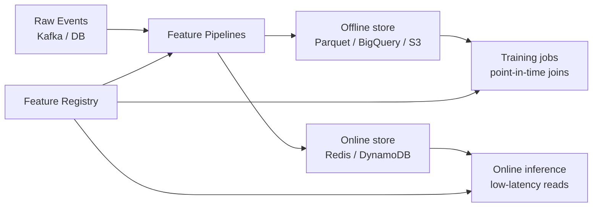

> *"Train-serve skew is a feature store problem masquerading as a model problem."*

## Introduction

A feature store is the system that:
1. Computes features **once**, consistently for training and serving.
2. Serves them with **point-in-time correctness** to training jobs.
3. Serves them with **low latency** to online inference.
4. Tracks **lineage, versioning, and ownership**.

If features look different in training vs production, even the best model degrades. This post covers the feature store mental model, open-source and managed options (Feast, Tecton, Vertex AI, Databricks, SageMaker), online/offline parity, and patterns specific to recommenders.

## 1. The Two-Sided Problem



The two reads (offline batch and online point lookup) must produce the **same** numbers for the same key and time.

## 2. Point-in-Time Correctness

Naive features leak: computing "user's avg purchase price" using the full table includes the purchase you're trying to predict.

Correct join:
```
For each training row with (user_id, timestamp T):
  feature.value = MAX(feature.value WHERE feature.timestamp <= T)
```

This is the heart of every feature store API.

```python
# Feast example
from feast import FeatureStore
store = FeatureStore(repo_path="./feature_repo")
training_df = store.get_historical_features(
    entity_df=labels_df,                       # has user_id + event_timestamp
    features=[
        "user_features:n_views_7d",
        "user_features:n_purch_30d",
        "item_features:avg_rating_30d",
    ],
).to_df()
```

## 3. Online Reads

Same feature view, online:
```python
online_features = store.get_online_features(
    features=[
        "user_features:n_views_7d",
        "item_features:avg_rating_30d",
    ],
    entity_rows=[{"user_id": 42, "item_id": 1337}],
).to_dict()
```

Same definition, same compute. **No drift.**

## 4. Feature Types in RecSys Context

| Type | Cadence | Store |
|---|---|---|
| Slow-changing (demographics) | Daily | Offline only, materialize daily |
| Aggregations (counts last 7d) | Hourly | Both — incremental |
| Real-time (last click) | Streaming | Online only with Kafka source |
| Item content (title, image) | On publish | Both — versioned |
| Embeddings | Daily or streaming | Both — separate vector store |

## 5. Architecture Patterns

### Lambda
Batch + streaming pipelines feed the same store; reconcile at read time.

### Kappa
Single streaming pipeline; batch is a replay.

### Tier-Aware Materialization
- Hot tier (Redis): top-1% of features, sub-ms reads.
- Warm tier (DynamoDB): all online-required features.
- Cold tier (Parquet on S3): everything for training.

## 6. Open Source & Managed Options

| Tool | Notes |
|---|---|
| **Feast** | Open source, pluggable backends, lightweight |
| **Tecton** | Managed, deep RT features |
| **Hopsworks** | OSS + enterprise, strong on Spark + Flink |
| **Databricks Feature Store** | Tight Spark + ML integration |
| **Vertex AI Feature Store** | GCP-native |
| **SageMaker Feature Store** | AWS-native |
| **Featureform** | OSS, focus on definitions + governance |
| **Chronon (Airbnb)** | OSS, batch + streaming, point-in-time |

## 7. Embedding Stores (Adjacent System)

Vector / embedding stores are a separate axis but feature-store-adjacent:

- **Online**: serve user/item vectors at request time.
- **Offline**: bulk export for training.
- **Versioning**: embeddings change with model version; pin combinations.

Tools: Vespa, Vertex AI Matching Engine, Pinecone, Milvus, Qdrant, Weaviate, Redis with vector search.

## 8. Versioning & Governance

- Every feature has a **schema, owner, description, freshness SLA, monitoring**.
- Feature transformations are **code-reviewed** like model code.
- **A/B safe**: serving both v1 and v2 of a feature simultaneously is supported.
- **PII tagging** for compliance — GDPR delete must cascade.

## 9. Monitoring

- **Freshness**: time since last update per feature.
- **Distribution drift**: KS test on online vs training distributions.
- **Null rates**: silent feature-pipeline failures.
- **Latency**: per-feature p95 online read.
- **Reconciliation tests**: compare online vs offline reads for the same key + timestamp daily.

## 10. End-to-End: Mini Feature Store with Feast

```yaml
# feature_repo/feature_store.yaml
project: rec_demo
registry: data/registry.db
provider: local
online_store:
    type: redis
    connection_string: localhost:6379
offline_store:
    type: file
```

```python
# feature_repo/views.py
from feast import Entity, FeatureView, Field, FileSource
from feast.types import Int64, Float32
from datetime import timedelta

user = Entity(name="user_id", join_keys=["user_id"])

user_stats_source = FileSource(
    path="data/user_stats.parquet",
    timestamp_field="event_timestamp",
)

user_stats = FeatureView(
    name="user_features",
    entities=[user],
    ttl=timedelta(days=7),
    schema=[Field(name="n_views_7d", dtype=Int64),
            Field(name="n_purch_30d", dtype=Int64),
            Field(name="ltv_total", dtype=Float32)],
    source=user_stats_source,
)
```

```bash
feast apply
feast materialize-incremental $(date -u +%Y-%m-%dT%H:%M:%S)
```

Now training and serving read from the *same* schemas via `get_historical_features` and `get_online_features`.

## 11. Patterns Unique to RecSys

- **Cross features at request time**: user × candidate features (e.g., `same_brand_as_recent_purchase`) must be computed in the ranker — feature stores serve the building blocks.
- **Sequence features**: store last-N item IDs per user; truncate to fixed length at read.
- **Embeddings as features**: store user/item vectors so retrieval and ranking share them.
- **Throttle hot keys**: top-1% of users/items dominate traffic; cache aggressively.

## 12. Pros & Cons

| Pros | Cons |
|---|---|
| Eliminates train-serve skew | Heavy upfront infra investment |
| Reuses features across models | Versioning rigor required |
| Centralized governance / PII | Becomes a SPOF if not redundant |
| Speeds up feature iteration | Adds latency hop if poorly designed |

## 13. Pitfalls

1. Adding features in Python at serve time that weren't computed offline = silent drift.
2. **TTL too short** → cache misses; **TTL too long** → stale.
3. Not logging **feature values served** alongside predictions — can't debug regressions.
4. Letting one team's bad pipeline take down all features — isolate by namespace.
5. Treating embeddings like normal features — they need their own vector store with proper indexing.

## 14. Public References & Datasets

- **Feast example repos** — https://github.com/feast-dev/feast
- **Chronon docs** — https://chronon.ai/
- **MovieLens** — easy to build a feature view: user counts, item averages
- **Criteo logs** — perfect for testing feature-store join scale — https://ailab.criteo.com/

## 15. Further Reading

- Uber, *Michelangelo Palette: A Feature Store for Machine Learning* (Uber Eng Blog 2019)
- Airbnb, *Zipline: Airbnb's Machine Learning Data Management Platform* (2018) — predecessor of Chronon
- Tecton & Databricks talks at ApplyConf, Data + AI Summit
- *Designing ML Systems* (Chip Huyen, O'Reilly 2022) — feature store chapter
- Feast architecture docs — https://docs.feast.dev/
