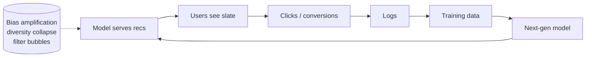
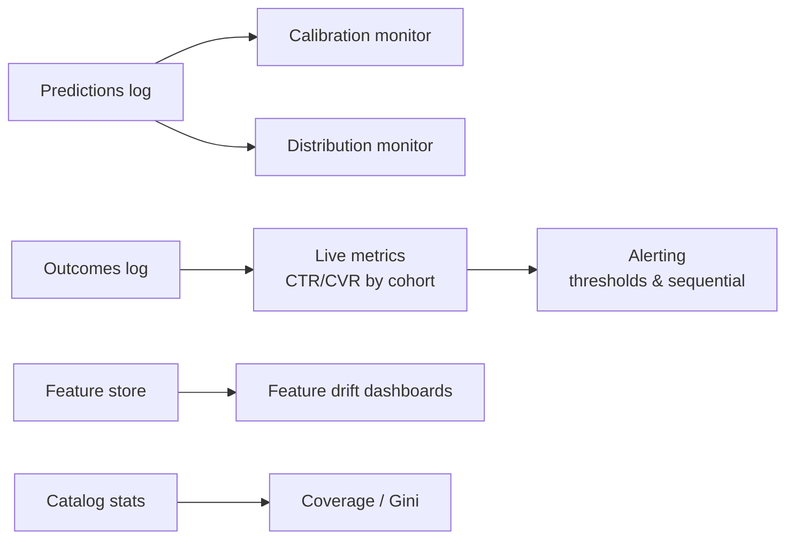

> *"Every recommender trains on data its previous self created. Whether that's a virtuous cycle or a vicious one is up to you."*

## Introduction

A recommender that's deployed becomes a **closed-loop system**: it influences what users see, which influences what they click, which becomes the next training set. Without care this loop **amplifies bias**, **collapses diversity**, and **drifts away** from real preferences. This post covers how to detect, measure, and remediate feedback loops, including exploration, randomized holdouts, drift detection, continual learning, and the right monitoring stack.

## 1. The Loop



Every time you retrain on logs from the previous model, you reinforce its choices.

## 2. What Goes Wrong

| Pathology | Symptom |
|---|---|
| **Popularity bias amplification** | Long-tail share drops month over month |
| **Distribution shift** | Training distribution stops matching the world |
| **Feedback collapse** | Model converges to a tiny "winners-take-all" set of items |
| **Stale freshness** | New items can't break in |
| **Click-bait spiral** | Engagement optimized at expense of satisfaction |
| **Demographic feedback** | Models reinforce stereotypes that nudge users into narrower content |

## 3. Detecting Loops

### Catalog Coverage Over Time
Plot fraction of catalog appearing in top-K across weeks. A steady decline is a red flag.

### Counterfactual Eval (Blog 17)
Use a small **uniform-random** traffic slice as an unbiased ground truth. Track gap to it.

### Holdouts
Reserve 1–5% of users in a **never-treated** holdout. Compare engagement vs treated cohort across months. If treated cohort engages more but enjoys less variety, you've identified a tradeoff.

### Distribution Drift
KS test on input features and on predictions, week-over-week.

```python
from scipy.stats import ks_2samp
def drift(today, baseline):
    return ks_2samp(today, baseline).statistic
```

## 4. Remediations

### Exploration Budget
Reserve K' slots for items the model would *not* otherwise have shown. Allocate via:
- Random sampling among long-tail items
- Multi-armed bandit (Blog 13)
- Quota for new items (cold start, Blog 18)

### Randomized Slices for Eval
Permanent ~1% traffic with uniform random rankings. Lets you compute **unbiased** propensities and detect overfitting to the loop.

### IPS / DR Training (Blog 17)
Counterfactual training removes the bias the loop introduces.

### Diversity / Calibration Re-Ranking (Blog 19)
Force breadth at slate composition time.

### Negative Feedback Channels
Explicit dislikes, "show me less of this," topic mute. These signals are gold — they aren't conditional on what you showed.

### Continual / Incremental Learning
Daily / hourly fine-tuning keeps the model close to current distribution. **Warm-start** from yesterday; **periodic from-scratch** retrain monthly to escape local optima.

```python
# Continual training loop pseudocode
prev_model = load_latest()
data_today = read_kafka_window(last_24h)
prev_model.fit(data_today, epochs=1, lr=1e-4)
prev_model.save_versioned()
```

### Replay Buffers
Mix today's data with a stratified sample of historical data so the model doesn't forget rare cases.

## 5. Online Learning vs Periodic Retraining

| Approach | Pros | Cons |
|---|---|---|
| Periodic (daily/weekly) | Simple, reproducible | Day-of-event freshness lost |
| Continual (hourly) | Always-fresh | Risk of catastrophic forgetting |
| Online (per-event) | Instant adaptation | Hard to roll back; debugging nightmare |

Most production systems run a **hybrid**: periodic full retrains + incremental hot updates.

## 6. Model Monitoring Stack



Watch:
- **CTR/CVR** by cohort, country, device, freshness bucket
- **Catalog Gini coefficient**
- **Calibration ECE** weekly
- **Latency p95/p99** per surface
- **Cold-start NDCG** specifically (users <5 interactions, items <7 days)

Alert on **rate of change**, not absolute thresholds.

## 7. Concept Drift Patterns

- **Sudden**: news event, viral content. Rapid retrain or rollback.
- **Gradual**: seasonality, taste evolution. Continual learning handles this.
- **Recurring**: weekday vs weekend, holidays. Calendar features + cohort-aware models.
- **Adversarial**: spam, bots, click farms. Anomaly detection upstream.

## 8. Catastrophic Forgetting

Continual training can forget rare patterns:
- **Elastic Weight Consolidation (EWC)**: penalize big changes to important weights.
- **Replay**: keep a buffer of historical examples.
- **Distillation**: new model matches old model's predictions on a holdout — keeps continuity.

## 9. End-to-End: Drift Dashboard Snippet

```python
import pandas as pd, numpy as np
from scipy.stats import ks_2samp

def daily_drift_report(baseline_df, today_df, features):
    rows = []
    for f in features:
        stat = ks_2samp(baseline_df[f].dropna(), today_df[f].dropna()).statistic
        nullrate = today_df[f].isna().mean()
        rows.append({"feature": f, "ks": stat, "null_rate": nullrate})
    return pd.DataFrame(rows).sort_values("ks", ascending=False)

# coverage
def catalog_gini(rec_counts):
    counts = np.sort(rec_counts.values)
    n = len(counts); c = counts.cumsum() / counts.sum()
    return 1 - 2 * (c.sum() - 0.5) / n
```

## 10. Pros & Cons of Loop Strategies

| Strategy | Pros | Cons |
|---|---|---|
| Exploration budget | Cheap, immediate | Costs CTR |
| Randomized slice | Unbiased eval forever | Some users see random recs |
| IPS / DR | Theoretically correct | Variance, propensity logging |
| Continual learning | Fresh | Catastrophic forgetting risk |
| Replay buffers | Memory of long tail | Storage cost |
| Calibration / diversity rerank | Improves UX | Complex tuning |

## 11. Production Tips

- **Never deploy** a new ranker without holdout + counterfactual eval (Blog 17, Blog 20).
- Log **everything**: served items, predicted scores, propensities, features used, model version.
- Make **rollback** a one-command operation. You will need it.
- Define a **degradation runbook**: which alerts trigger which rollbacks.
- Re-derive **gold labels** quarterly from a randomized slice.
- Pair every retraining job with **shadow scoring** of yesterday's traffic by the new candidate model.

## 12. Pitfalls

1. Retraining on logs only — no holdout, no randomization → silent collapse.
2. Treating CTR upticks as success without checking diversity or long-term retention.
3. Letting fresh-content gates push out cold items entirely.
4. Forgetting **user-side feedback**: dislikes, churn, app uninstalls are signals.
5. Ignoring **infra drift**: a Kafka schema change can quietly corrupt features.

## 13. Public Datasets / References

- **MovieLens** with simulated retraining loops
- **Yahoo R6** — randomized slices for OPE
- **ZOZO Open Bandit** — drift simulation supported — https://github.com/st-tech/zr-obp
- **Kaggle "Drift detection" datasets**
- **Recsys Challenge logs** — across multiple years (drift visible)

## 14. Further Reading

- Bottou et al., *Counterfactual Reasoning and Learning Systems* (JMLR 2013) — defines the loop
- Chaney, Stewart, Engelhardt, *How Algorithmic Confounding in Recommendation Systems Increases Homogeneity and Decreases Utility* (RecSys 2018)
- Sinha, Gleich, Ramani, *Deconvolving Feedback Loops in Recommender Systems* (NIPS 2016)
- Kirkpatrick et al., *Overcoming Catastrophic Forgetting in Neural Networks (EWC)* (PNAS 2017)
- Klabjan & Naumov, *Online Learning at Scale at Facebook* talk
- Lu et al., *Learning under Concept Drift: A Review* (TKDE 2019)
