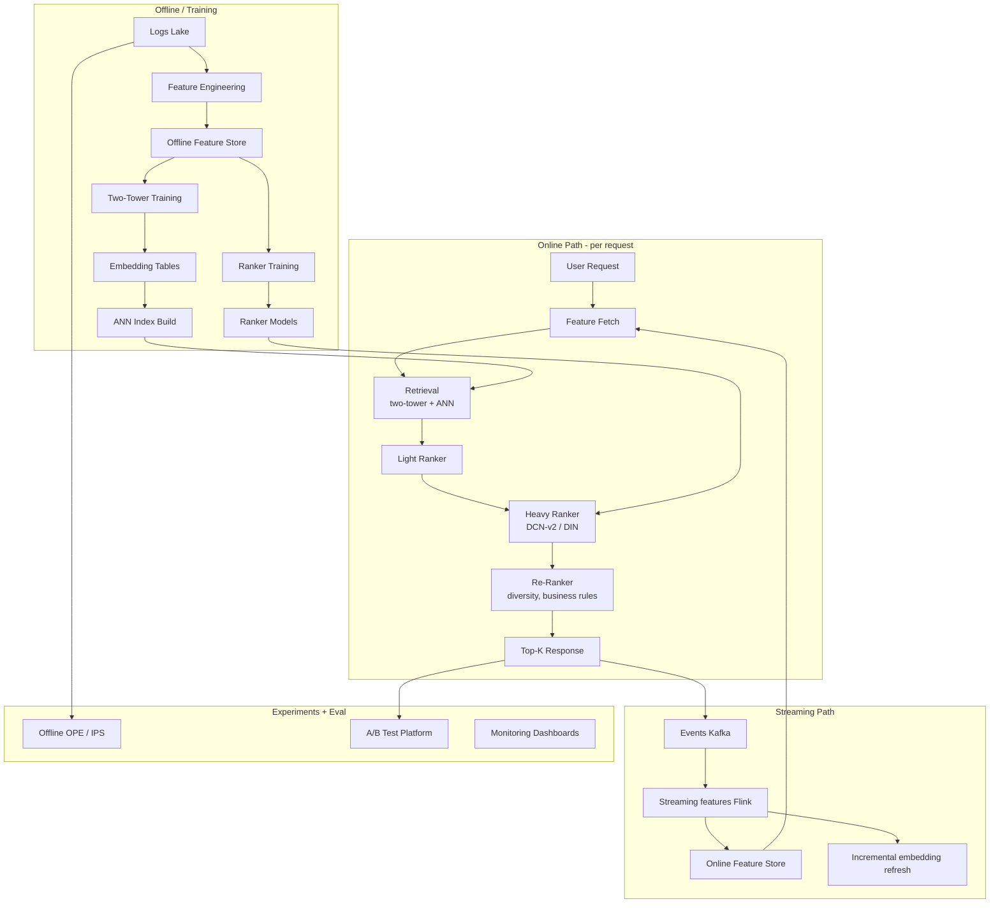
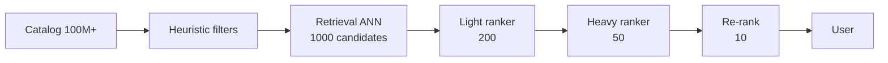

> *"The blueprint that ties every previous post together."*

## Introduction

This capstone connects the dots. We design a **production-grade recommender** end to end: data, features, retrieval, ranking, re-ranking, serving, experimentation, monitoring, and closing the loop. Use it as an interview reference, an architecture review checklist, or a starting point for your own design.

## 1. The Reference Architecture



## 2. The Layered Funnel



Cost per stage drops as candidates shrink — heavy compute only at the very top.

## 3. Component Choices (and Why)

### 3.1 Retrieval — Two-Tower DNN ([Blog 09](./09-two-tower.md))
- **User tower**: history sequence (SASRec encoder), demographics, contextual features.
- **Item tower**: ID embedding + content (SBERT title), category, image (CLIP), popularity features.
- **Loss**: in-batch softmax with logQ correction.
- **Index**: ScaNN (huge catalog) or HNSW (≤50M).
- Multiple retrieval sources (collab, content-based, graph-based) **unioned** with quotas.

### 3.2 Light Ranker — GBDT ([Blog 11](./11-learning-to-rank.md))
- LightGBM with lambdarank
- 200 candidates → 50; fits in <2ms.

### 3.3 Heavy Ranker — DCN-v2 + DIN ([Blog 07](./07-advanced-algorithms.md))
- DCN-v2 cross net for tabular feature interactions
- DIN attention over user history
- **Multi-task heads** (MMoE — [Blog 12](./12-multi-task.md)): CTR, CVR, dwell, share
- Calibration: temperature scaling on a daily holdout

### 3.4 Re-Ranker
- MMR / DPP for diversity ([Blog 19](./19-diversity-fairness.md))
- Calibration to user's category profile
- Hard business rules (no duplicates, blocklist, freshness floor)
- Exploration budget for cold items ([Blog 18](./18-cold-start.md))

### 3.5 Bandit Layer (optional)
- For modules with low data and high turnover (e.g., shelves, banners): contextual Thompson sampling.

## 4. Data Layer

- **Events** in Kafka. Schemas evolved via Avro / Protobuf.
- **Feature store** ([Blog 22](./22-feature-stores.md)) bridges online/offline with point-in-time correctness.
- **Logs** to a data lake (Parquet on S3/GCS).
- **Embedding store**: dual offline (Parquet) + online (Vespa / Redis Vector / FAISS service).

## 5. Training Layer

- **Daily** retrain rankers; **hourly** incremental for hot models.
- **Weekly** from-scratch retrain to escape local optima.
- Training in PyTorch on GPU; distributed via DeepSpeed / FSDP for very large embedding tables.
- Validation: time-based split, hold out last 3 days.
- Promotion gates: NDCG@10, GAUC, calibration ECE, latency benchmark.

## 6. Serving Layer ([Blog 21](./21-serving.md))

- **User tower** + **light ranker** on CPU pods, autoscaled.
- **Heavy ranker** on GPU pods with batching (e.g., Triton Inference Server).
- **ANN service** sharded by item hash.
- p95 budget: 200ms; p99: 300ms.
- Caching: edge top-K (60s TTL), embedding cache (10min), feature cache (30s for hot keys).

## 7. Experimentation ([Blog 20](./20-ab-testing.md))

- Sticky bucketing by user_id; salts per experiment.
- Default: 10% treatment + 10% control; ramp to 50/50.
- Variance reduction: CUPED on pre-period metrics.
- Long-term holdout: 1% never-exposed.
- Sequential Bayesian monitoring for ship/kill decisions.

## 8. Closing the Loop ([Blog 23](./23-closing-the-loop.md))

- Permanent 0.5–1% **randomization slice** for unbiased eval.
- Daily **catalog Gini** and **long-tail share** dashboards.
- **IPS-corrected** training data.
- Replay buffer keeps last 30 days mixed with last 24h for incremental fine-tune.

## 9. Concrete Tech Stack (One Sensible Choice)

| Layer | Choice |
|---|---|
| Streaming | Kafka + Flink |
| Lake | Parquet on S3, Iceberg tables |
| Feature store | Feast (or Tecton managed) |
| Embedding store / vector index | Vespa or Milvus |
| Training | PyTorch + Ray + GPU cluster |
| Tabular ranker | LightGBM |
| Online inference | Triton Inference Server (GPU), FastAPI for CPU |
| Experimentation | GrowthBook (OSS) or Statsig |
| Orchestration | Airflow or Dagster |
| Monitoring | Prometheus + Grafana + EvidentlyAI |
| Logging | Snowplow / Mixpanel + raw to Kafka |

## 10. KPIs & SLOs

| Metric | Target |
|---|---|
| p95 latency | <200ms |
| p99 latency | <300ms |
| Recall@200 (retrieval) | ≥0.85 |
| NDCG@10 (ranker offline) | beat prod by >2% |
| Catalog coverage @ top-K | ≥30% of active catalog/week |
| Long-tail share | ≥20% of impressions on bottom-50% items |
| New-item time-to-warm | <48h to graduate from exploration |
| Deploy frequency | weekly |
| Rollback time | <5 min |

## 11. Interview Talking Points

If asked "design YouTube recommendations" or similar:

1. **Clarify scope**: surface (homepage vs related videos), latency, freshness, scale.
2. **Define metrics**: NDCG / watch time / retention; trade-offs.
3. **Sketch the funnel**: retrieval → ranking → re-rank.
4. **Choose models per layer** with reasoning.
5. **Data & features**: feature store + streaming.
6. **Serving infra & SLOs**.
7. **Experimentation strategy & monitoring**.
8. **Closing the loop, bias, fairness**.
9. **Failure modes & rollback**.

## 12. End-to-End Demo Stub (Pseudo-architecture in Code)

```python
class Recommender:
    def __init__(self):
        self.user_tower = load_torch_model("user_tower.pt")
        self.ann = FAISSANNService("hnsw_index")
        self.light_ranker = lgb.Booster(model_file="light.lgb")
        self.heavy_ranker = load_torch_model("dcn_din.pt")
        self.feature_store = FeastClient(...)
        self.rerank = MMR(lam=0.7)

    def recommend(self, user_id, context, k=10):
        ufeat = self.feature_store.get_online_features(user_id, context)
        uvec = self.user_tower(ufeat)             # encode

        cand = self.ann.search(uvec, top=1000)    # retrieval
        cand = self.filter_blocklist(cand)
        ifeat = self.feature_store.get_online_features_items(cand)

        light_scores = self.light_ranker.predict(join(ufeat, ifeat))
        cand200 = top_k(cand, light_scores, 200)

        heavy_scores = self.heavy_ranker(ufeat, cand200, context)   # multi-task
        score = combine(heavy_scores, weights=self.objective_weights)

        return self.rerank(cand200, score, item_features=ifeat, k=k)
```

## 13. Common Failure Modes

| Failure | Symptom | Likely cause | Fix |
|---|---|---|---|
| Train-serve skew | Online metrics worse than offline | Feature mismatch | Feature store, parity tests |
| Cold-start regress | Newly added items invisible | Two-tower depends on ID only | Add content embeddings |
| Tail latency spike | p99 ↑ | One slow shard | Hedge + timeouts |
| Diversity collapse | Same N items shown to everyone | Ranker overweights popularity | Calibration / DPP |
| Drift undetected | Slow CTR decay | No monitoring | Daily KS, calibration |
| Feedback loop | Long-tail share decreases | No exploration | Bandit budget, IPS |

## 14. Reading Order Recap

For new engineers joining a recsys team:

1. [Metrics](./01-metrics.md) — speak the language
2. [Target Variables](./03-target-variables.md) — know what you're predicting
3. [Two-Tower](./09-two-tower.md), [Vector Search](./16-vector-search.md) — retrieval
4. [Advanced Algorithms](./07-advanced-algorithms.md), [Multi-Task](./12-multi-task.md) — ranking
5. [Position Bias](./17-position-bias.md), [A/B Testing](./20-ab-testing.md) — eval rigor
6. [Serving](./21-serving.md), [Feature Stores](./22-feature-stores.md) — infra
7. [Closing the Loop](./23-closing-the-loop.md) — operate over time
8. [Generative AI](./15-generative-ai.md) — what's next

## 15. Further Reading

- Covington et al., *Deep Neural Networks for YouTube Recommendations* (RecSys 2016)
- Davidson et al., *The YouTube Video Recommendation System* (RecSys 2010)
- Pinterest, *PinSage* (KDD 2018)
- Twitter, *Real Graph: User Interactions in Twitter* (KDD 2014)
- Spotify, *Music Recommendations at Scale* — Engineering blog
- Netflix Research blog — https://research.netflix.com/
- Alibaba's DIN/DIEN/BST series (KDD 2018, AAAI 2019, DLP-KDD 2019)
- Eugene Yan's *Mental Models for RecSys* posts — https://eugeneyan.com/
- Chip Huyen, *Designing Machine Learning Systems* (O'Reilly 2022)
