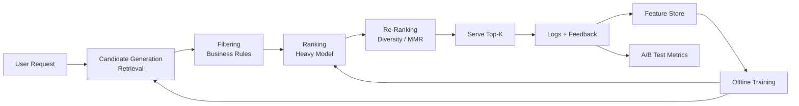

<section class="hero" style="padding-bottom:1.25rem;">
  Series
  <h1 class="fade-in delay-1">Retrieval, Ranking &amp; Recommendation.</h1>
  

    A hands-on series covering the <strong>full stack</strong> of modern recommender systems —
    from objectives and features to training, retrieval, ranking, serving, and closing the
    feedback loop. Each post is self-contained, with runnable code, math, diagrams, public
    datasets, and production design notes.
  

</section>

  How to read &nbsp;·&nbsp;
  <strong>Beginners:</strong> 01 → 04 → 06 → 21 &nbsp;·&nbsp;
  <strong>Practitioners:</strong> jump to your problem &nbsp;·&nbsp;
  <strong>System designers:</strong> start with 24, then drill in.

## The end-to-end mental model

## All 24 posts



<a class="series-card" href="{{ post.url | relative_url }}">0{{ post.order }}{{ post.title | split: "— " | last }}{{ post.theme }} — {{ post.description }}</a>

## Recurring public datasets

| Dataset | Domain | Scale | Link |
|---|---|---|---|
| MovieLens (100K–25M) | Movies | up to ~25M ratings | [grouplens.org](https://grouplens.org/datasets/movielens/) |
| Amazon Reviews 2018 | E-commerce | ~233M reviews | [nijianmo.github.io](https://nijianmo.github.io/amazon/index.html) |
| Yelp Open Dataset | Local business | ~7M reviews | [yelp.com/dataset](https://www.yelp.com/dataset) |
| H&M Personalized Fashion | Fashion | 31M transactions | [kaggle.com](https://www.kaggle.com/c/h-and-m-personalized-fashion-recommendations) |
| RetailRocket | E-commerce | ~2.7M events | [kaggle.com](https://www.kaggle.com/datasets/retailrocket/ecommerce-dataset) |
| Criteo 1TB Click Logs | Ads CTR | 4B examples | [ailab.criteo.com](https://ailab.criteo.com/download-criteo-1tb-click-logs-dataset/) |
| Spotify MPD | Playlists | 1M playlists | [aicrowd.com](https://www.aicrowd.com/challenges/spotify-million-playlist-dataset-challenge) |
| GoodReads | Books | ~228M interactions | [mengtingwan.github.io](https://mengtingwan.github.io/data/goodreads.html) |
| MIND News | News | high item churn | [msnews.github.io](https://msnews.github.io/) |

